# Hướng dẫn sử dụng hệ thống Email 365

## **Hướng dẫn sử dụng hệ thống Email 365**

Lưu ý: Vì Office 365 được bảo mật dùng đa yếu tố xác thực (không chỉ dùng mật khẩu vì dễ bị tấn công), khi cài đặt phần mềm lên một thiết bị mới, bạn cần cho phép thông qua phần mềm Authenticator trên điện thoại. Do vậy trước khi cài đặt email và Office trên máy tính, bạn cần cài đặt của bạn trước phần mềm Authenticator trên điện thoại

## **Đăng nhập mail trên web**

### Bước 1:Mở trình duyệt web, vào địa chỉ office.com

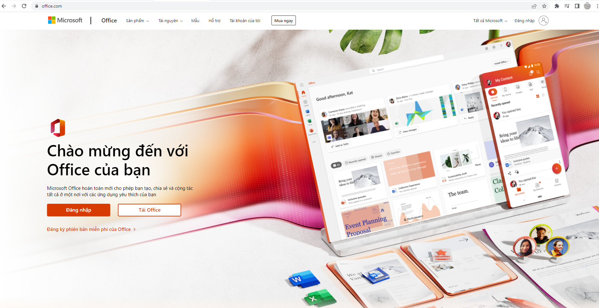

### Bước 2 : Chọn đăng nhập (Sign in), rồi gõ địa chỉ email được cấp (ví dụ của tôi là : [**testdangnhap@cmcu.edu.vn**](mailto:testdangnhap@cmc-u.edu.vn)**)**

_Note: Đối với cán bộ nhân viên và các thầy cô sẽ dùng đuôi Email là @cmcu.edu.vn và các em sinh viên sẽ là @st.cmcu.edu.vn_

### Bước 3: Chọn tiếp theo (Next) sau đó điền mật khẩu đã của mình vào ô Enter password rồi ấn đăng nhập (Sign in)

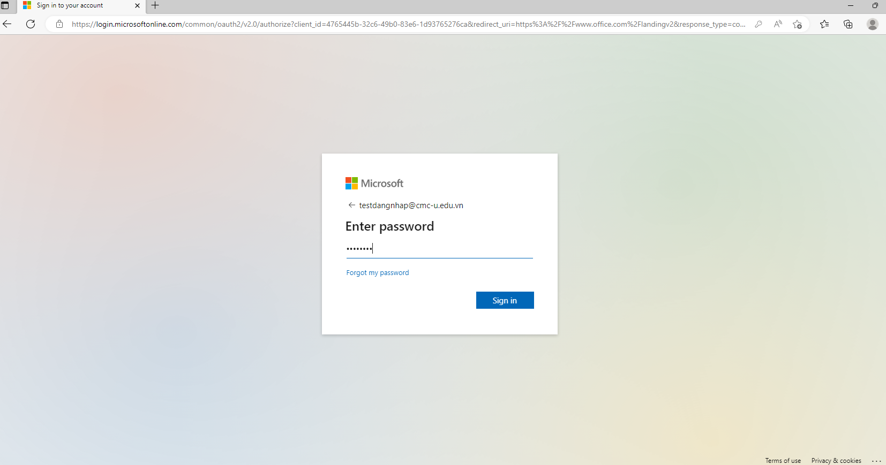

### Bước 4: Đổi mật khẩu lần đầu tiên khi đăng nhập trên hệ thống (nhập mật khẩu ban đầu hệ thống cấp và đặt mật khẩu mới) sau đó chọn đăng nhập (Sign in)

Lưu ý : Mật khẩu mới phải đảm bảo yêu cầu sau: ít nhất có 8 ký tự, có 1 ký tự in hoa, chữ thường, số và ký tự đặc biệt

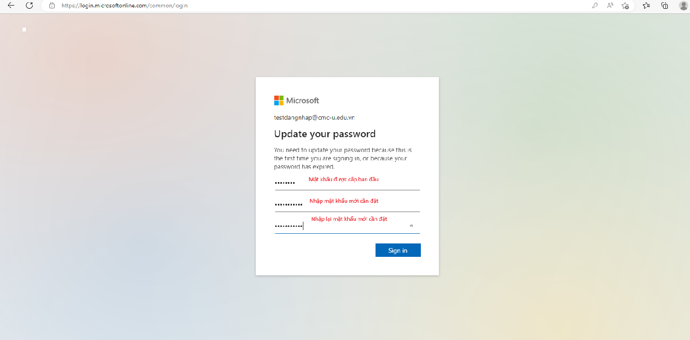

### Bước 5: Trên hệ thống sẽ hiện ra bảng thông báo, chọn Next

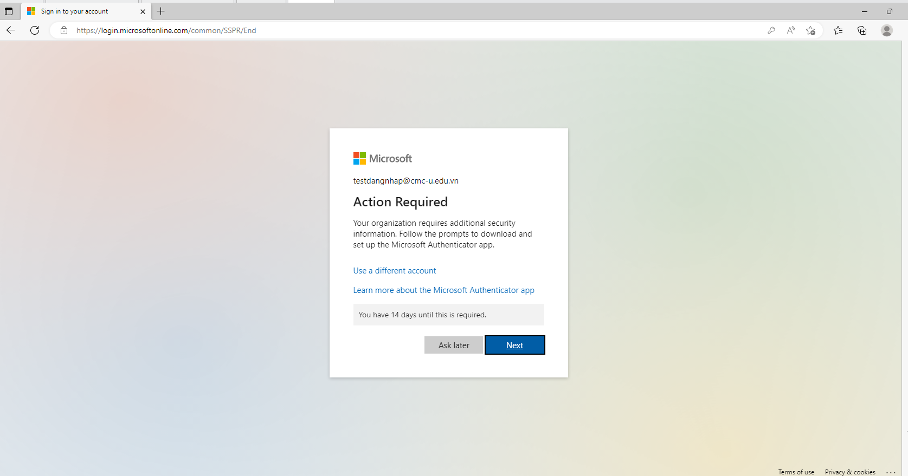

### Bước 6: Trên hệ thống sẽ hiện ra bảng thông báo, chọn Next

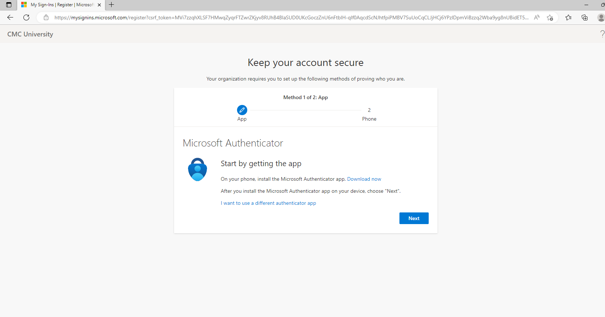

### Bước 7: Trên hệ thống sẽ hiện ra bảng thông báo, chọn Next

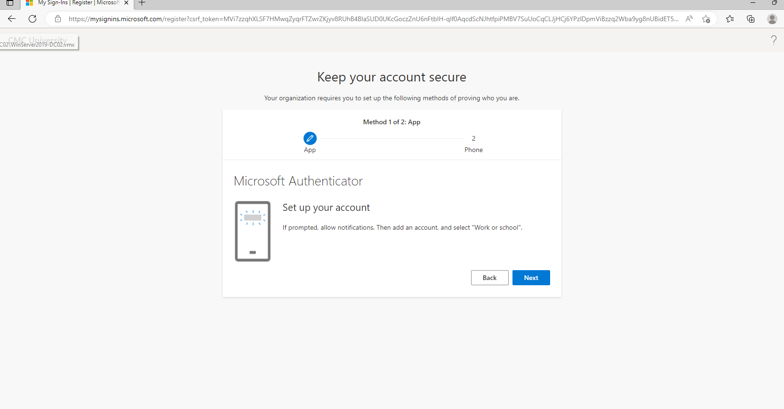

### Bước 8 : Ở bước này hệ thống sẽ yêu cầu quét QR code qua ứng dụng Authenticator trên điện thoại.

Lưu ý: Tải ứng dụng Authenticator của Microsoft qua đường link sau :

\+ Đối với điện thoại Iphone: [https://apps.apple.com/vn/app/microsoft-authenticator/id983156458](https://apps.apple.com/vn/app/microsoft-authenticator/id983156458)&#x20;

\+ Đối với điện thoại Adroid: [https://play.google.com/store/apps/details/Microsoft\_Authenticator?id=com.azure.authenticator\&hl=en\&pli=1](https://play.google.com/store/apps/details/Microsoft_Authenticator?id=com.azure.authenticator\&hl=en\&pli=1)

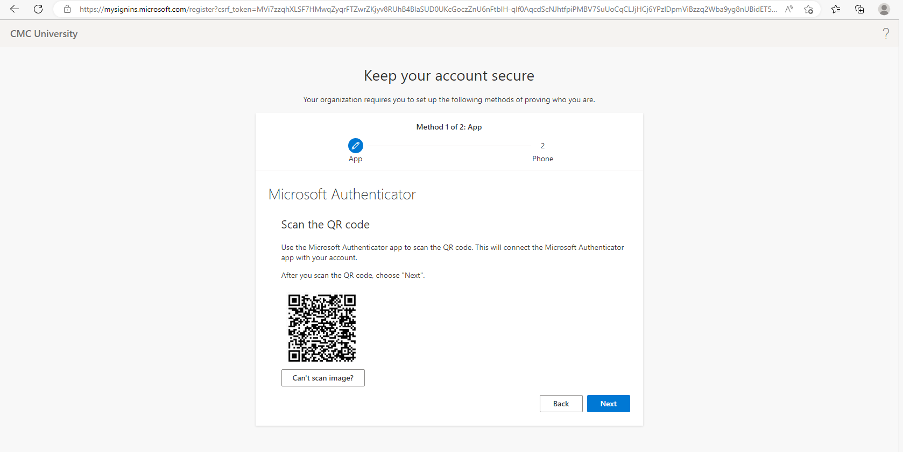

### Bước 9 : Sau khi sử dụng điện thoại tải app về chúng ta sẽ quét QR trên điện thoại

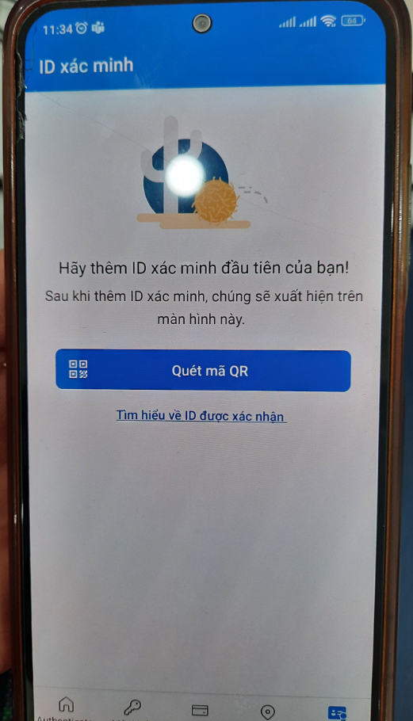

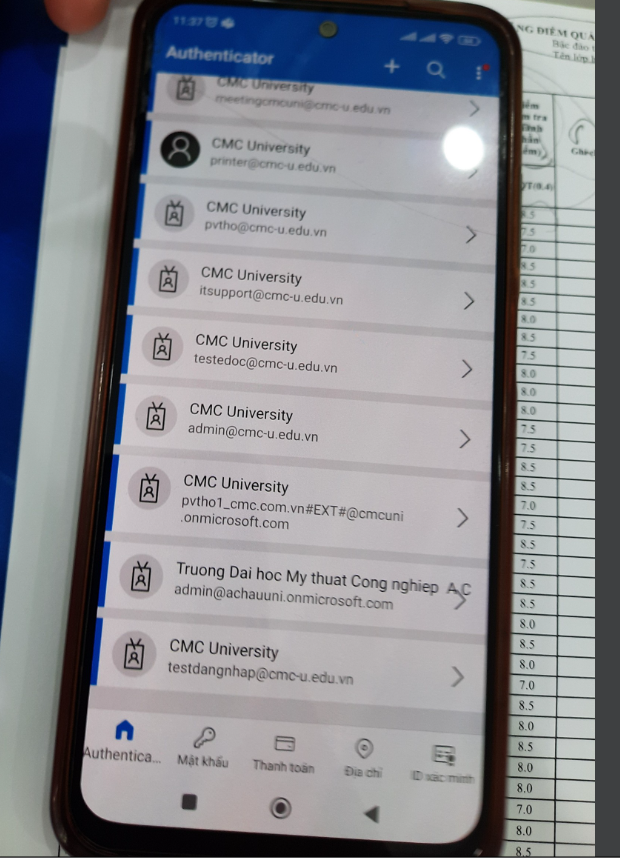

### Bước 10: Sau khi quét QR code thành công, trên máy tính chọn Next, trên màn hình máy tính sẽ hiện ra số để xác thực

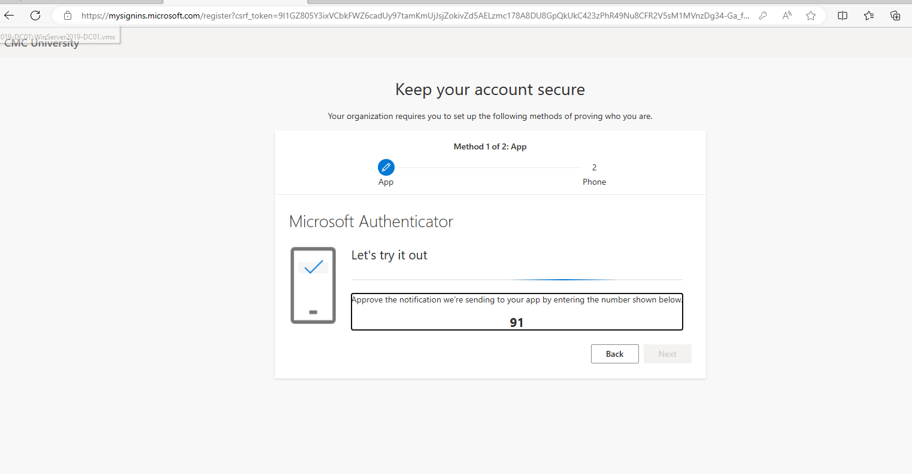

### Bước 11: Nhập số vừa hiên trên màn máy tính vào ứng dụng xác thực trên điện thoại và chọn Yes.

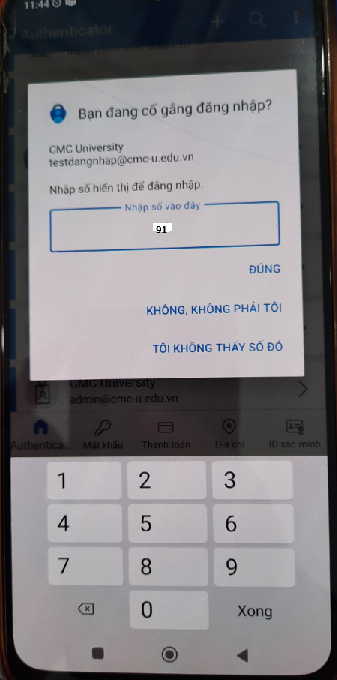

### Bước 12: Chọn Next và nhập số điện thoại cần xác thực (chọn quốc gia Viet Nam)

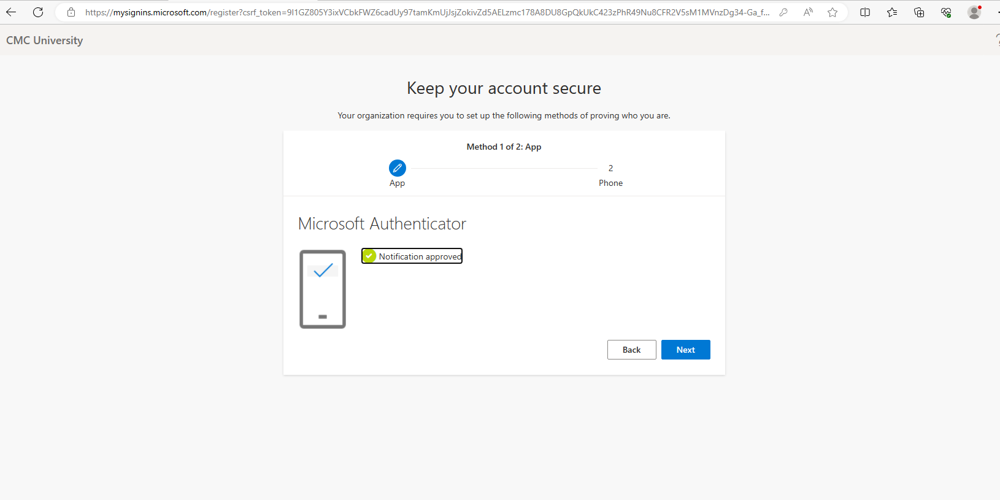

### Bước 13: Chọn Next và hệ thống sẽ gửi 1 đoạn mã gồm 6 số về số điện thoại, nhập 6 số gửi từ điện thoại như hình minh họa ở dưới

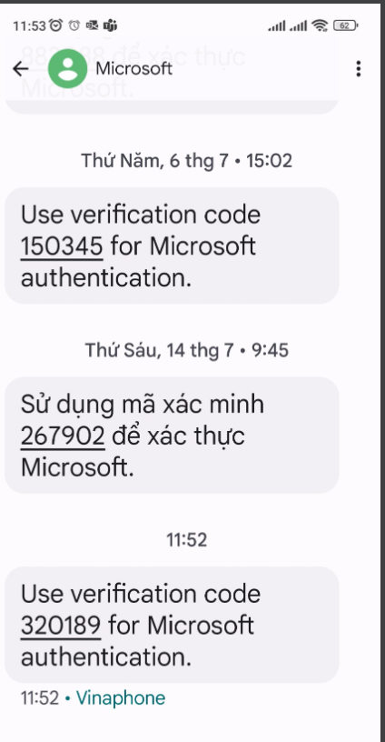

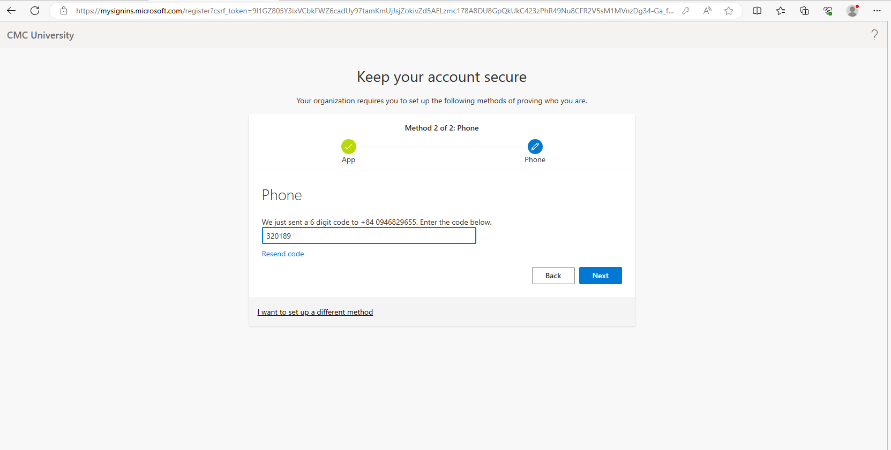

### Bước 14: Chọn Next => Next => Done

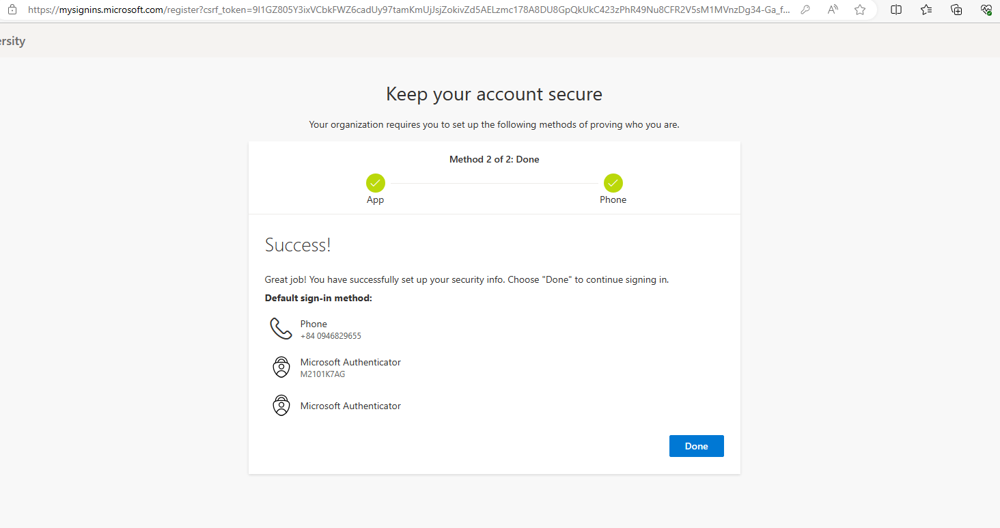

