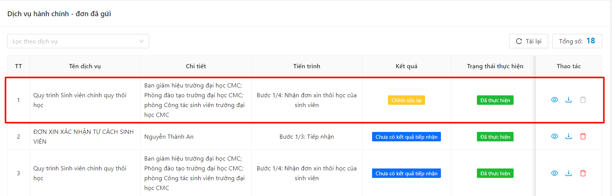
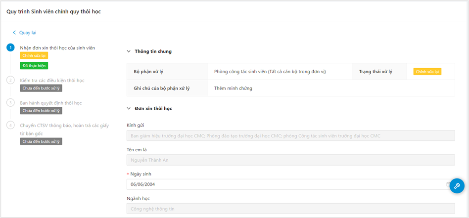

# Dịch vụ hành chính

### Xem danh sách đơn dịch vụ hành chính đã gửi 

* Chọn mục Dịch vụ hành chính, chọn mục Lịch sử

.png>)

* Danh sách đơn đã gửi hiển thị

.png>)

### Gửi đơn dịch vụ hành chính 

* Bước 1: Chọn mục Dịch vụ hành chính, chọn mục Đăng ký

.png>)

* Bước 2: Danh sách các đơn DVHC hiển thị

.png>)

* Bước 3: Chọn 1 mẫu DVHC muốn gửi

.png>)

* Bước 4: Thông tin biểu mẫu hiển thị

.png>)

* Bước 5: Người dùng điền thông tin biểu mẫu, sau đó ấn Khai báo

.png>)

* Bước 6: Gửi đơn thành công

.png>)

### Theo dõi trạng thái xử lý đơn 

* Bước 1: Chọn mục Dịch vụ hành chính, chọn mục Lịch sử

.png>)

* Bước 2: Người dùng chọn 1 đơn đã gửi

.png>)

* Bước 3: Trạng thái xử lý của đơn hiển thị

.png>)

### Xem nội dung đơn đã gửi 

* Bước 1: Chọn mục Dịch vụ hành chính, chọn mục Lịch sử

.png>)

* Bước 2: Người dùng chọn 1 đơn đã gửi

.png>)

* Bước 3: Nội dung chi tiết đơn đã gửi hiển thị

.png>)

### Gửi phản hồi đơn 

* Bước 1: Người dùng chọn Phản hồi

.png>)

* Bước 2: Chọn thao tác Gửi phản hồi

.png>)

* Bước 3: Thông tin phiếu phản hồi hiển thị.

.png>)

* Bước 4: Người dùng chọn chủ đề câu hỏi Dịch vụ hành chính điền thông tin vào phiếu và ấn Gửi phản hồi

.png>)

* Bước 5: Gửi phản hồi thành công

.png>)

### Chỉnh sửa đơn đã gửi 

* Bước 1: Chọn mục Dịch vụ hành chính, chọn mục Lịch sử

.png>)

* Bước 2: Chọn đơn có trạng thái Chỉnh sửa lại

* Bước 3: Màn hình chỉnh sửa đơn hiển thị

<figure><figcaption></figcaption></figure>

* Bước 4: Người dùng chỉnh sửa thông tin đơn, sau đó ấn Khai báo

<figure><figcaption></figcaption></figure>

* Bước 5: Chỉnh sửa đơn thành công

<figure><figcaption></figcaption></figure>

### Xóa đơn 

* Bước 1: Chọn mục Dịch vụ hành chính, chọn mục Lịch sử

<figure><figcaption></figcaption></figure>

* Bước 2: Người dùng chọn thao tác Xóa tại đơn đã gửi muốn xóa

<figure><figcaption></figcaption></figure>

* Bước 3: Người dùng chọn Đồng ý

<figure><figcaption></figcaption></figure>

* Bước 4: Xóa đơn đã gửi thành công

<figure><figcaption></figcaption></figure>
