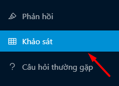
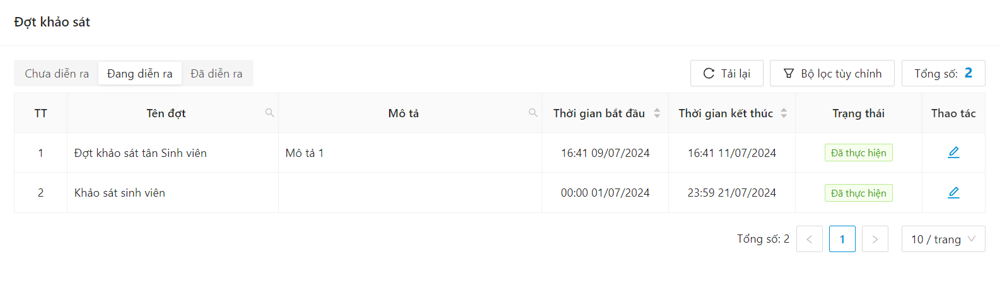
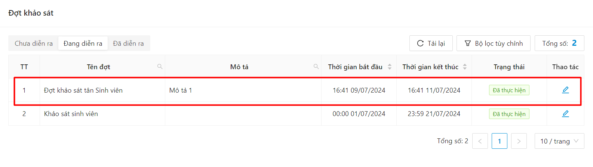
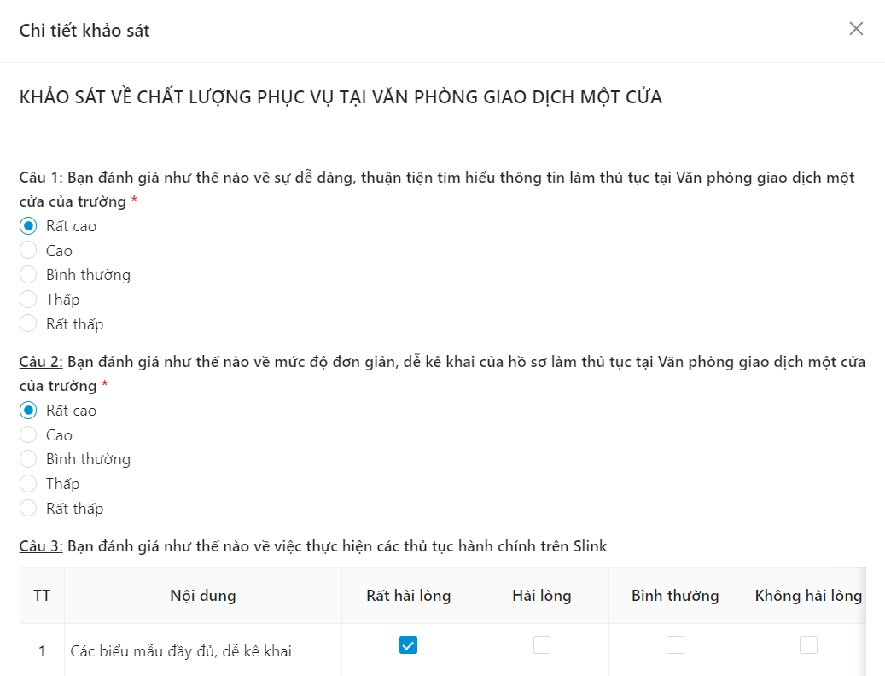
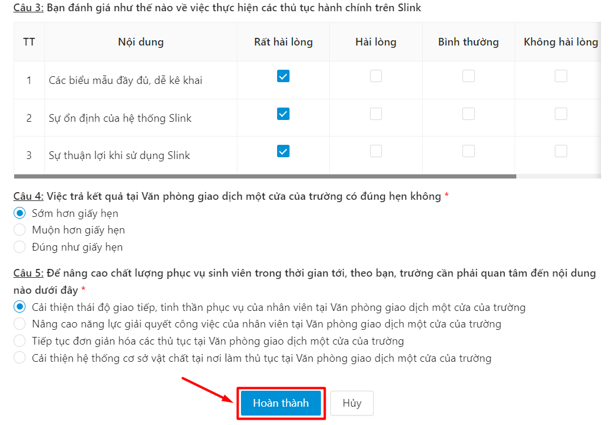
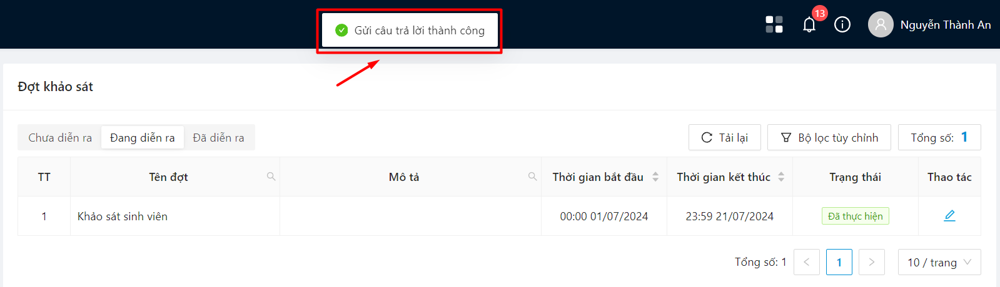

# Khảo sát

### Xem danh sách khảo sát theo loại 

* Chọn mục Khảo sát

* Danh sách các khảo sát kèm trạng thái thực hiện hiển thị

### Thực hiện khảo sát 

* Bước 1: Chọn mục Khảo sát

* Bước 2: Chọn mẫu khảo sát muốn thực hiện

* Bước 3: Chi tiết bài khảo sát hiển thị

* Bước 4: Người dùng thực hiện khảo sát sau đó ấn Hoàn thành

* Bước 5: Thực hiện khảo sát thành công

