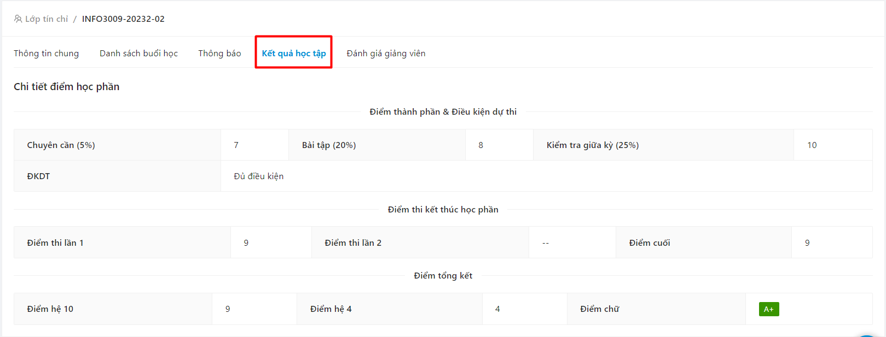
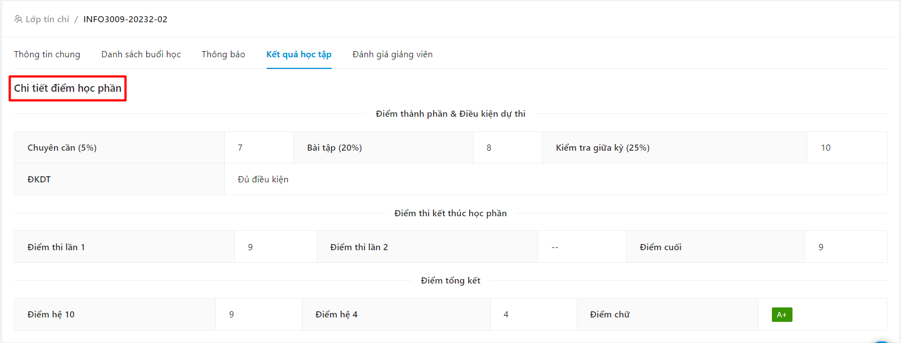
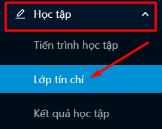
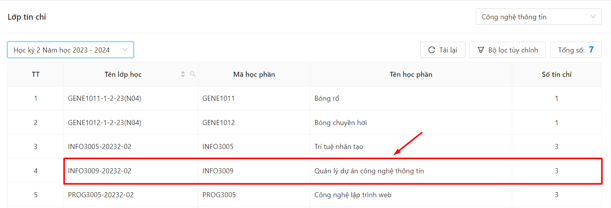
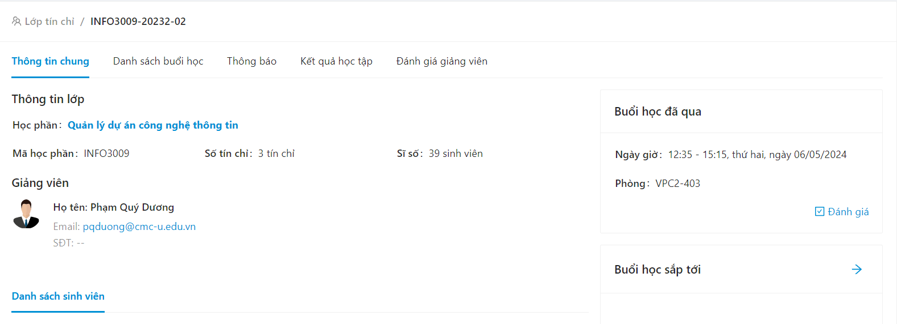
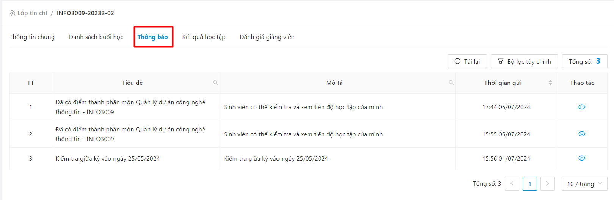
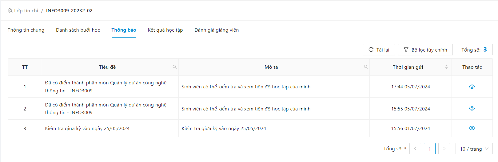

# Lớp học phần

### Xem danh sách lớp học phần đang học trong kỳ 

* Chọn mục Lớp tín chỉ

.png>)

* Danh sách các lớp học phần theo kỳ học hiển thị

.png>)

### Xem thông tin chi tiết lớp học phần 

* Bước 1: Chọn mục Lớp tín chỉ

.png>)

* Bước 2: Chọn lớp học phần SV muốn theo dõi

.png>)

* Bước 3: Thông tin chi tiết lớp học phần hiển thị

.png>)

### Xem danh sách buổi học 

* Bước 1: Chọn mục Lớp tín chỉ

.png>)

* Bước 2: Chọn lớp học phần SV muốn theo dõi

.png>)

* Bước 3: Thông tin chi tiết lớp học phần hiển thị

.png>)

* Bước 4: Chọn mục Danh sách buổi học

.png>)

* Bước 5: Danh sách các buổi học hiển thị

.png>)

### Xem kết quả học tập 

* Bước 1: Chọn mục Lớp tín chỉ

.png>)

* Bước 2: Chọn lớp học phần SV muốn theo dõi

.png>)

* Bước 3: Thông tin chi tiết lớp học phần hiển thị

.png>)

* Bước 4: Chọn mục Kết quả học tập

* Bước 5: Thông tin kết quả học tập hiển thị

### Nhận thông tin thông báo 

* Bước 1: Chọn mục Lớp tín chỉ

* Bước 2: Chọn lớp học phần SV muốn theo dõi

* Bước 3: Thông tin chi tiết lớp học phần hiển thị

* Bước 4: Chọn biểu tượng Thông báo

* Bước 5: Danh sách thông báo lớp học phần hiển thị

