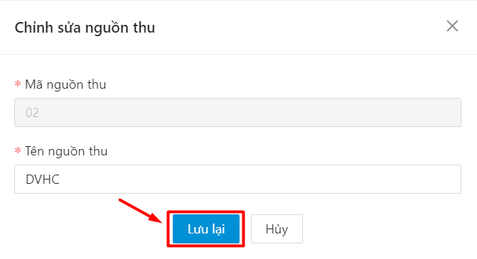
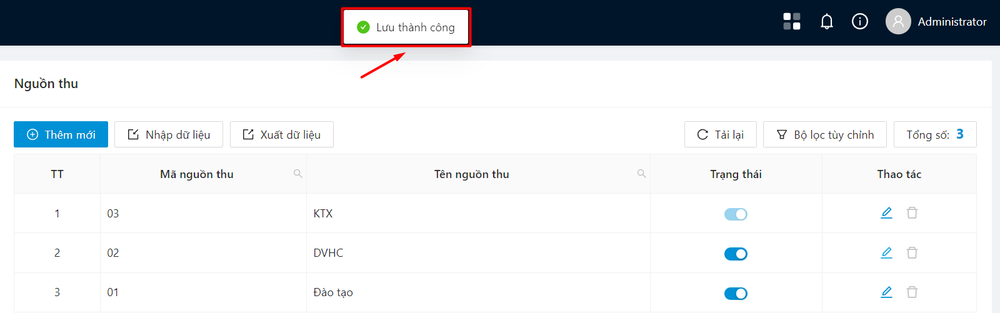
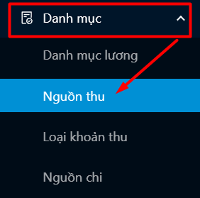
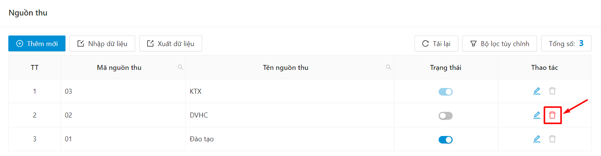
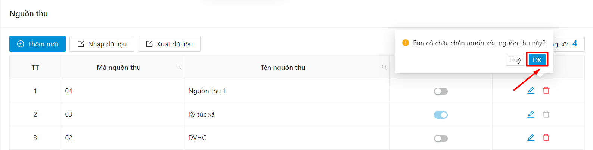
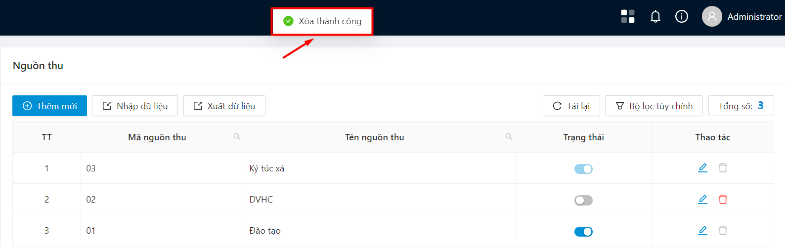

# Quản lý nguồn thu

## Quản lý danh sách nguồn thu 

### Xem danh sách nguồn thu 

* Bước 1: Người dùng click vào menu Danh mục, chọn Nguồn thu

.png>)

* Bước 2: Hệ thống hiển thị danh sách nguồn thu

.png>)

### Xem chi tiết nguồn thu 

* Bước 1: Người dùng click vào menu Danh mục, chọn Nguồn thu

.png>)

* Bước 2: Hệ thống hiển thị danh sách nguồn thu

.png>)

* Bước 3: Click chọn thao tác Chỉnh sửa ở cuối hàng nguồn thu cần xem chi tiết

.png>)

* Bước 4: Hệ thống hiển thị thông tin chi tiết nguồn thu

.png>)

### Thêm mới nguồn thu 

* Bước 1: Người dùng click vào menu Danh mục, chọn Nguồn thu

.png>)

* Bước 2: Click vào nút Thêm mới

.png>)

* Bước 3: Nhập các thông tin vào form thêm mới

.png>)

* Bước 4: Ấn vào nút Thêm mới

.png>)

Þ Hệ thống thông báo thêm mới nguồn thu thành công

.png>)

### Chỉnh sửa nguồn thu 

* Bước 1: Người dùng click vào menu Danh mục, chọn Nguồn thu

.png>)

* Bước 2: Hệ thống hiển thị danh sách nguồn thu

.png>)

* Bước 3: Click chọn thao tác Chỉnh sửa ở cuối hàng nguồn thu cần xem chi tiết

.png>)

* Bước 4: Chỉnh sửa thông tin nguồn thu

.png>)

* Bước 5: Ấn vào nút Lưu lại để lưu lại các thay đổi

* Þ Hệ thống thông báo cập nhật thông tin thành công

### Xoá nguồn thu 

* Bước 1: Người dùng click vào menu Danh mục, chọn Nguồn thu

* Bước 2: Chọn thao tác xoá tại cột Thao tác ở cuối hàng nguồn thu cần xoá

* Bước 3: Hệ thống hiển thị thông báo xác nhận, chọn OK để xác nhận xoá

Þ Xóa thành công

