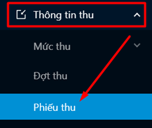

# Quản lý phiếu thu

### Tải biểu mẫu import phiếu thu 

* Bước 1: Người dùng click vào menu Thông tin thu, chọn Phiếu thu

.png>)

* Bước 2: Người dùng chọn thao tác **Nhập dữ liệu**

.png>)

 Màn hình nhập dữ liệu hiển thị

.png>)

* Bước 3: Người dùng thực hiện tải tập tin mẫu về máy

.png>)

 Tải về biểu mẫu thành công dưới dạng file excel, người dùng nhập thông tin vào tập tin mẫu

.png>)

### Khởi tạo phiếu thu 

* Bước 1: Người dùng click vào menu Thông tin thu, chọn Phiếu thu

.png>)

* Bước 2: Click vào nút Thêm mới

.png>)

*
  * Bước 3: Nhập thông tin phiếu thu

.png>)

* Bước 4: Ấn vào nút Thêm mới

.png>)

* Bước 5: Hệ thống thông báo khởi tạo phiếu thu thành công.

.png>)

### Import dữ liệu phiếu thu 

* Bước 1: Người dùng click vào menu Thông tin thu, chọn Phiếu thu

.png>)

* Bước 2: Người dùng chọn thao tác **Nhập dữ liệu**

.png>)

 Màn hình nhập dữ liệu hiển thị

.png>)

* Bước 3: Người dùng thực hiện tải tập tin mẫu về máy

.png>)

 Tải về biểu mẫu thành công dưới dạng file excel, người dùng nhập thông tin vào tập tin mẫu

* Bước 4: Sau khi nhập đủ các thông tin vào biểu mẫu, người dùng tải lên biểu mẫu đã nhập thông tin

.png>)

* Bước 5: Sau khi tải lên file dữ liệu, người dùng ấn **Tiếp theo**

.png>)

* Bước 6: Tại bước 2, các cột dữ liệu tương ứng với file mẫu sẽ hiển thị, người dùng có thể tìm cột thông tin trên tập dữ liệu để ghép vào cột dữ liệu còn trống

.png>)

* Bước 7: Tại Bước 3, người dùng có thể xem trước dữ liệu hiển thị sau khi import thông tin

.png>)

* Bước 8: Người dùng ấn **Kiểm tra dữ liệu** để kiểm tra kết quả dữ liệu có hợp lệ hay không

.png>)

* Bước 9: Thông tin kiểm tra dữ liệu hiển thị
* Nếu dữ liệu hợp lệ -> import thành công thông tin lên hệ thống
* Nếu dữ liệu báo lỗi -> người dùng import lại thông tin mới

.png>)

* Bước 10: Kiểm tra dữ liệu thành công, người dùng ấn **Lưu dữ liệu** để lưu lại dữ liệu đã nhập lên hệ thống

.png>)

### Export danh sách phiếu thu 

* Bước 1: Người dùng click vào menu Thông tin thu, chọn Phiếu thu

<figure><figcaption></figcaption></figure>

* Bước 2: Click vào nút Xuất dữ liệu

<figure><figcaption></figcaption></figure>

* Bước 3: Tick chọn các cột dữ liệu cần tải. Ấn vào nút Tải xuống dữ liệu

<figure><figcaption></figcaption></figure>

* Bước 4: Hệ thống tải xuống thành công file dữ liệu phiếu thu.

<figure><figcaption></figcaption></figure>
