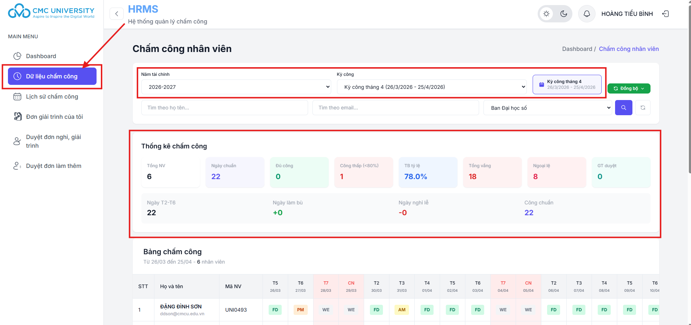

# 2. Xem dữ liệu chấm công

Bước 1: Truy cập chức năng\
Tại thanh menu điều hướng bên trái màn hình, nhấn chọn vào mục Dữ liệu chấm công. Hệ thống sẽ hiển thị giao diện quản lý chi tiết công của nhân viên thuộc đơn vị bạn quản lý.

Bước 2: Lọc dữ liệu cần tra cứu Tại khu vực trên cùng của màn hình chính, thực hiện các thao tác sau để giới hạn phạm vi dữ liệu:

* Chọn Năm tài chính & Kỳ công: Lựa chọn khoảng thời gian bạn muốn kiểm tra.
* Tìm kiếm nhân viên: Bạn có thể tìm nhanh theo Họ tên, Email hoặc lọc theo từng Phòng ban cụ thể.
* Đồng bộ dữ liệu: Nhấn nút Đồng bộ nếu bạn muốn cập nhật dữ liệu mới nhất từ máy chấm công hoặc hệ thống gốc.

<figure><figcaption></figcaption></figure>

Theo dõi Thống kê tổng hợp (Thống kê chấm công) Trước khi xem chi tiết từng người, hãy quan sát bảng chỉ số nhanh để nắm bắt tình hình chung của nhóm:

* Nhóm chỉ số định lượng: Xem tổng số nhân sự, số ngày công chuẩn trong tháng và số nhân viên đạt đủ công.
* Nhóm chỉ số cảnh báo: Theo dõi số nhân viên có tỷ lệ công thấp, số ngày vắng, số lỗi ngoại lệ và số đơn giải trình đã được duyệt.
* Thông tin lịch: Hiển thị rõ số ngày làm việc hành chính (T2-T6), ngày làm bù hoặc ngày nghỉ lễ trong kỳ.

<figure><figcaption></figcaption></figure>

Bước 4: Tra cứu Chi tiết Bảng chấm công Kéo xuống phần Bảng chấm công để xem dữ liệu chi tiết của từng cá nhân theo từng ngày trong tháng:

* Hệ thống hiển thị danh sách nhân viên kèm mã số (Mã NV).
* Các cột ngày tháng sẽ hiển thị các ký hiệu viết tắt đại diện cho trạng thái công của ngày đó (Ví dụ: FD, AM, PM, WE...).
