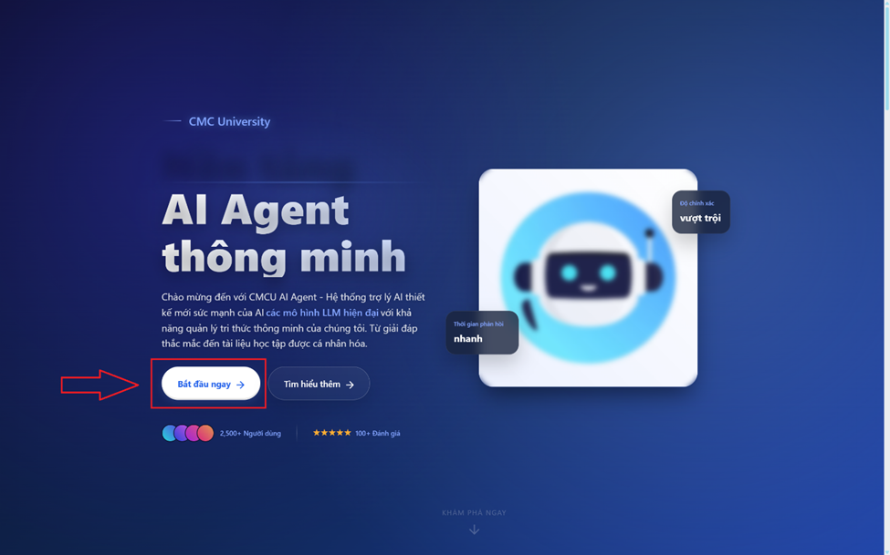
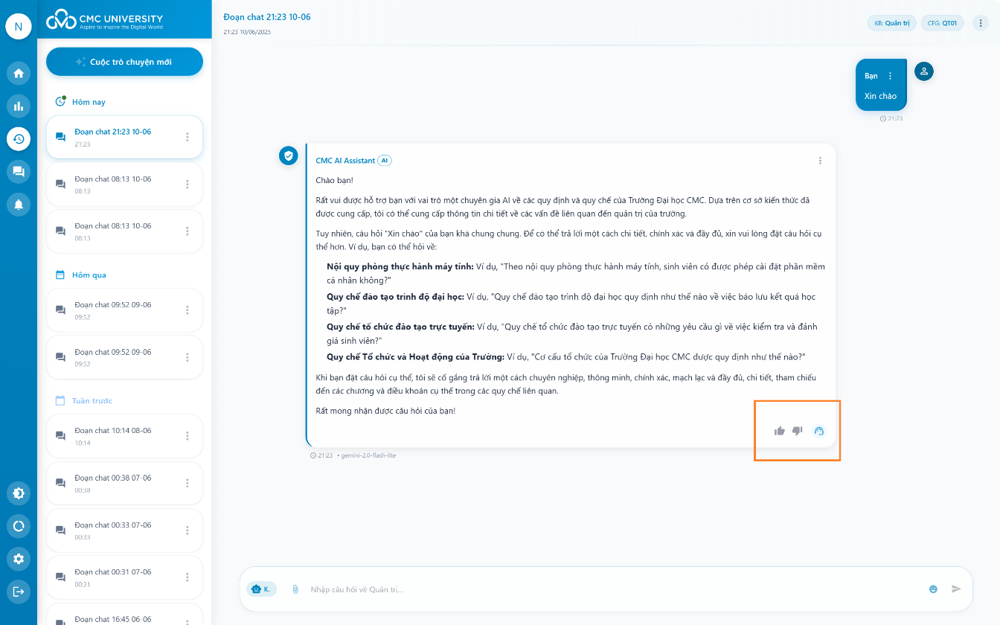
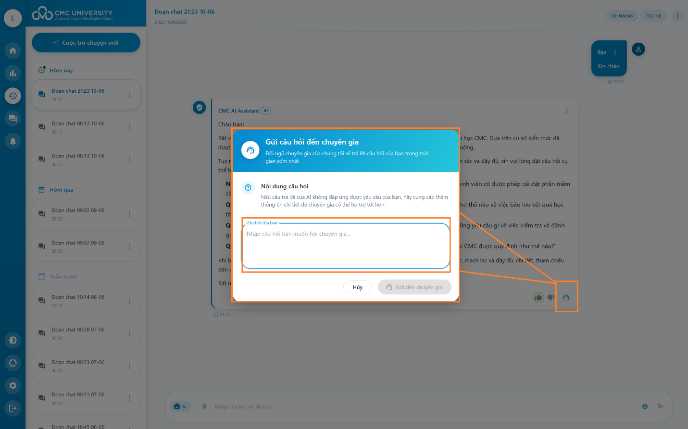

# II. Hướng dẫn sử dụng

## 1.Màn hình giới thiệu

<figure><figcaption></figcaption></figure>

Bước 1: Mở trình duyệt đang sử dụng truy cập vào hệ thống: [cagent.cmcu.edu.vn](https://cagent.cmcu.edu.vn/landing)

Bước 2: Nhấn vào “Bắt đầu ngay” để có thể truy cập đăng nhập vào hệ thống

## 2. Màn hình đăng nhập

Để bắt đầu sử dụng hệ thống AI Agent của Đại học CMC, đầu tiên người dùng cần đăng nhập vào hệ thống.

<figure><figcaption></figcaption></figure>

**a. Đăng nhập bằng tài khoản nội bộ:**

* &#x20;Trong mục "Đăng nhập vào hệ thống", nhập thông tin đăng nhập của bạn:
* Tại ô "Email": Nhập địa chỉ email được cấp bởi nhà trường&#x20;
* Tại ô "Mật khẩu": Nhập mật khẩu của bạn
* Nhấp vào nút "Đăng nhập" có màu xanh để tiến hành đăng nhập

**b. Đăng nhập bằng Microsoft:**

* Nếu bạn có tài khoản Microsoft được liên kết với nhà trường, nhấp vào nút "Đăng nhập với Microsoft"
* Hệ thống sẽ chuyển hướng bạn đến trang đăng nhập của Microsoft
* Nhập thông tin tài khoản Microsoft và làm theo hướng dẫn

<figure><figcaption>
Hình 3 Màn hình đăng nhập xác thực tài khoản Microsoft
</figcaption></figure>

## 3. Giao diện người dùng

**3.1. Đăng nhập và giao diện chào mừng**

Khi đăng nhập thành công vào hệ thống, người dùng sẽ được chào đón bởi một giao diện như hình 4.

<figure><figcaption>
Hình 4 Giao diện tổng quan hệ thống
</figcaption></figure>

**3.2. Tương tác với AI Agent**

Để bắt đầu một cuộc trò chuyện mới với AI Agent, người dùng có thể:

&#x20;  **Cách 1:** Nhấn vào nút xanh "Cuộc trò chuyện mới" ở phía trên cùng của thanh bên trái.

&#x20; **Cách 2:** Nhấn vào nút "Tạo mới" ở trung tâm màn hình (nút màu xanh với biểu tượng "+" và chữ "Tạo mới").

Sau khi nhấn, hệ thống sẽ tạo một cuộc trò chuyện mới và hiển thị giao diện chat để bắt đầu tương tác.

<figure><figcaption>
Hình 5 Màn hình thực hiện hỏi đáp
</figcaption></figure>

Khi bắt đầu một cuộc trò chuyện mới hoặc mở lại cuộc trò chuyện cũ, giao diện sẽ hiển thị như hình trên với các thành phần:

* Tiêu đề cuộc trò chuyện: Hiển thị ở phía trên cùng, bao gồm tên cuộc trò chuyện và thời gian tạo.
* Khung chat chính: Hiển thị nội dung trao đổi giữa người dùng và AI Agent.
* Khung nhập tin nhắn: Nằm ở cuối màn hình, người dùng nhập câu hỏi hoặc yêu cầu tại đây.
* Nút gửi: Biểu tượng mũi tên màu xanh ở bên phải khung nhập tin nhắn để gửi câu hỏi.
* Nhấp chuột vào khung nhập tin nhắn (có dòng chữ "Nhập câu hỏi về Quản trị...").
* Nhập câu hỏi của bạn bằng ngôn ngữ tự nhiên.
* Nhấn nút gửi (biểu tượng mũi tên) hoặc nhấn phím Enter trên bàn phím để gửi câu hỏi.

Sau khi gửi câu hỏi, AI Agent sẽ xử lý và trả lời ngay sau khi suy nghĩ xong. Câu trả lời sẽ hiển thị trong khung chat chính với biểu tượng "CMC AI Assistant" ở bên cạnh. Người dùng có thể:

* Đánh giá câu trả lời bằng cách nhấn vào biểu tượng "Thích"  hoặc "Không thích".
* Sao chép câu trả lời bằng cách nhấn vào biểu tượng sao chép.
* Tiếp tục đặt câu hỏi mới trong cùng một cuộc trò chuyện để làm rõ hoặc mở rộng chủ đề.

**3.3. Cài đặt truy vấn**

Màn hình cài đặt truy vấn cho phép tùy chỉnh cách thức AI trả lời câu hỏi, bao gồm việc chọn nguồn thông tin, cấu hình AI và các tham số khác.

<figure><figcaption>
Hình 6 Màn hình cài đặt truy vấn
</figcaption></figure>

**Hướng dẫn truy cập màn hình cài đặt:**

* Trong khi đang ở màn hình trò chuyện, hãy nhìn vào thanh công cụ bên trái màn hình
* Tìm và nhấp vào biểu tượng bánh răng (cài đặt) nằm ở phần dưới thanh công cụ (được khoanh tròn màu đỏ trong hình)
* &#x20;Cửa sổ "Cài đặt truy vấn" sẽ hiện ra ở phía bên phải màn hình

Phần "Knowledge Base" cho phép bạn chọn nguồn thông tin mà AI sẽ tham khảo khi trả lời. Mỗi nhóm tri thức chứa những tài liệu khác nhau, phù hợp với từng lĩnh vực.

Phần cấu hình truy vấn xác định bộ tham số AI sẽ sử dụng khi tìm kiếm và xử lý thông tin. Các cấu hình khác nhau có thể ảnh hưởng đến tốc độ, độ chính xác và phong cách trả lời.

Phần "Sử dụng memory" cho phép AI ghi nhớ các tin nhắn trước đó trong cuộc trò chuyện. Khi bật tính năng này, AI có thể hiểu ngữ cảnh sâu và cung cấp câu trả lời liên quan đến các câu hỏi trước đó mà không cần nhắc lại.

System Instruction định nghĩa vai trò và cách thức AI phản hồi câu hỏi và Instruction Template cung cấp mẫu hướng dẫn bổ sung để định hình cách AI trả lời chi tiết hơn.

**3.4 Xem hạn mức token**

Màn hình "Hạn mức token" hiển thị thông tin về việc sử dụng và giới hạn token cho các mô hình AI mà người dùng được phép sử dụng. Token là đơn vị đo lường cho việc xử lý văn bản của mô hình AI - mỗi câu hỏi và câu trả lời sẽ tiêu tốn một số lượng token nhất định. Màn hình này giúp người dùng theo dõi mức sử dụng để đảm bảo không vượt quá giới hạn được cấp phép.

<figure><figcaption>
Hình 7 Màn hình xem hạn mức token
</figcaption></figure>

**3.5 Gửi yêu cầu và theo dõi câu trả lời từ chuyên gia**

Khi AI Agent không thể trả lời đầy đủ hoặc chính xác câu hỏi của bạn, hệ thống cung cấp tính năng chuyển câu hỏi đến đội ngũ chuyên gia của trường.

<figure><figcaption></figcaption></figure>

Màn hình chính: Tương tác với AI và nhận diện nhu cầu chuyển chuyên gia

**1.     Đánh giá câu trả lời của AI:**

* Sau khi nhận được câu trả lời từ AI, quan sát phần cuối của tin nhắn, bạn sẽ thấy các biểu tượng phản hồi
* Nếu câu trả lời không đáp ứng nhu cầu của bạn, nhấp vào biểu tượng hình người (được khoanh tròn màu cam trong hình trên)

<figure><figcaption>
Hình 8 Màn hình gửi yêu cầu đến chuyên gia
</figcaption></figure>

2. **Điền thông tin yêu cầu:**

* Một cửa sổ pop-up "Gửi câu hỏi đến chuyên gia" sẽ hiện ra
* Phần trên hiển thị thông báo: "Đội ngũ chuyên gia của chúng tôi sẽ trả lời câu hỏi của bạn trong thời gian sớm nhất"
* Phần "Nội dung câu hỏi" đã được điền sẵn với câu hỏi của bạn từ cuộc trò chuyện
* Nếu muốn bổ sung thông tin, bạn có thể nhập thêm vào ô văn bản "Nhập câu hỏi bạn muốn hỏi chuyên gia..."

**Màn hình theo dõi yêu cầu đã gửi:**

<figure><figcaption>
Hình 9 Màn hình hiển thị yêu cầu đã gửi
</figcaption></figure>

**1.     Truy cập danh sách yêu cầu đã gửi:**

* Nhấp vào biểu tượng hình bong bóng chat (được khoanh tròn màu cam trong hình trên) trên thanh công cụ bên trái
* Panel "Yêu cầu đã gửi" sẽ hiển thị ở bên phải màn hình
* Bạn sẽ thấy danh sách các yêu cầu đã gửi, sắp xếp theo thời gian

2\.     Xem trả lời từ chuyên gia (nếu có):

* Nếu đã có phản hồi từ chuyên gia, bạn sẽ thấy nội dung phản hồi trong phần "Trả lời từ chuyên gia"
* Nếu chưa có phản hồi, phần này sẽ trống và bạn cần đợi thêm
* Thời gian phản hồi phụ thuộc vào tính chất câu hỏi và lịch làm việc của đội ngũ chuyên gia
