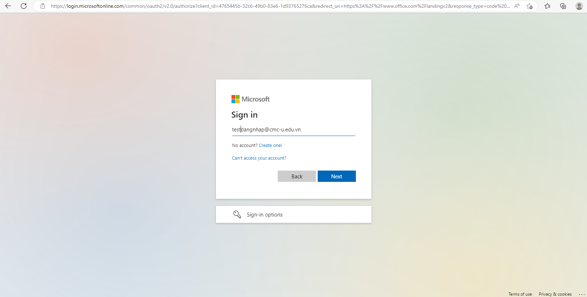

# Hướng dẫn sử dụng hệ thống Chữ ký số (Esign Service)

## 1. **Hướng dẫn ký tài liệu nhanh**

### Bước 1: Mở trình duyệt web, vào địa chỉ: [https://esign.cmcu.edu.vn/](https://esign.cmcu.edu.vn/)

<figure><figcaption></figcaption></figure>

### Bước 2 : Chọn đăng nhập với Microsoft, rồi gõ địa chỉ email được cấp (ví dụ của tôi là : [**testdangnhap@cmcu.edu.vn**](mailto:testdangnhap@cmc-u.edu.vn)**)**

### Bước 3: Chọn tiếp theo (Next) sau đó điền mật khẩu đã của mình vào ô Enter password rồi ấn đăng nhập (Sign in)

### Bước 4: Sau khi đăng nhập sẽ vào màn hình trang chủ như ảnh, click 'Bắt đầu ký ngay' hoặc menu 'Ký nhanh'

<figure><figcaption></figcaption></figure>

### Bước 5: Sau khi nhấn chọn hiện ra trang như ảnh, kéo thả file hoặc nhấn tải lên file để chuẩn bị ký

Lưu ý: Hiện tại hệ thống chỉ hỗ trợ ký file PDF

<figure><figcaption></figcaption></figure>

### Bước 6: Sau khi tải lên tài liệu click 'Ký tài liệu'

<figure><figcaption></figcaption></figure>

### Bước 7: Sau khi nhấn 'Ký tài liệu' popup ký sẽ hiện ra và chọn loại chữ ký và kéo thả vào vị trí muốn ký sau đó nhấn Ký OTP hoặc ký nhanh

Lưu ý: ở đây có 2 lựa chọn ký:\
&#x20; 1\. Ký nhanh sẽ phải nhập 'Mã bí mật' mã này đã được gửi về email của bạn tại lần đầu đăng ký (mã này sẽ dùng để ký nhiều lần)

2. Ký OTP, sẽ phải nhập OTP được gửi về Email sau khi bấm 'Ký OTP' (mã này chỉ có hiệu lực 5p kể từ lúc tạo yêu cầu)

<figure><figcaption></figcaption></figure>

### Bước 8 (bấm Ký OTP): Sau khi bấm 'Ký OTP' sẽ hiện ra popup nhập mã xác thực OTP

Lưu ý: Mã OTP sẽ được gửi về email của bạn và có hiệu lực trong vòng 5 phút

<figure><figcaption></figcaption></figure>

### Bước 9: Check mã OTP được gửi về Email và nhập vào input box sau đó click xác nhận

Lưu ý: sau khi click xác nhận file ký sẽ được tự động tải về

<figure><figcaption></figcaption></figure> <figure><figcaption></figcaption></figure>

### Bước 10: Kiểm tra file đã ký vừa được trả về ở thư mục download

<figure><figcaption></figcaption></figure>

## Hoặc ký bằng khoá bí mật

### Bước 8: Sau khi nhấn 'Ký tài liệu' popup ký sẽ hiện ra và chọn loại chữ ký và kéo thả vào vị trí muốn ký sau đó nhấn Ký OTP hoặc ký nhanh

<figure><figcaption></figcaption></figure>

### Bước 9 (bấm Ký nhanh): Sau khi bấm 'Ký nhanh' sẽ hiện ra popup nhập khoá bí mật

Lưu ý: Khoá bí mật là mã khoá đã được gửi vào email của bạn sau khi đăng kí ký số

<figure><figcaption></figcaption></figure>

### Bước 10: Nhập khoá bí mật và nhấn 'Ký nhanh'

Lưu ý: sau khi click ký nhanh file ký sẽ được tự động tải về

<figure><figcaption></figcaption></figure>

### Bước 11: Kiểm tra file đã ký vừa được trả về ở thư mục download

