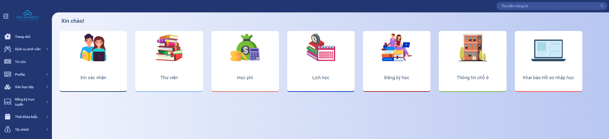

# Page

**Bước 1:**  Truy cập vào tài khoản trên hệ thống IU tại địa chỉ [https://iu.cmc-u.edu.vn/](https://iu.cmc-u.edu.vn/)

<figure><figcaption></figcaption></figure>

**Bước 2:** Chọn "Đăng ký học trực tuyến" tại menu bên trái màn hình, sau đó chọn "Đăng ký thi"

<figure><figcaption></figcaption></figure>

**Bước 3:** Tại màn hình "Đăng ký thi" chọn "Xem" để tìm kiếm các lịch thi lại tương ứng

<figure><figcaption></figcaption></figure>

**Bước 4:** Tích chọn và ấn "Đăng ký" các học phần cần thi lại tương ứng. Sau khi có thông báo đăng ký thành công, thông tin đăng ký được được cập nhật tại "Danh sách học phần đã đăng ký".

<figure><figcaption></figcaption></figure>

<figure><figcaption></figcaption></figure>

<figure><figcaption></figcaption></figure>

Bước 5: Quay lại "Trang chủ" và chọn "Học phí" để hoàn thành lệ phí thi lại theo các bước sau

* Chọn Học phí

<figure><figcaption></figcaption></figure>

* Chọn Tổng nợ chung các khoản

<figure><figcaption></figcaption></figure>

* Chọn Mã thanh toán định danh để hiện QR thanh toán và tiến hành thanh toán

<figure><figcaption></figcaption></figure>

<figure><figcaption></figcaption></figure>
