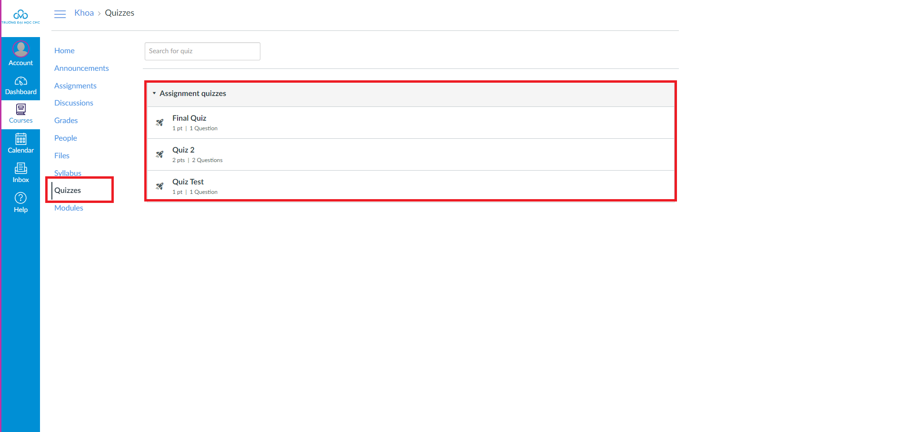

# (4) HƯỚNG DẪN LÀM BÀI TẬP DẠNG QUIZ TRÊN LMS

## I. Mục đích

* Dễ dàng làm bài tập, ôn luyện lại kiến thức của những bài giảng đã học
* Đánh giá mức độ hiểu nội dung bài giảng và thống kê được kết quả, điểm số&#x20;

## II. Hướng dẫn làm bài tập dạng Quiz

#### Bước 1: Tại khóa học cần làm bài tập, chọn Quizzes. Trong giao diện Quizzes chọn bài quiz cần làm

<figure><figcaption></figcaption></figure>

#### Bước 2: Chọn “Take the Quiz” để bắt đầu làm bài tập

<figure><figcaption></figcaption></figure>

#### Bước 3: Trong quá trình làm bài tập&#x20;

#### _Trường hợp 1: Câu hỏi dạng “essay question” cần tải file:_

1\. Giao diện câu hỏi tự luận có thể tải file

<figure><figcaption></figcaption></figure>

2\. Chọn “Insert” → “Document” → “Upload Document” để tải file lên

<figure><figcaption></figcaption></figure>

3\. Chọn “Upload file” để tải file lên

<figure><figcaption></figcaption></figure>

4\. File sau khi được tải lên sẽ hiển thị tại đây. Sau đó chọn “Submit” để hoàn tất nộp file bài tập

<figure><figcaption></figcaption></figure>

5\. Giao diện sau khi tải file lên. Chọn “Link Option”

<figure><figcaption></figcaption></figure>

6\. Chọn "Preview inline". Chọn “Done” để hoàn tất

<figure><figcaption></figcaption></figure>

Khi đó file bài tập sẽ xuất hiện biểu tượng này

<figure><figcaption></figcaption></figure>

Sinh viên và giảng viên có thể xem trực tiếp bài tập trên trang mà không cần tải xuống file bài tập

<figure><figcaption></figcaption></figure>

#### _**Trường hợp 2: Đối với câu hỏi dạng trắc nghiệm, sinh viên chọn đáp án tương ứng mỗi câu. Sau khi submit, tuỳ thuộc vào chế độ cài đặt của giảng viên, sinh viên có thể kiểm tra được đáp án của mỗi câu hỏi và số điểm tương ứng đạt được.**_

<figure><figcaption></figcaption></figure>
