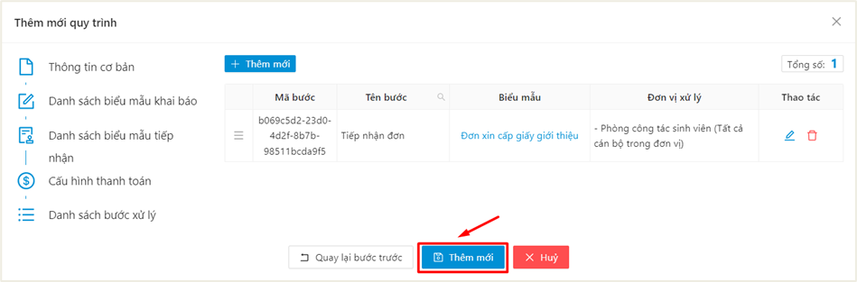

# Thêm mới Biểu mẫu

* Bước 1: Chọn menu Quản lý quy trình, sau đó chọn Thiết lập quy trình

.png>)

* Bước 2: Ấn vào nút **Thêm mới**

.png>)

* Bước 3: Hệ thống hiển thị màn thêm mới, người dùng điền các thông tin quy trình
  * Thông tin cơ bản
  * Biểu mẫu khai báo
  * Biểu mẫu tiếp nhận
  * Thanh toán
  * Quy trình xử lý

#### **Thông tin cơ bản**

.png>)

| **CHÚ GIẢI**              |                                                                                                                                                                                                                                                                                                                                                              |
| ------------------------- | ------------------------------------------------------------------------------------------------------------------------------------------------------------------------------------------------------------------------------------------------------------------------------------------------------------------------------------------------------------ |
| Lĩnh vực:                 | 
Cấu hình nơi mà người dùng có thể sử dụng quy trình.

=> Chọn Dịch vụ hành chính
                                                                                                                                                                                                                                                                 |
| Phân hệ:                  | Cấu hình phân hệ tiếp nhận các đơn khai báo của quy trình.                                                                                                                                                                                                                                                                                                   |
| Độ ưu tiên:               | Độ ưu tiên là STT hiển thị quy trình trong danh sách quy trình. Quy trình nào có STT bé hơn thì sẽ được ưu tiên hiển thị ở đầu danh sách.                                                                                                                                                                                                                    |
| Tên:                      | 
Nhập tên của quy trình

Ví dụ: Đơn xin cấp giấy giới thiệu
                                                                                                                                                                                                                                                                                       |
| Cho phép gửi nhiều lần:   | 
Tick chọn có cho phép người dùng tạo nhiều đơn quy trình
<ul><li>: Cho phép tạo nhiều lần</li></ul>
 : Không cho phép tạo khi vẫn còn đơn quy trình chưa xử lý xong
                                                                                                                           |
| Trả kết quả:              | 
Tick chọn quy trình đơn này có trả kết quả hay không

Ví dụ: Đối với quy trình xin cấp giấy giới thiệu, đơn vị quản lý sau khi xử lý đơn của sinh viên sẽ cần cấp cho sinh viên giấy giới thiệu (bản cứng) và sẽ hẹn sinh viên đến trường để nhận. Khi đó đơn vị này khi thiết lập đơn sẽ tick vào ô Trả kết quả và nhập số ngày hẹn trả kết quả
 |
| Cấu hình thông tin chung: | 
Thông tin chung là thông tin giới thiệu về quy trình, các lưu ý khi thực hiện quy trình trên hệ thống, … và sẽ hiển thị khi người dùng tạo đơn quy trình.
<ul><li>Người dùng click vào nút <strong>Thêm mới</strong> để thêm mới thông tin giới thiệu quy trình</li><li>Nhập thông tin</li><li>Ấn <strong>Lưu</strong></li></ul>                       |

* Tiếp theo, người dùng hoàn thành phần còn lại của phần Thông tin chung

.png>)

| **CHÚ GIẢI:**           |                                                                                                                                                                                                                                                                                                                                                                                                                                                                                 |
| ----------------------- | ------------------------------------------------------------------------------------------------------------------------------------------------------------------------------------------------------------------------------------------------------------------------------------------------------------------------------------------------------------------------------------------------------------------------------------------------------------------------------- |
| Cấu hình đợt quy trình: | 
Người dùng lựa chọn đợt khai báo (thời gian bắt đầu được phép khai báo và kết thúc) của loại đơn này là:
<ul><li>Tự tạo: Tự tạo là người dùng tự tạo đợt tại màn chức năng Quản lý quy trình, không phụ thuộc vào các đơn vị khác</li><li>Lấy từ phân hệ khác: Tức là thời gian khai báo của loại đơn này được lấy từ Phân hệ khác</li><li>Không có đợt: Nghĩa là người gửi đơn có thể gửi bất kỳ lúc nào, không có khoảng thời gian cố định được phép khai báo</li></ul> |
| Phạm vi quy trình:      | 
Phạm vi quy trình là phạm vi các đối tượng được phép sử dụng, gửi loại đơn này
<ul><li>Click vào nút <strong>Thêm mới</strong> để thêm mới đối tượng sử dụng đơn</li><li>Chọn đối tượng và vai trò phù hợp</li><li>Ấn Thêm mới</li></ul>                                                                                                                                                                                                                                  |
| Bộ phận phụ trách:      | 
Bộ phận phụ trách là bộ phận thực hiện xét duyệt đơn

Người dùng điền các thông tin sau:
<ul><li>Đơn vị: Chọn đơn vị phụ trách</li><li>Tên đơn vị: Hệ thống sẽ tự động điền khi người dùng chọn đơn vị phía trên</li><li>Mã đơn vị: Hệ thống sẽ tự động điền khi người dùng chọn đơn vị phía trên</li><li>Danh sách người phụ trách: Người dùng có thể chọn người chịu trách nhiệm xử lý đơn. Để trống nếu toàn bộ người trong đơn vị đều được quyền xử lý</li></ul> |

* Sau khi điền đầy đủ thông tin, người dùng ấn vào nút **Bước tiếp theo** để chuyển qua bước cấu hình các thông tin cần khai báo trong đơn

#### **Danh sách biểu mẫu khai báo**

* Mô tả: Tại bước cấu hình danh sách biểu mẫu khai báo, người dùng cấu hình các biểu mẫu khai báo của quy trình.
* Người dùng ấn vào nút **Thêm mới**

.png>)

* Hệ thống hiển thị form cấu hình biểu mẫu, người dùng điền các thông tin biểu mẫu

.png>)

| **CHÚ GIẢI:** |                                                                                                        |
| ------------- | ------------------------------------------------------------------------------------------------------ |
| Tên biểu mẫu  | Điền tên của biểu mẫu                                                                                  |
| Mã biểu mẫu   | Hệ thống sẽ tự động điền sau khi người dùng điền tên biểu mẫu                                          |
| File đính kèm | Người dùng tải lên template dùng để in thông tin đã khai báo ra file (định dạng docx - không bắt buộc) |

* Người dùng click vào nút **Thêm mới** tại phần **Danh sách các trường thông tin** để thêm mới các trường thông tin của biểu mẫu

.png>)

.png>)

| **CHÚ GIẢI:**         |                                                                                                                                                                                                                                                                                                                                                                                                                                                          |
| --------------------- | -------------------------------------------------------------------------------------------------------------------------------------------------------------------------------------------------------------------------------------------------------------------------------------------------------------------------------------------------------------------------------------------------------------------------------------------------------- |
| Mã                    | Hệ thống sẽ tự động điền khi người dùng nhập tên trường thông tin. Người dùng cũng có thể tự chỉnh sửa                                                                                                                                                                                                                                                                                                                                                   |
| Tên                   | Điền tên trường thông tin cần khai báo                                                                                                                                                                                                                                                                                                                                                                                                                   |
| Loại giá trị mặc định | Cấu hình giá trị mặc định sẽ tự động điền vào trường thông tin.                                                                                                                                                                                                                                                                                                                                                                                          |
| Chỉ đọc               | 
Nếu người dung tick chọn chỉ đọc thì người khai báo đơn chỉ có thể xem được giá trị của trường thông tin này và không thể chỉnh sửa. Thường được dùng để cấu hình cho các trường thông tin có giá trị mặc định và không muốn cho người dùng sửa

: Người dùng có thể chỉnh sửa giá trị

: Người dùng không thể chỉnh sửa giá trị
 |
| Kiểu dữ liệu          | Người dung chọn kiểu dữ liệu cho trường thông tin như kiểu Số, Chữ, Ngày/tháng/năm, File, Đoạn văn bản…                                                                                                                                                                                                                                                                                                                                                  |
| Bắt buộc              | 
Người dung tick chọn có/không:
<ul><li><strong>Có:</strong> Tick chọn có nếu đây là trường thông tin bắt buộc phải khai báo</li><li><strong>Không:</strong> Tick chọn không nếu đây là trường thông tin không bắt buộc khai báo</li></ul>                                                                                                                                                                                                          |
| Chiều rộng            | 
Là độ rộng của trường thông tin khi hiển thị trên form
<ul><li>24: Là chiều rộng của form.</li><li>12: Là chiều rộng của nửa form</li></ul>

                                                                                                                                                                                                                        |

* Thêm mới trường thông tin thành công, người dung thực hiện tương tự để them mới các trường thông tin khác.
* Người dung có thể click vào nút **Xem trước** để xem các trường thông tin mình đã thêm được hiển thị như thế nào và căn chỉnh lại chiều rộng của trường thông tin sao cho phù hợp

.png>)

.png>)

* Sau khi cấu hình đủ các trường thông tin cho đơn, người dùng ấn nút **Thêm mới**

.png>)

* Người dung hoàn tất các trường thông tin còn thiếu và ấn vào nút **Bước tiếp theo** để chuyển sang bước cấu hình **Danh sách biểu mẫu tiếp nhận**

.png>)

#### **Danh sách biểu mẫu tiếp nhận**

* Mô tả: Biểu mẫu tiếp nhận là bước giúp người dung cấu hình biểu mẫu trả kết quả sau khi tiếp nhận đơn. Tại bước này người dung thực hiện tương tự như cấu hình danh sách biểu mẫu khai báo ở trên.

.png>)

**Cấu hình thanh toán**

* Mô tả: Cấu hình thanh toán là bước để người dung cấu hình lệ phí khi gửi đơn. Nếu không phải đơn mất phí thì người dung bỏ qua bước này.
* Người dung tick vào ô **Yêu cầu trả phí**

.png>)

* Người dùng điền các thông tin cấu hình thanh toán

.png>)

| **CHÚ GIẢI:** |                             |
| ------------- | --------------------------- |
| Nguồn thu     | Chọn nguồn thu của loại đơn |
| Khoản thu     | Chọn khoản thu              |
| Mức thu       | Chọn mức thu của đơn        |

* Người dung tick chọn **Thanh toán theo số lượng** (nếu lệ phí đơn được tính theo số lượng)

.png>)

| **CHÚ GIẢI:**                        |                                                                                                                                                                   |
| ------------------------------------ | ----------------------------------------------------------------------------------------------------------------------------------------------------------------- |
| Thanh toán theo số lượng             | 
Tick chọn thanh toán theo số lượng nếu lệ phí đơn tính theo số lượng

Ví dụ: Đơn xin thi lại, thi cải thiện sẽ tính theo số lượng môn đăng ký thi lại
 |
| Form tham chiếu số lượng             | 
Chọn form khai báo có trường thông tin số lượng để tính phí

Ví dụ: Chọn form Đơn xin thi lại, thi cải thiện
                                          |
| Trường thông tin tham chiếu số lượng | 
Chọn trường thông tin trong đơn chưa thông tin số lượng

Ví dụ: Chọn trường thông tin “Số lượng môn”
                                                  |

* Ấn **Bước tiếp theo** để chuyển qua bước tiếp theo

.png>)

#### **Danh sách bước xử lý**

* Mô tả: Danh sách bước xử lý là bước để người dung thiết lập quy trình xử lý đơn: Các đơn vị nào được quyền xử lý, thứ tự xử lý đơn như thế nào.
* Người dung click vào nút **Thêm mới** để thêm mới bước xử lý đơn
* Hệ thống hiển thị form khai báo thông tin bước xử lý, người dung điền thông tin vào form
* Điền thông tin chung của bước xử lý

| **CHÚ GIẢI:**                                   |                                                                                                                                                                                                                                                                                   |
| ----------------------------------------------- | --------------------------------------------------------------------------------------------------------------------------------------------------------------------------------------------------------------------------------------------------------------------------------- |
| Tên bước                                        | Nhập tên của bước xử lý                                                                                                                                                                                                                                                           |
| Mô tả                                           | Nhập mô tả bước                                                                                                                                                                                                                                                                   |
| Thời hạn xử lý                                  | 
Chọn 1 trong hai loại thời hạ xử lý:
<ul><li>

<ul><li><strong>Ngày trong tuần:</strong> Nếu đơn này chỉ được xử lý ở một số thứ nhất định trong tuần</li><li><strong>Số ngày cụ thể:</strong> nếu đơn được xử lý trong phạm vi một số ngày cụ thể</li></ul></li></ul> |
| Mẫu đơn liên quan                               | Chọn biểu mẫu có bước xử lý này trong quy trình xử lý                                                                                                                                                                                                                             |
| Mẫu đơn tiếp nhận (nếu có)                      | Chọn biểu mẫu tiếp nhận đã cấu hình ở bước 1.3 (nếu có)                                                                                                                                                                                                                           |
| Văn bản, quy định đính kèm (nếu có)             | Văn bản quy định liên quan đến bước này.                                                                                                                                                                                                                                          |
| Ghi chú tiếp nhận (gửi kèm thông báo tiếp nhận) | Ghi chú gửi kèm thông báo đến người dùng khi đơn quy trình được tiếp nhận                                                                                                                                                                                                         |

* Tiếp theo, người dung ấn nút **Thêm mới** để thêm mới đơn vị được xử lý ở bước này

| **CHÚ GIẢI**                       |                                                                                                                                                                                                                 |
| ---------------------------------- | --------------------------------------------------------------------------------------------------------------------------------------------------------------------------------------------------------------- |
| Phương thức phân công              | 
Chọn một trong các phương thức:
<ul><li><strong>Đơn vị cụ thể:</strong> Phân công xử lý cho đơn vị cụ thể.</li><li><strong>Nhóm người dùng:</strong> Phân công xử lý cho nhóm người dùng cụ thể</li></ul> |
| Đơn vị                             | Chọn đơn vị được phép xử lý bước này                                                                                                                                                                            |
| Mã đơn vị                          | Hệ thống sẽ tự động điền khi người dùng chọn đơn vị                                                                                                                                                             |
| Tên đơn vị                         | Hệ thống sẽ tự động điền khi người dùng chọn đơn vị                                                                                                                                                             |
| Theo dõi đơn ngoài phạm vi đơn vị: | Nếu chọn Có thì đơn vị được chọn xử lý có thể quan sát được những đơn của các đơn vị khác, nhưng không được thao tác trên các đơn đó khi không có quyền xử lý                                                   |

* Sau khi điền thầy đủ thông tin bước xử lý, người dung click vào nút **Thêm mới**
* Người dùng thực hiện tương tự để thêm mới các bước xử lý khác

_**Lưu ý:**_

_Thứ tự các bước xử lý được sắp xếp từ trên xuống và theo thứ tự thời gian. Bước nào thêm trước thì là bước xử lý trước trong quy trình;_

_Người dung có thể click vào nút  để đổi thứ tự xử lý của các bước._

* Bước 4: Sau khi thực hiện cấu hình tất cả các thông tin biểu mẫu: thông tin cơ bản, biểu mẫu khai báo, biểu mẫu tiếp nhận, thanh toán, quy trình xử lý, người dùng ấn **Thêm mới** để thêm biểu mẫu vào hệ thống

<figure><figcaption></figcaption></figure>

⇒ Thêm mới biểu mẫu thành công, người dùng có thể thực hiện gửi đơn về hệ thống

<figure><figcaption></figcaption></figure>
