# Danh sách ban cán sự lớp

### Xem danh sách ban cán sự lớp 

* Bước 1: Chọn menu Quản lý thông tin người học, sau đó chọn Ban cán sự lớp

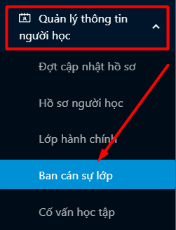

* Bước 2: Danh sách các ban cán sự lớp hiển thị

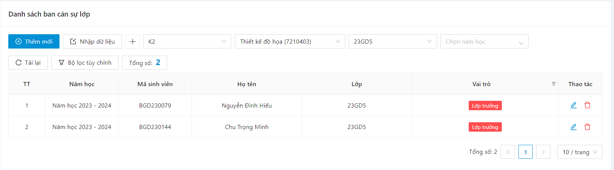

### Xem chi tiết thông tin ban cán sự lớp 

* Bước 1: Chọn menu Quản lý thông tin người học, sau đó chọn Ban cán sự lớp

* Bước 2: Danh sách các ban cán sự lớp hiển thị

* Bước 3: Người dùng chọn 1 ban cán sự lớp

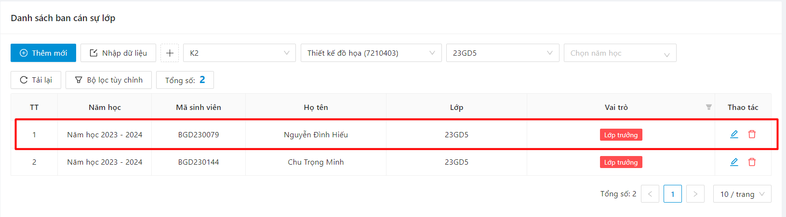

⇒ Hệ thống hiển thị thông tin ban cán sự lớp

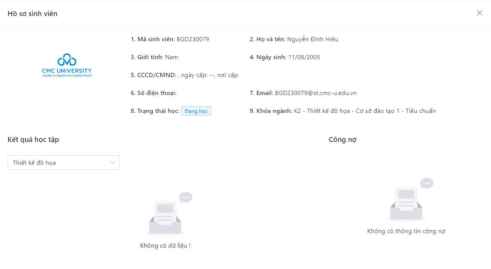

### Thêm mới ban cán sự lớp 

* Bước 1: Người dùng click vào button **Thêm mới**

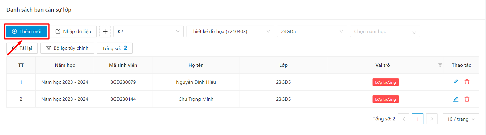

* Bước 2: Hệ thống hiển thị màn thêm mới. Người dùng điền thông tin sinh viên và vai trò

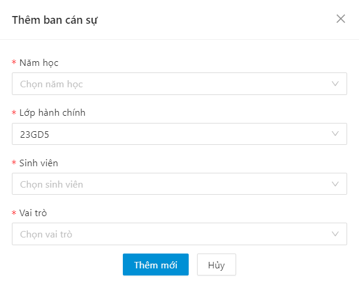

* Bước 3: Sau đó ấn Thêm mới

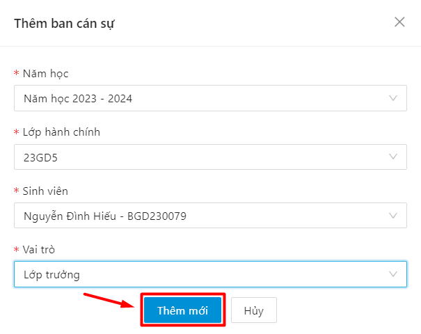

⇒ Thêm mới thành công

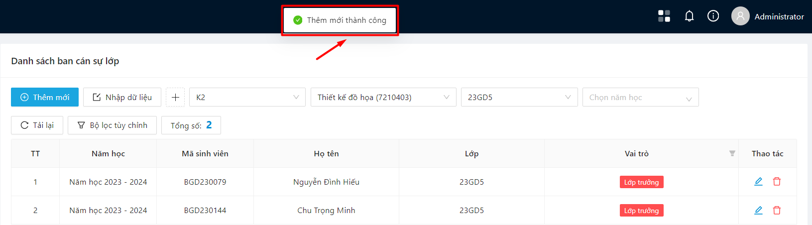

### Chỉnh sửa ban cán sự lớp 

* Bước 1: Người dùng click vào button  ở cột **Thao tác** ở dòng ban cán sự lớp cần chỉnh sửa thông tin

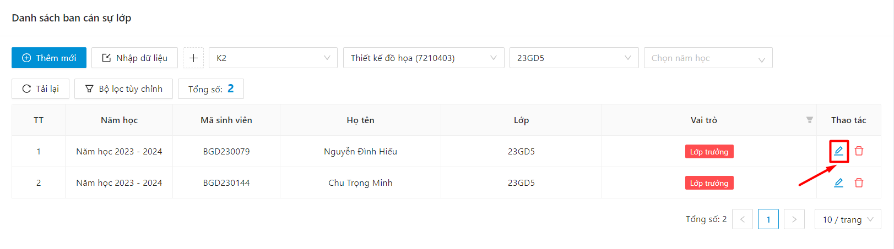

* Bước &#x32;**:** Hệ thống hiển thị màn chỉnh sửa, người dùng thực hiện chỉnh sửa thông tin

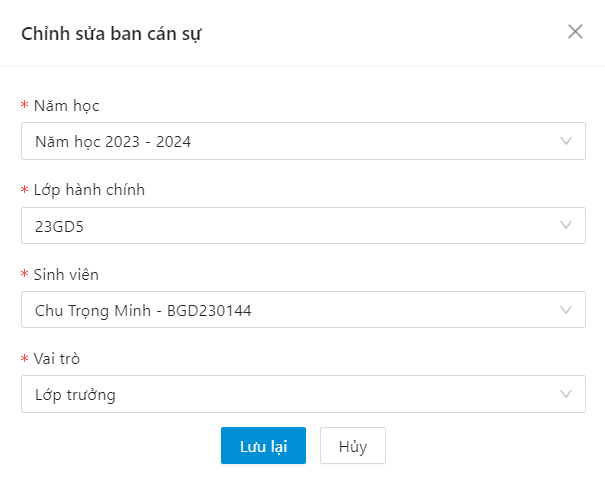

* Bước 3: Sau đó click vào button **Lưu lại**

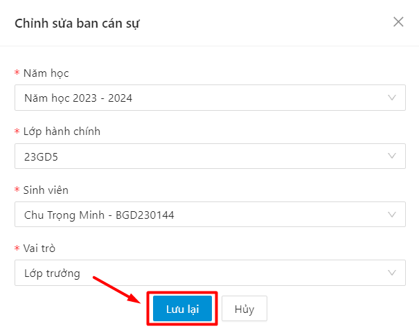

⇒ Cập nhật thông tin thành công

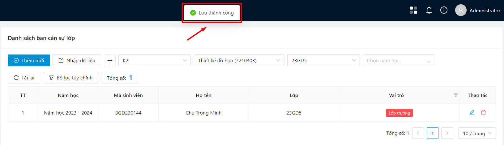

### Xóa ban cán sự lớp 

* Bước 1: Chọn biểu tượng  ở cuối hàng ban cán sự lớp muốn xóa

* Bước 2: Xác nhận **OK** để xóa ban cán sự lớp

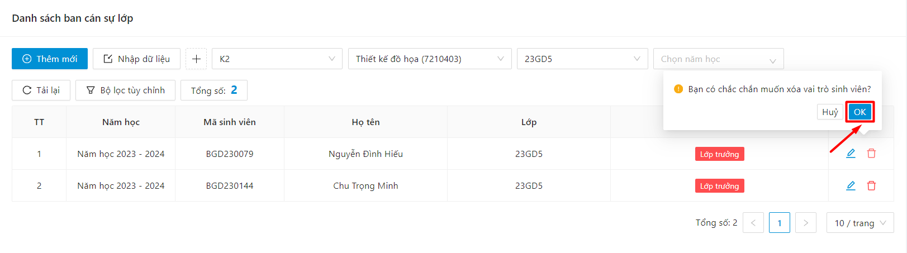

* Bước 3: Xóa ban cán sự lớp thành công

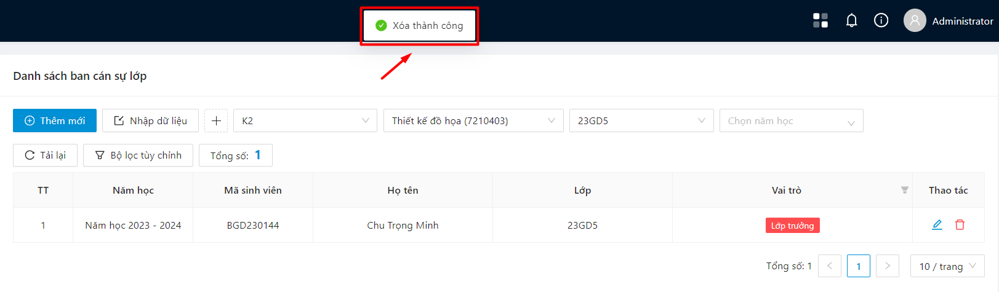

### Nhập dữ liệu ban cán sự lớp 

* Bước 1: Người dùng chọn thao tác **Nhập dữ liệu**

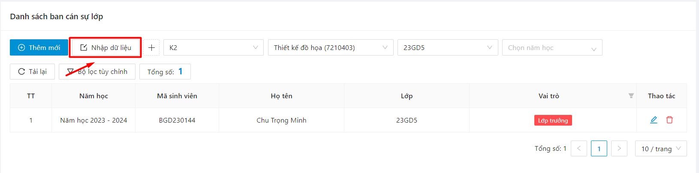

 Màn hình nhập dữ liệu hiển thị

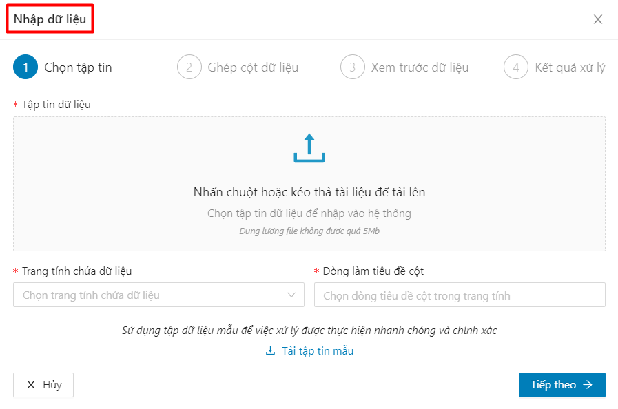

* Bước 2: Người dùng thực hiện tải tập tin mẫu về máy

<figure><figcaption></figcaption></figure>

 Tải về biểu mẫu thành công dưới dạng file excel, người dùng nhập thông tin vào tập tin mẫu

* Bước 3: Sau khi nhập đủ các thông tin vào biểu mẫu, người dùng tải lên biểu mẫu đã nhập thông tin

<figure><figcaption></figcaption></figure>

* Bước 4: Sau khi tải lên file dữ liệu, người dùng ấn **Tiếp theo**

<figure><figcaption></figcaption></figure>

* Bước 5: Tại bước 2, các cột dữ liệu tương ứng với file mẫu sẽ hiển thị, người dùng có thể tìm cột thông tin trên tập dữ liệu để ghép vào cột dữ liệu còn trống

<figure><figcaption></figcaption></figure>

* Bước 6: Tại Bước 3, người dùng có thể xem trước dữ liệu hiển thị sau khi import thông tin

<figure><figcaption></figcaption></figure>

* Bước 7: Người dùng ấn **Kiểm tra dữ liệu** để kiểm tra kết quả dữ liệu có hợp lệ hay không

<figure><figcaption></figcaption></figure>

* Bước 8: Thông tin kiểm tra dữ liệu hiển thị

1. Nếu dữ liệu hợp lệ -> import thành công thông tin lên hệ thống
2. Nếu dữ liệu báo lỗi -> người dùng import lại thông tin mới

<figure><figcaption></figcaption></figure>

* Bước 9: Kiểm tra dữ liệu thành công, người dùng ấn **Lưu dữ liệu** để lưu lại dữ liệu đã nhập lên hệ thống

<figure><figcaption></figcaption></figure>
