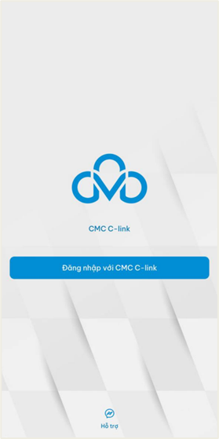

# Hướng dẫn truy cập hệ thống

## Đăng nhập

#### Người dùng chọn Đăng nhập với CMC C-link

<figure><figcaption></figcaption></figure>

#### Người dùng chọn Đăng nhập bằng Trường Đại học CMC Office 365

<figure><figcaption></figcaption></figure>

#### Màn hình đăng nhập hiển thị, người dùng điền thông tin tài khoản đăng nhập

<figure><figcaption></figcaption></figure>

#### Sau khi điền đủ thông tin đăng nhập, ấn Đăng nhập

<figure><figcaption></figcaption></figure>

#### Đăng nhập thành công, giao diện hệ thống hiển thị

<figure><figcaption></figcaption></figure>

## Đăng xuất

#### Người dùng chọn Đăng xuất tại thư mục Cá nhân

<figure><figcaption></figcaption></figure>

#### Hệ thống hiển thị thông báo xác nhận. Người dùng chọn Đồng ý. Đăng xuất thành công

<figure><figcaption></figcaption></figure>
