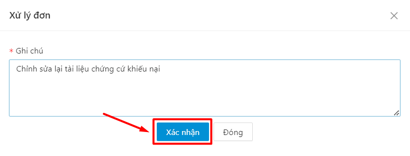
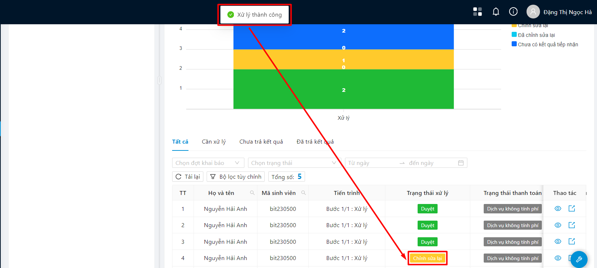

# Dịch vụ hành chính

### Xử lý đơn 

* Bước 1: Người dùng chọn menu Dịch vụ hành chính.

.png>)

* Bước 2: Chọn 1 đơn DVMC chưa được xét duyệt bất kỳ

.png>)

* Bước 3: Thông tin chi tiết đơn hiển thị. Người dùng chọn thao tác **Xử lý** ở cuối mẫu đơn

.png>)

* Bước 4: Điền thông tin ghi chú xử lý, sau đó ấn **Xác nhận**

.png>)

Þ Xử lý đơn thành công, đơn được đổi sang trạng thái **Duyệt**

.png>)

### Yêu cầu chỉnh sửa lại đơn 

* Bước 1: Người dùng chọn menu Dịch vụ hành chính.

.png>)

* Bước 2: Chọn 1 đơn DVMC chưa được xét duyệt bất kỳ

.png>)

* Bước 3: Thông tin chi tiết đơn hiển thị. Người dùng chọn thao tác **Yêu cầu chỉnh sửa** ở cuối mẫu đơn

.png>)

* Bước 4: Điền thông tin ghi chú xử lý đơn, sau đó ấn **Xác nhận**

Þ Yêu cầu chỉnh sửa đơn thành công

