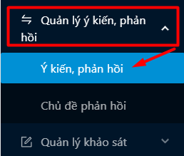
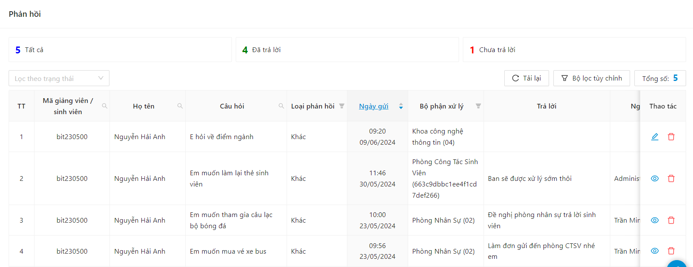
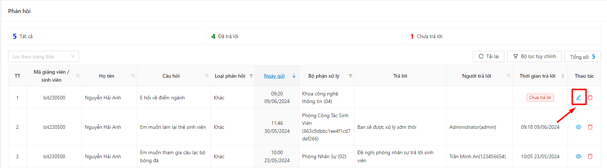
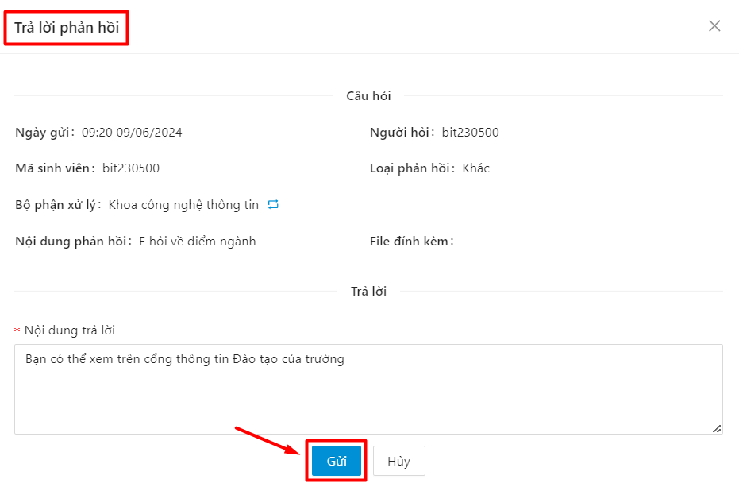
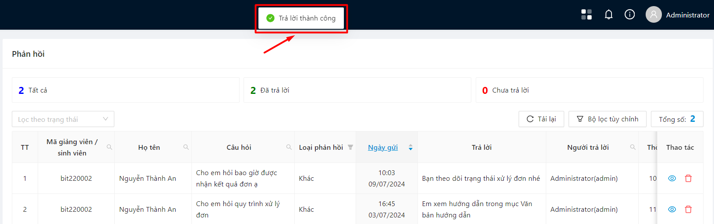
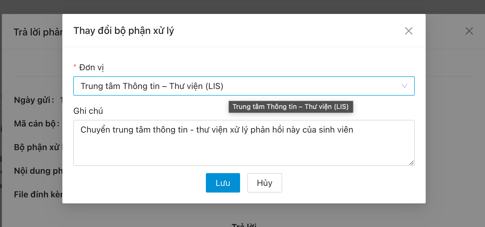

# Phản hồi sinh viên

### Quản lý phản hồi sinh viên 

* Người dùng click vào menu **Quản lý ý kiến, phản hồi**, sau đó chọn **Ý kiến, phản hồi**.

* Hệ thống sẽ hiển thị danh sách tất cả phản hồi cùng thống kê theo trạng thái trả lời. Người dùng có thể lọc theo trạng thái

### Xử lý phản hồi sinh viên 

* Người dùng ấn vào nút  ở cột Thao tác của phản hồi đang ở trạng thái Chưa trả lời. Hoặc sử dụng bộ lọc Chưa trả lời

* Hệ thống hiển thị form trả lời phản hồi. Người dùng nhập nội dung trả lời, sau đó ấn **Gửi**

\=> Trả lời phản hồi thành công

\- Đối với ý kiến phản hồi không thuộc phạm vi xử lý của cán bộ, cán bộ ấn vào nút ở phần hiển thị tên Bộ phận xử lý trong Form trả lời phản hồi để chuyển ý kiến phản hồi cho đơn vị khác xử lý và có thể nhập ghi chú kèm theo.

