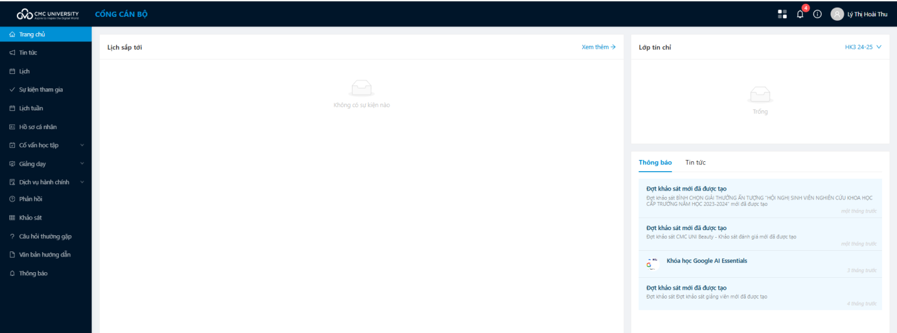
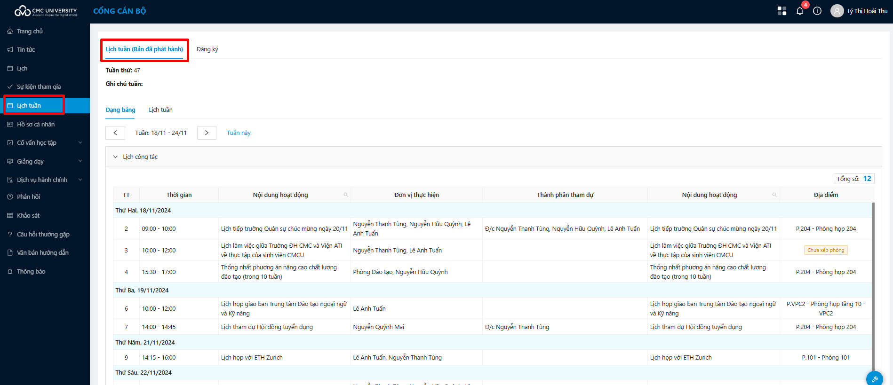
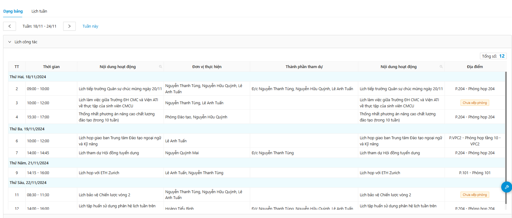
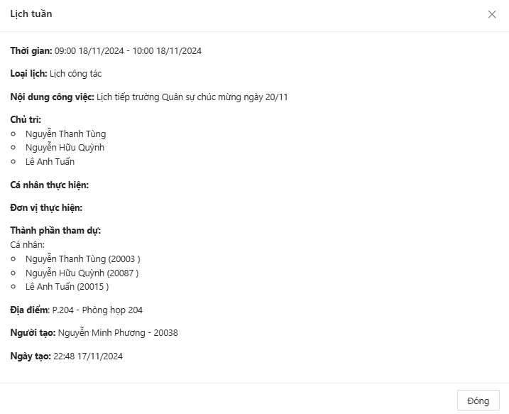
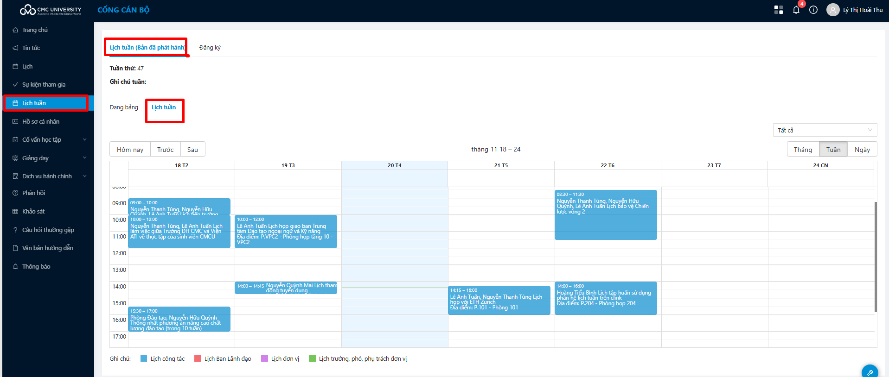
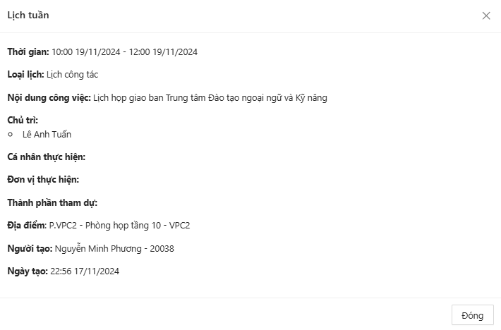
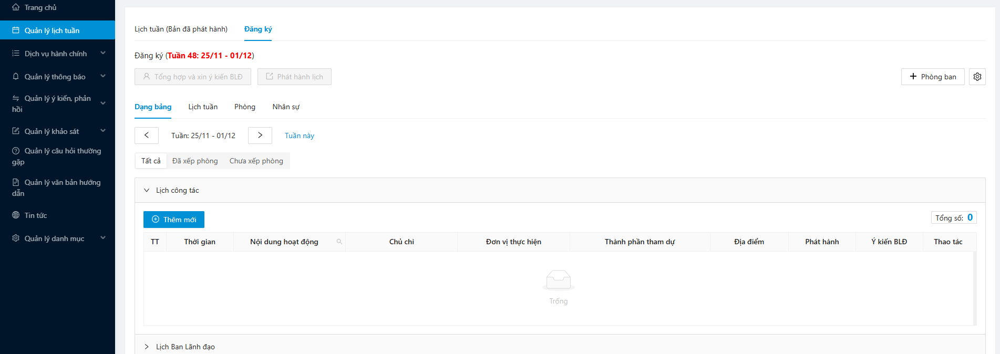
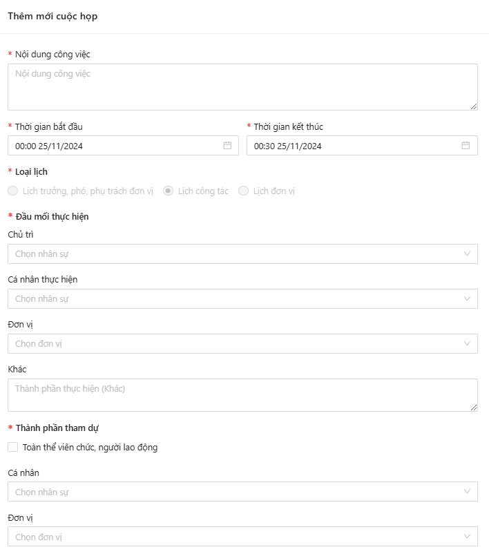
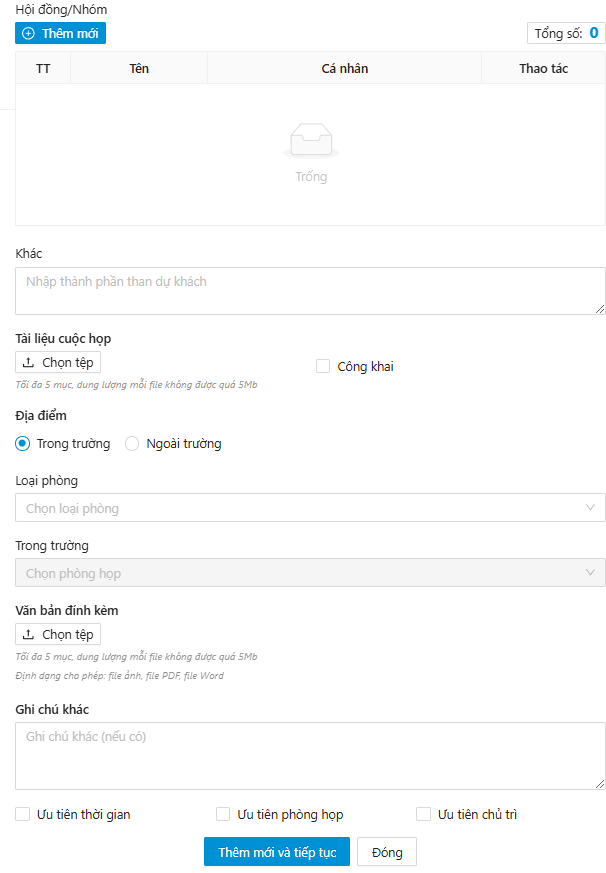

# HDSD LỊCH TUẦN - CBGVNV

## ĐĂNG NHẬP

**Bước 1:** Trước tiên, người dùng truy cập vào link [https://clink.cmcu.edu.vn/-](https://clink.cmcu.edu.vn/-)>Hệ thống hiển thị màn hình đăng nhập.

**Bước 2:** Nhập thông tin tài khoản đăng nhập -> Click **Trường Đại học CMC Office 365** -> Hệ thống đăng nhập thành công cổng cán bộ

## **QUẢN LÝ LỊCH TUẦN**

### **Xem chi tiết lịch đã phát hành**

**Bước 1:** Trong menu **Lịch tuần**, người dùng chọn **Lịch tuần (Bản đã phát hành)**, hệ thống hiển thị màn hình Danh sách lịch tuần trong tuần hiện tại.

Tại đây, hiển thị các loại lịch: Lịch công tác, Lịch Ban Lãnh đạo, Lịch đơn vị, Lịch trưởng, phó, phụ trách đơn vị, Lịch nghỉ

**Bước 2:** Người dùng click vào loại lịch muốn xem danh sách để xem được toàn bộ các lịch. Ví dụ: Lịch công tác

**Bước 3:** Chọn 1 lịch muốn xem chi tiết. Ví dụ: Lịch tiếp trường Quân sự chức mừng ngày 20/11. Hệ thống hiển thị thông tin chi tiết của lịch muốn xem.

### **Xem lịch tuần dạng lịch**

**Bước 1:** Trong menu **Lịch tuần**, người dùng chọn **Lịch tuần (Bản đã phát hành)**. Chọn tab **Lịch tuần**

Hệ thống hiển thị danh sách dạng lịch theo màu sắc các loại lịch, có thể lọc theo các loại lịch

**Bước 2:** Người dùng click vào 1 lịch muốn xem chi tiết. Hệ thống hiển thị chi tiết lịch đã chọn

### **Đăng ký lịch tuần**

**Bước 1:** Trong menu **Quản lý lịch tuần**, người dùng chọn **Đăng ký**

**Bước 2:** Chọn loại lịch muốn đăng ký và click Thêm mới. Hệ thống hiển thị màn hình thêm mới

 

Điền các thông tin:

* **Nội dung công việc (\*):** Tên công việc đăng ký
* **Thời gian bắt đầu (\*)**
* **Thời gian kết thúc (\*)**
* **Loại lịch:** Khi chọn loại lịch nào để thêm mới thì hệ thống tự tích là loại lịch đã thêm mới
* **Đầu mối thực hiện (\*):** Chủ trì/Cá nhân thực hiện/Đơn vị/Khác
* **Thành phần tham dự:** Tất cả nhân sự/Cá nhân/Đơn vị
* **Hội đồng/nhóm:** Thêm nhân sự theo nhóm người
* **Tài liệu cuộc họp**
* **Địa điểm:** Trong trường/Ngoài trường

\+ Với trong trường thì chọn loại phòng -> Chọn phòng theo loại phòng đã chọn

\+ Với ngoài trường: Nhập đại chỉ ngoài trường

* **Văn bản đính kèm**
* **Ghi chú khác**
* **Ưu tiên:** Ưu tiên thời gian/Ưu tiên phòng họp/Ưu tiên chủ trì

_Chú ý: Những trường thông tin (\*) là những trường bắt buộc_

**Bước 3:** Người dùng click **Thêm mới**, hệ thống thêm mới lịch tuần thành công
