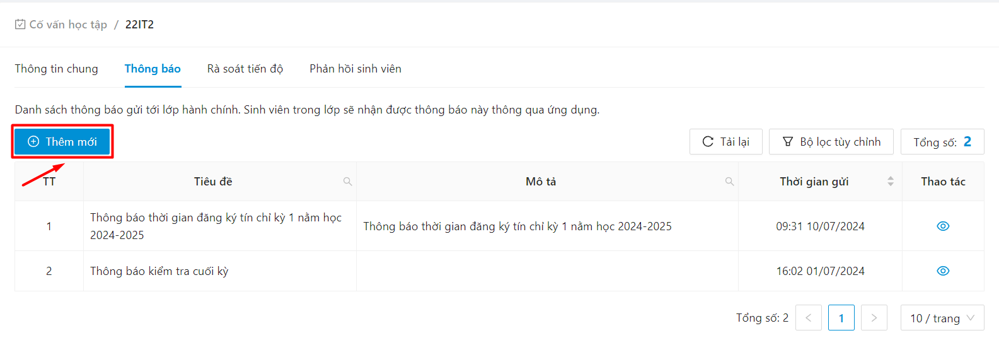
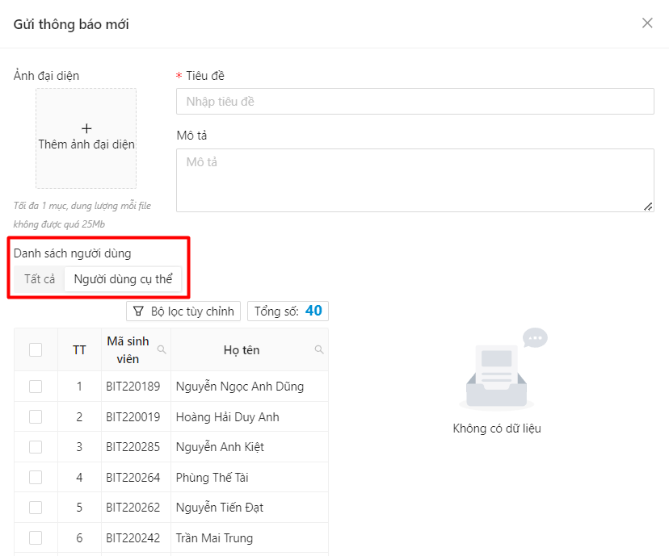
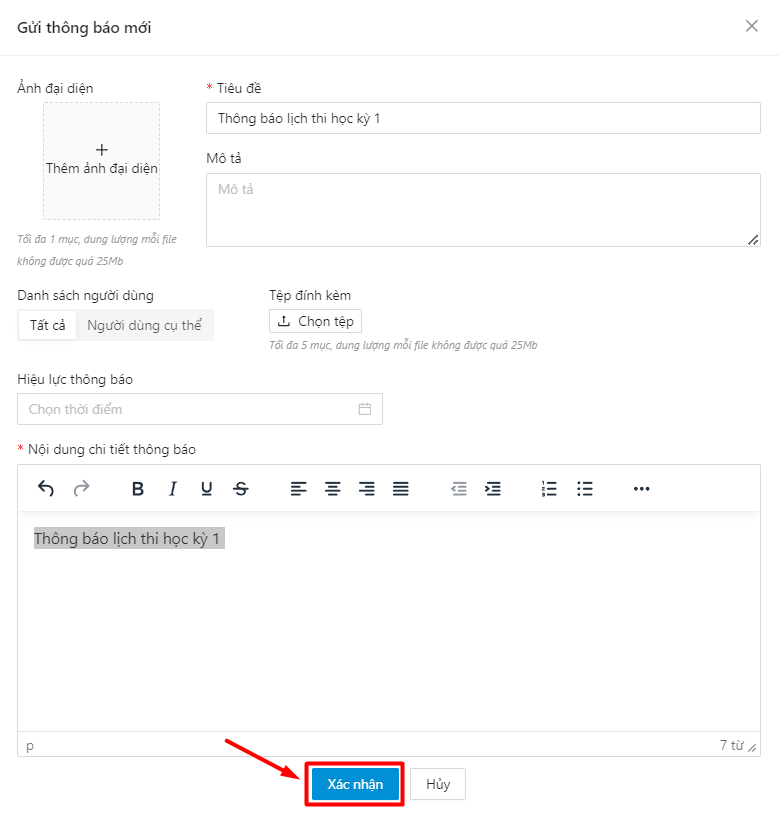
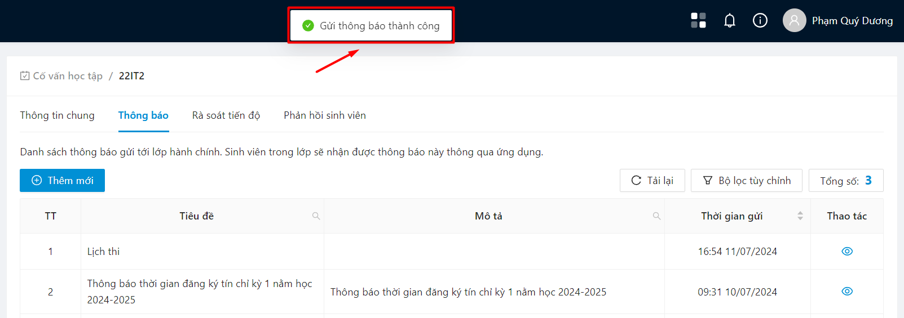
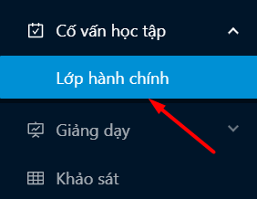
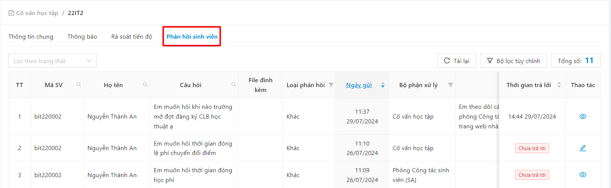
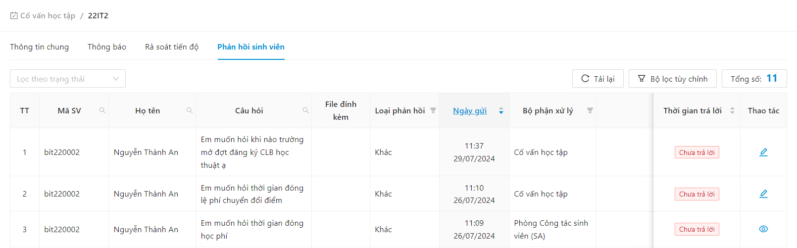
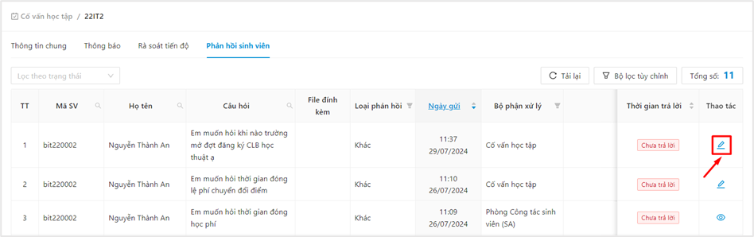

# Cố vấn học tập

### Xem danh sách lớp cố vấn 

* Chọn mục Lớp hành chính

.png>)

* Danh sách các lớp cố vấn hiển thị

.png>)

### Xem thông tin chi tiết lớp 

* Bước 1: Chọn mục Lớp hành chính

.png>)

* Bước 2: Danh sách các lớp cố vấn hiển thị

.png>)

* Bước 3: Chọn 1 lớp cố vấn bất kỳ bất kỳ

.png>)

* Bước 4: Thông tin lớp cố vấn hiển thị

.png>)

### Xem chi tiết thông tin sinh viên 

* Bước 1: Chọn mục Lớp hành chính

.png>)

* Bước 2: Danh sách các lớp cố vấn hiển thị

.png>)

* Bước 3: Chọn 1 lớp cố vấn bất kỳ bất kỳ

.png>)

* Bước 4: Thông tin sinh viên lớp cố vấn hiển thị

.png>)

### Báo cáo kết quả cố vấn 

### Gửi thông báo lớp cố vấn 

* Bước 1: Chọn mục Lớp hành chính

.png>)

* Bước 2: Người dùng chọn lớp cố vấn muốn gửi thông báo

.png>)

* Bước 3: Người dùng chọn biểu tượng Thông báo.

.png>)

* Bước 4: Chọn biểu tượng Thêm mới thông báo

* Bước 5: Màn hình gửi thông báo hiển thị. Cố vấn có thể gửi thông báo tới tất cả SV trong lớp hoặc SV cụ thể trong lớp

* Bước 6: Người dùng nhập nội dung thông báo, sau đó ấn Gửi thông báo

* Bước 7: Gửi thông báo đến lớp cố vấn thành công

### Phản hồi sinh viên 

#### Quản lý phản hồi sinh viên 

* Chọn mục Lớp hành chính

* Người dùng chọn tab Phản hồi sinh viên

* Hệ thống sẽ hiển thị danh sách tất cả phản hồi của sinh viên trong lớp hành chính gửi đến cố vấn học tập cùng thống kê theo trạng thái trả lời

#### Xử lý phản hồi sinh viên 

* Người dùng ấn vào nút  ở cột Thao tác của phản hồi đang ở trạng thái Chưa trả lời. Hoặc sử dụng bộ lọc Chưa trả lời

<figure><figcaption></figcaption></figure>

* Hệ thống hiển thị form trả lời phản hồi. Người dùng nhập nội dung trả lời, sau đó ấn **Gửi**

<figure><figcaption></figcaption></figure>

\=> Trả lời phản hồi thành công

<figure><figcaption></figcaption></figure>

### Danh sách cán sự lớp 

#### Xem danh sách cán sự lớp 

* Chọn mục Lớp hành chính

<figure><figcaption></figcaption></figure>

* Người dùng chọn tab Danh sách cán sự lớp, thông tin danh sách cán sự lớp hiển thị

<figure><figcaption></figcaption></figure>

#### Thêm mới cán sự lớp 

* Bước 1: Người dùng click vào button **Thêm mới**

<figure><figcaption></figcaption></figure>

* Bước 2: Hệ thống hiển thị màn thêm mới. Người dùng điền thông tin học kỳ và cán sự lớp

<figure><figcaption></figcaption></figure>

* Bước 3: Sau đó ấn Thêm mới

<figure><figcaption></figcaption></figure>

⇒ Thêm mới thành công

<figure><figcaption></figcaption></figure>

#### Chỉnh sửa cán sự lớp 

* Bước 1: Người dùng click vào button  ở cột **Thao tác** ở dòng cán sự lớp cần chỉnh sửa thông tin

<figure><figcaption></figcaption></figure>

* Bước &#x32;**:** Hệ thống hiển thị màn chỉnh sửa, người dùng thực hiện chỉnh sửa thông tin

<figure><figcaption></figcaption></figure>

* Bước 3: Sau đó click vào button **Lưu lại**

<figure><figcaption></figcaption></figure>

⇒ Cập nhật thông tin thành công

<figure><figcaption></figcaption></figure>

#### Xóa cán sự lớp 

* Bước 1: Chọn biểu tượng .png>)  ở cuối hàng cán sự lớp muốn xóa

<figure><figcaption></figcaption></figure>

* Bước 2: Xác nhận **OK** để xóa cán sự lớp

<figure><figcaption></figcaption></figure>

* Bước 3: Xóa cán sự lớp thành công

<figure><figcaption></figcaption></figure>
