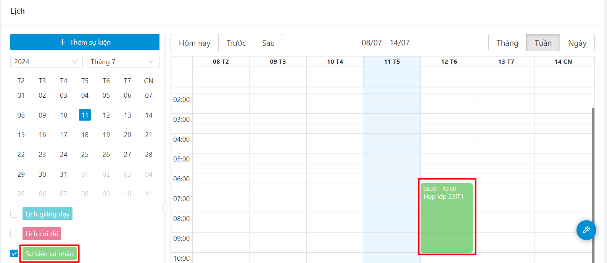
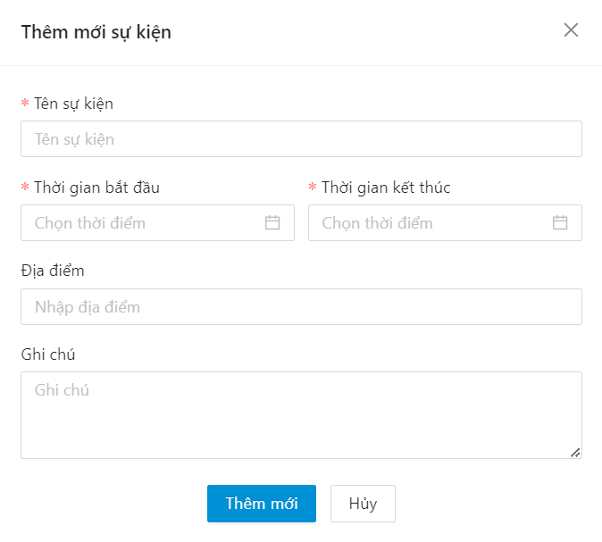
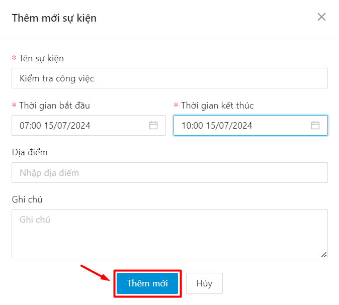
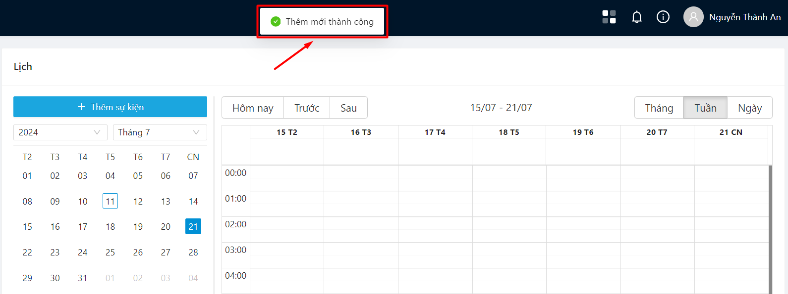

# Lịch

### Xem lịch giảng dạy 

* Người dùng chọn mục Lịch

.png>)

* Thông tin lịch giảng dạy của giảng viên hiển thị

.png>)

### Xem lịch thi 

* Người dùng chọn mục Lịch

.png>)

* Thông tin lịch coi thi của giảng viên hiển thị

.png>)

### Xem sự kiện chung 

* Người dùng chọn mục Lịch

.png>)

* Thông tin sự kiện chung hiển thị

.png>)

### Xem sự kiện cá nhân 

* Người dùng chọn mục Lịch

* Thông tin sự kiện cá nhân hiển thị

### Thêm mới sự kiện cá nhân 

* Bước 1: Người dùng chọn mục Lịch

* Bước 2: Chọn thao tác tạo sự kiện cá nhân

* Bước 3: Màn hình thêm mới sự kiện cá nhân hiển thị

* Bước 4: Người dùng điền các thông tin sự kiện
* Sau khi điền đủ các thông tin, người dùng ấn Thêm mới để lưu thông tin

* Bước 5: Thêm mới lịch cá nhân thành công

