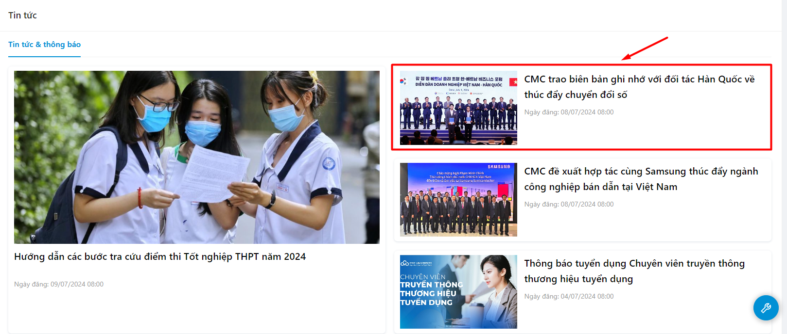
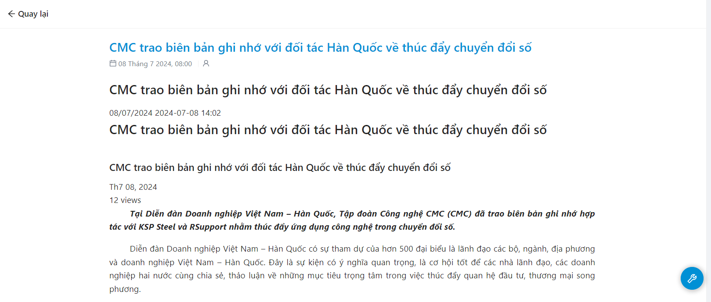

# Tin tức

### Theo dõi thông tin tin tức của nhà trường 

* Bước 1: Người dùng chọn menu Tin tức

.png>)

* Bước 2: Danh sách tin tức hiển thị

.png>)

### Xem thông tin tin tức 

* Bước 1: Người dùng chọn menu Tin tức

.png>)

* Bước 2: Danh sách tin tức hiển thị

.png>)

* Bước 3: Chọn 1 tin tức muốn xem

* Bước 4: Thông tin chi tiết tin tức hiển thị

