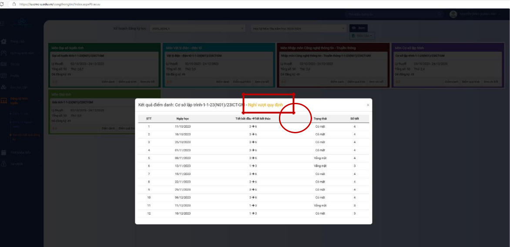
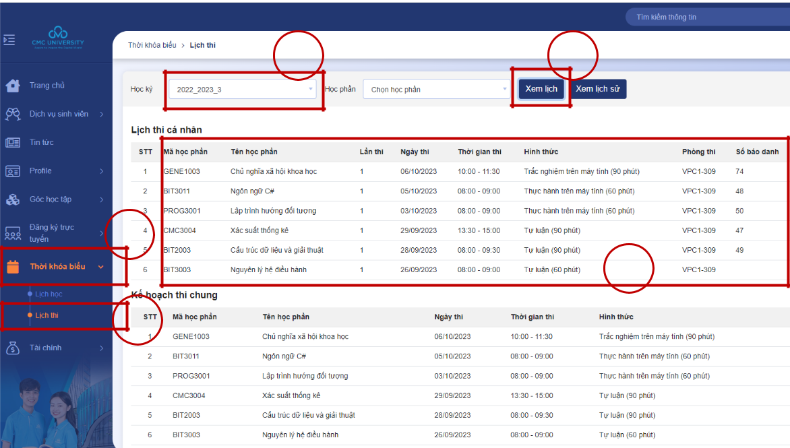

# Hướng dẫn sinh viên tra cứu điều kiện dự thi

## &#x20;Bước 1: Sinh viên truy cập vào tài khoản IU cá nhân

&#x20;

## Bước 2: Thao tác tra cứu điều kiện dự thi kết thúc học phần:

<figure><figcaption></figcaption></figure>

<figure><figcaption></figcaption></figure>

1. Vào phần "Đăng ký học"
2. Chọn **Tra cứu kết quả đăng ký**
3. Chọn **Năm học-Kỳ**
4. Chọ **Học kỳ đăng ký**
5. Chọn **Xem**
6. Chọn **Điểm danh** ở học phần muốn xem
7. Kết quả điều kiện dự thi hiển thị ở dòng đầu tiên

## Bước 3: Thao tác tra cứu thông tin dự thi kết thúc học phần (Phòng thi, SBD, ca thi, buổi thi…):

<figure><figcaption></figcaption></figure>

1. Chọn mục “Thời khóa biểu”
2. Chọn “Lịch thi”
3. Chọn “Học kỳ” tương ứng
4. Bấm “Xem lịch”
5. Khu vực hiển thị các thông tin dự thi

Mọi thắc mắc về điều kiện dự thi và thông tin dự thi sinh viên liên hệ trực tiếp với Phòng Đào tạo (VPC1-210) hoặc gửi qua email: [oaa@cmcu.edu.vn ](mailto:oeqs@cmc-u.edu.vn)trước ngày tổ chức thi 01 ngày để được hỗ trợ giải quyết
