# HDSD LỊCH TUẦN - QUẢN LÝ

## ĐĂNG NHẬP

**Bước 1:** Trước tiên, người dùng truy cập vào link https://clink.cmcu.edu.vn/ -> Hệ thống hiển thị màn hình đăng nhập.

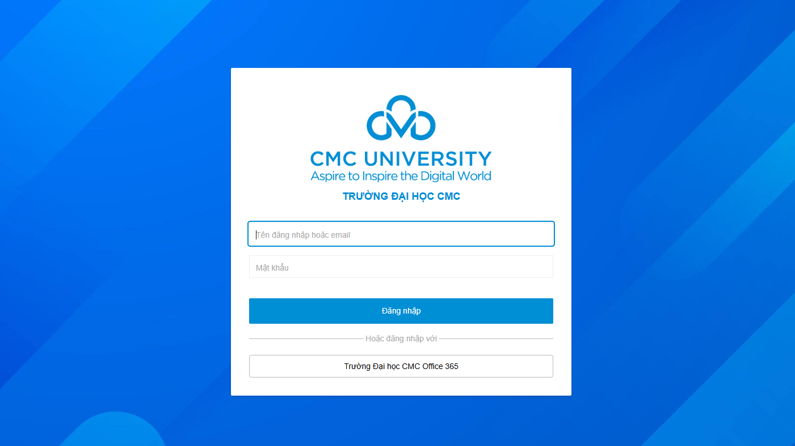

**Bước 2:** Nhập thông tin tài khoản đăng nhập -> Click **Đăng nhập** -> Hệ thống đăng nhập thành công

**Bước 3:** Người dùng truy cập vào phân hệ **Văn phòng điều hành**

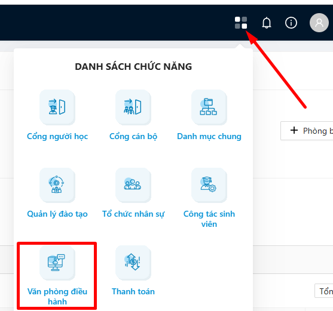

## **VĂN PHÒNG ĐIỀU HÀNH**

### **Xem chi tiết lịch đã phát hành**

**Bước 1:** Trong menu **Quản lý lịch tuần**, người dùng chọn **Lịch tuần (Bản đã phát hành)**, hệ thống hiển thị màn hình Danh sách lịch tuần trong tuần hiện tại.

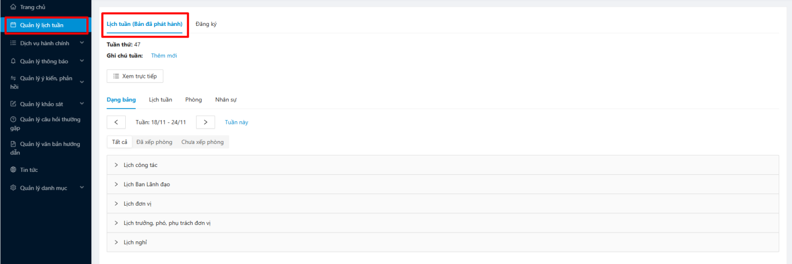

Tại đây, hiển thị các loại lịch: Lịch công tác, Lịch Ban Lãnh đạo, Lịch đơn vị, Lịch trưởng, phó, phụ trách đơn vị, Lịch nghỉ

**Bước 2:** Người dùng click vào loại lịch muốn xem danh sách để xem được toàn bộ các lịch. Ví dụ: Lịch công tác

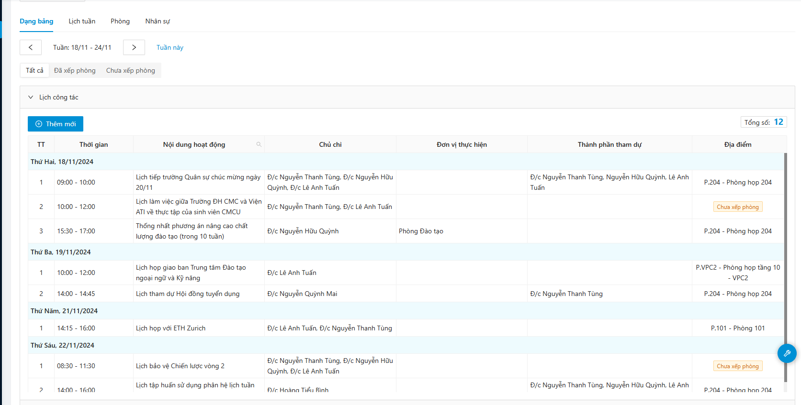

**Bước 3:** Chọn 1 lịch muốn xem chi tiết. Ví dụ: Lịch tiếp trường Quân sự chức mừng ngày 20/11. Hệ thống hiển thị thông tin chi tiết của lịch muốn xem.

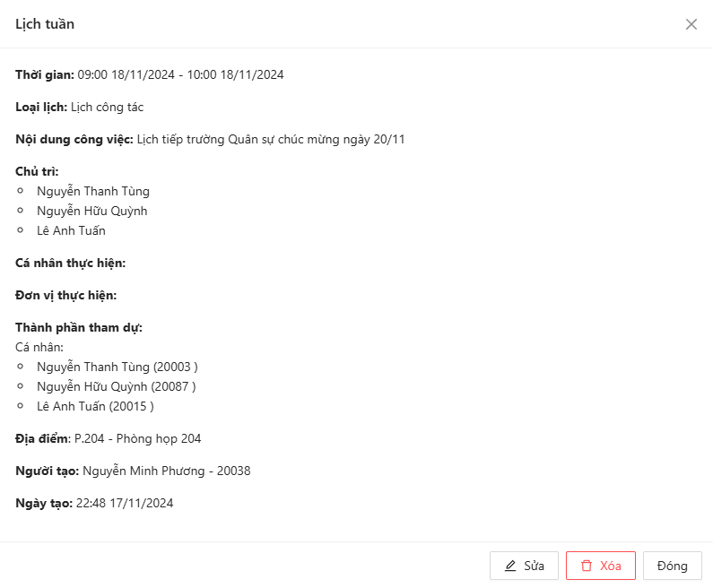

### **Xem trực tiếp lịch tuần**

**Bước 1:** Trong menu **Quản lý lịch tuần**, người dùng chọn **Lịch tuần (Bản đã phát hành)**, hệ thống hiển thị màn hình Danh sách lịch tuần trong tuần hiện tại.

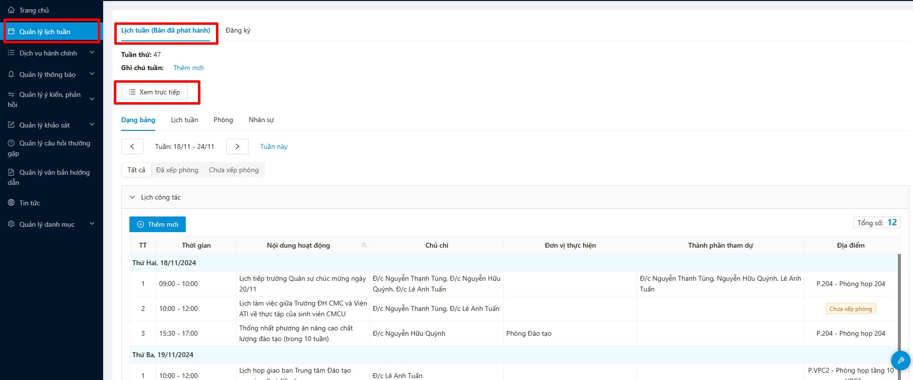

**Bước 2:** Click vào mục **Xem trực tiếp**, hệ thống sẽ chuyển link tới trang lịch tuần công khai. Người dùng có thể xem toàn bộ lịch công khai trong trang đó

### **Xem lịch tuần dạng lịch**

**Bước 1:** Trong menu **Quản lý lịch tuần**, người dùng chọn **Lịch tuần (Bản đã phát hành)**. Chọn tab **Lịch tuần**

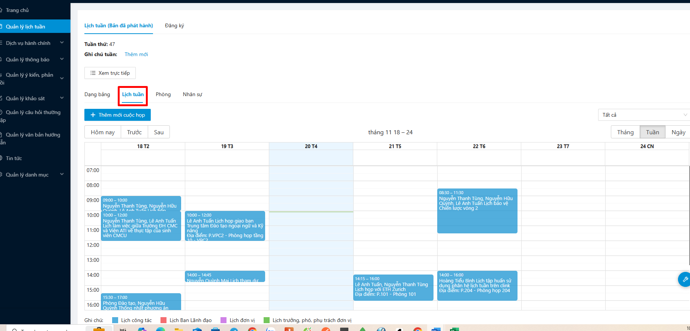

Hệ thống hiển thị danh sách dạng lịch theo màu sắc các loại lịch, có thể lọc theo các loại lịch

**Bước 2:** Người dùng click vào 1 lịch muốn xem chi tiết. Hệ thống hiển thị chi tiết lịch đã chọn

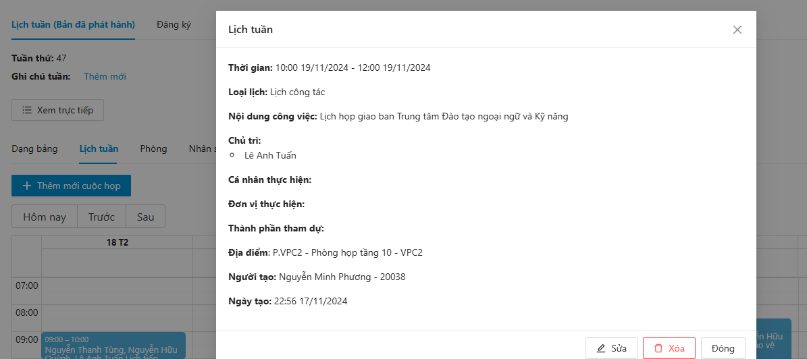

### **Xem lịch theo phòng**

**Bước 1:** Trong menu **Quản lý lịch tuần**, người dùng chọn **Lịch tuần (Bản đã phát hành)**. Chọn tab **Phòng**

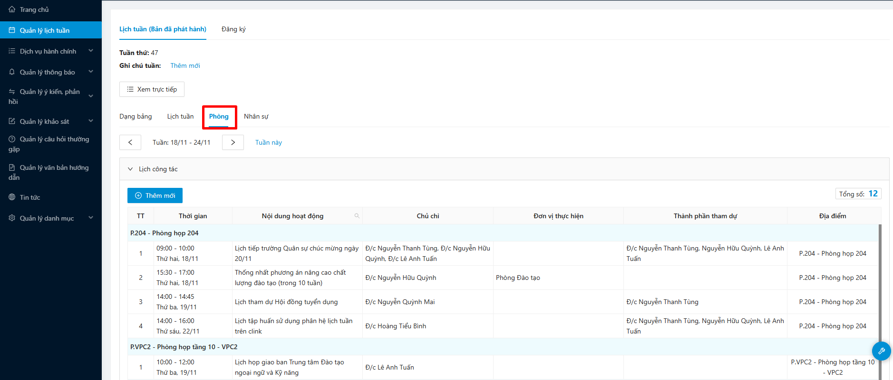

Hệ thống hiển thị danh sách lịch tuần theo phòng họp

**Bước 2:** Người dùng click vào 1 lịch muốn xem chi tiết. Hệ thống hiển thị chi tiết lịch đã chọn

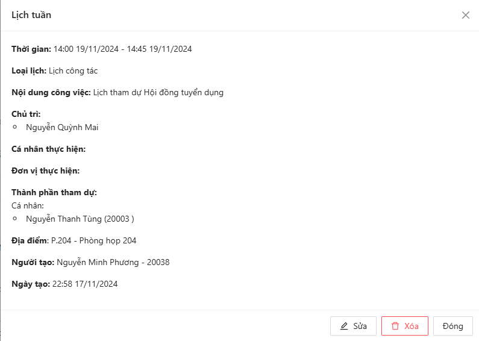

### **Xem lịch theo nhân sự**

**Bước 1:** Trong menu **Quản lý lịch tuần**, người dùng chọn **Lịch tuần (Bản đã phát hành)**. Chọn tab **Nhân sự**

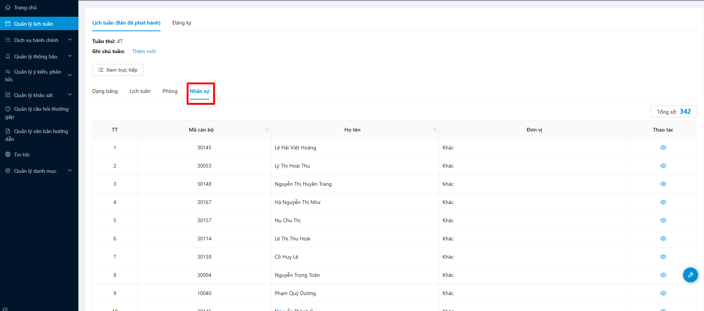

Hệ thống hiển thị danh sách nhân sự của trường.

**Bước 2:** Người dùng click vào 1 cán bộ, hệ thống hiển thị danh sách lịch của cán bộ đó

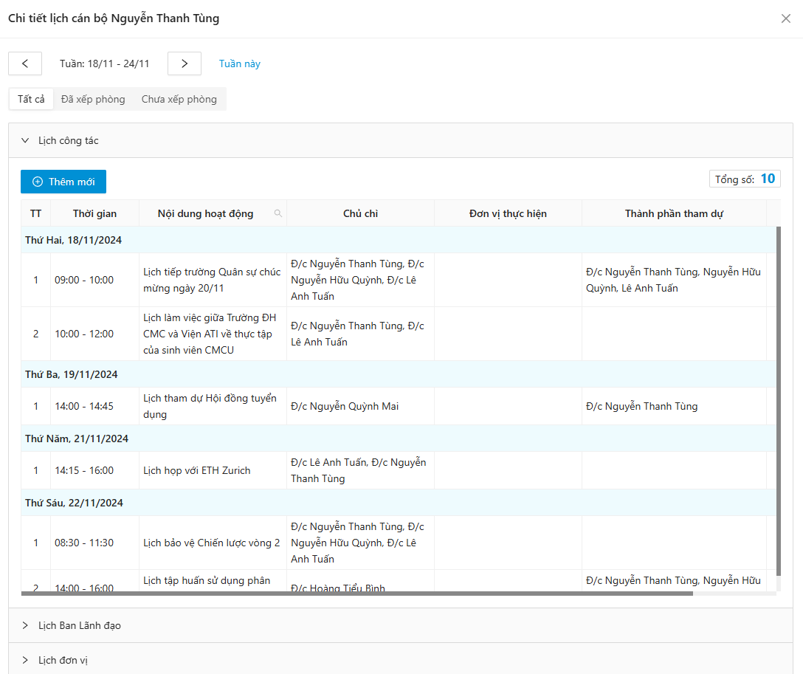

### **Đăng ký lịch tuần**

**Bước 1:** Trong menu **Quản lý lịch tuần**, người dùng chọn **Đăng ký**

**Bước 2:** Chọn loại lịch muốn đăng ký và click Thêm mới. Hệ thống hiển thị màn hình thêm mới

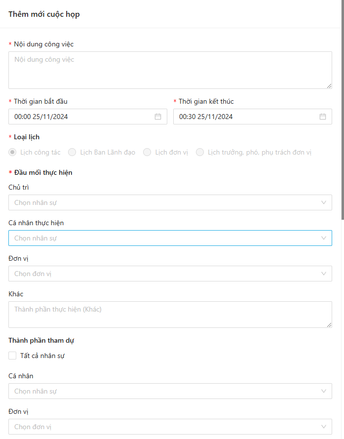 

Điền các thông tin:

* **Nội dung công việc (\*):** Tên công việc đăng ký
* **Thời gian bắt đầu (\*)**
* **Thời gian kết thúc (\*)**
* **Loại lịch:** Khi chọn loại lịch nào để thêm mới thì hệ thống tự tích là loại lịch đã thêm mới
* **Đầu mối thực hiện (\*):** Chủ trì/Cá nhân thực hiện/Đơn vị/Khác
* **Thành phần tham dự:** Tất cả nhân sự/Cá nhân/Đơn vị
* **Hội đồng/nhóm:** Thêm nhân sự theo nhóm người
* **Tài liệu cuộc họp**
* **Địa điểm:** Trong trường/Ngoài trường

\+ Với trong trường thì chọn loại phòng -> Chọn phòng theo loại phòng đã chọn

\+ Với ngoài trường: Nhập đại chỉ ngoài trường

* Văn bản đính kèm
* Ghi chú khác
* Ưu tiên: Ưu tiên thời gian/Ưu tiên phòng họp/Ưu tiên chủ trì

_Chú ý: Những trường thông tin (\*) là những trường bắt buộc_

**Bước 3:** Người dùng click **Thêm mới**, hệ thống thêm mới lịch tuần thành công

### **Xếp phòng trong lịch tuần**

**Bước 1:** Trong danh sách lịch tuần đăng ký, click vào 1 lịch tuần chưa được xếp phòng. Hệ thống hiển thị thông tin lịch tuần

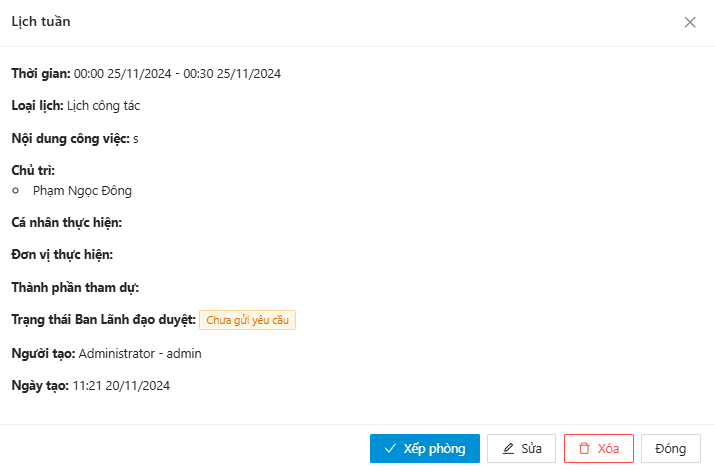

**Bước 2:** Click Xếp phòng, hiển thị màn hình xếp phòng

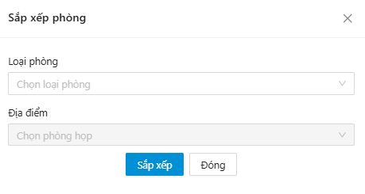

Người dùng chọn loại phòng và phòng thuộc loại phòng đã chọn, tại đây hệ thống sẽ cho người dùng nhìn được thông tin của phòng khi di chuyển chuột tới icon con mắt

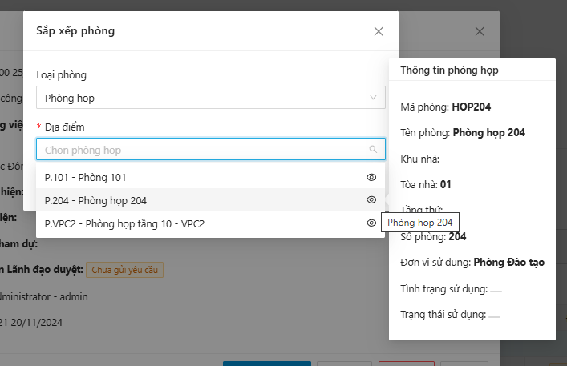

**Bước 3:** Chọn phòng thích hợp và click sắp xếp -> Hệ thống xếp phòng thành công

### **Tổng hợp và xin ký kiến BLĐ**

**Bước 1:** Trong menu **Quản lý lịch tuần**, người dùng chọn **Đăng ký**

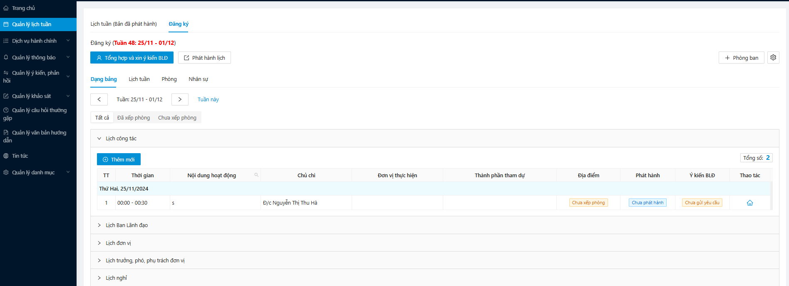

**Bước 2:** Click **Tổng hợp và xin ý kiến BLĐ,** màn hình hiển thị màn xác nhận

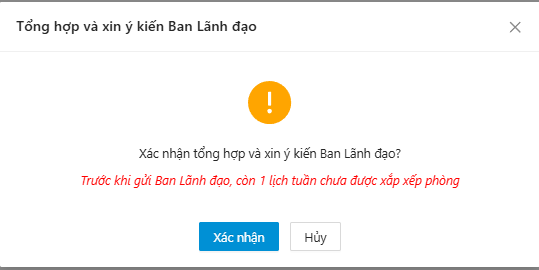

**Bước 3:** Người dùng click xác nhận, hệ thống thông báo gửi xin ý kiến thành công

### **Phát hành lịch**

**Bước 1:** Trong menu **Quản lý lịch tuần**, người dùng chọn **Đăng ký**

**Bước 2:** Click **Phát hành lịch,** màn hình hiển thị màn xác nhận xem trước lịch tuần đã tạo trước khi phát hành

Tại đây, hệ thống hiển thị tất cả các lịch bao gồm, lịch được thêm mới, lịch sửa lại, lịch đã bị xáo để cán bộ xác nhận

**Bước 3:** Click **Phát hành lịch tuần**, hệ thống thông báo phát hành lịch tuần thành công
