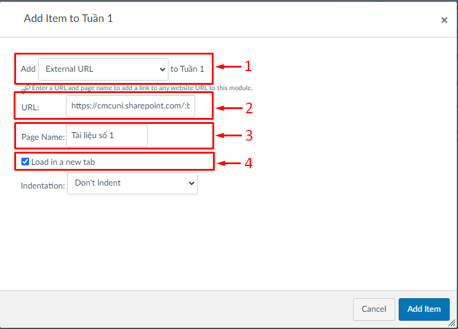

# Hướng dẫn đưa bài giảng lên LMS

<figure><figcaption></figcaption></figure>

<figure><figcaption></figcaption></figure>

Để có thể tối ưu hóa và quản lý tài liệu giảng dạy một cách đồng bộ. Sau đây là các bước thực hiện để có thể đẩy tài liệu lên LMS của giảng viên.

## **1. Trên Sharepoint**

**Bước 1:** Truy cập vào đường dẫn sharepoint sau : [`https://cmcuni.sharepoint.com/`](https://cmcuni.sharepoint.com/)

Chú ý sử dụng tài khoản email của nhà trường cấp để truy cập.

<figure><figcaption></figcaption></figure>

**Bước 2:** Chọn vào "Cán bộ/Giảng viên" để truy cập vào danh sách các phòng ban, khoa của trường.

**Bước 3:** Chọn phòng/ban/khoa phù hợp với phòng/ban/khoa đang công tác.

<figure><figcaption></figcaption></figure>

## **2. Thiết lập trạng thái của tài liệu**

**Bước 1:** Chọn "Document"

**Bước 2:** Chọn vào nút "..." với file mà bạn định chia sẻ

**Bước 3:** Chọn vào "Copy link"

<figure><figcaption></figcaption></figure>

**Bước 4:** Chọn vào "Setting" để thiết lập trạng thái xem của file.

<figure><figcaption></figcaption></figure>

**Bước 5:** Chọn "More settings", chọn "Can view" (chỉ cho người nhận được link có quyền xem, không có quyền sửa). Sau đó chọn "Apply", thông báo sẽ hiển thị thành công như hình dưới.

<figure><figcaption></figcaption></figure>

Lúc này đã copy được đường dẫn của file cần chia sẻ với trạng thái xem.

## 3. Truy cập LMS

Truy cập vào lớp học của giảng viên được phân công trên LMS.

**Bước 1:** Tạo module tương ứng với các học phần của sinh viên <mark style="color:red;">(1)</mark>. Sau đó chọn "+" để thêm tài liệu vào học phần tương ứng <mark style="color:red;">(2).</mark>

<figure><figcaption></figcaption></figure>

## 4. Tạo Item sử dụng URL

**Bước 2:** Tại "Add" chọn External URL <mark style="color:red;">(1)</mark>.

"URL" điền đường dẫn vừa copy tại SharePoint <mark style="color:red;">(2)</mark>.

"Page Name" điền tên học phần mà giảng viên muốn để <mark style="color:red;">(3)</mark>.

"Load in new tab" chọn trạng thái này để mở tab mới khi sinh viên click vào tài liệu <mark style="color:red;">(4)</mark>.

Sau đó chọn "Add Item".

<figure><figcaption></figcaption></figure>

**Bước 3:** Chọn "Publish" để đẩy tài liệu lên cho sinh viên có thể xem.&#x20;

<figure><figcaption></figcaption></figure>

Khi cả 2 trạng thái đều có tích xanh, tài liệu đã được công bố cho sinh viên.

<figure><figcaption></figcaption></figure>
