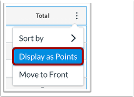

# Hướng dẫn cách hiển thị Tổng điểm trong Cột Tổng điểm

Theo mặc định, Canvas hiển thị Tổng điểm trong sổ điểm của giảng viên và chế độ xem điểm của sinh viên dưới dạng phần trăm. Nếu khóa học có các nhóm bài tập không được thiết lập trọng số thì điểm của những bài tập đó có thể hiển thị dưới dạng điểm.

_<mark style="color:red;">Lưu ý: Nếu giảng viên sử dụng nhóm bài tập có trọng số, tổng điểm chỉ có thể được hiển thị dưới dạng phần trăm</mark><mark style="color:yellow;">.</mark>_

<figure><figcaption></figcaption></figure>

Để hiển thị Tổng điểm dưới dạng điểm, hãy chuyển đến trang "Sổ điểm" (Grades)

<figure><figcaption></figcaption></figure>

Trong phần tiêu đề cột Tổng số điểm, nhấp vào biểu tượng tùy chỉnh (dấu ba chấm) và chọn "Hiển thị dưới dạng điểm"

<figure><figcaption></figcaption></figure>

Hộp Cảnh báo Canvas sẽ hiển thị trên màn hình.

Đọc cảnh báo và nhấp vào 'Tiếp tục"&#x20;

<figure><figcaption></figcaption></figure>

Tổng số điểm sẽ hiển thị:

<figure><figcaption></figcaption></figure>

Để quay lại xem tổng số điểm bằng %, nhấp vào biểu tượng tùy chỉnh (dấu ba chấm) trong tiêu đề cột và chọn "Hiển thị dưới dạng Phần trăm"

<figure><figcaption></figcaption></figure>
