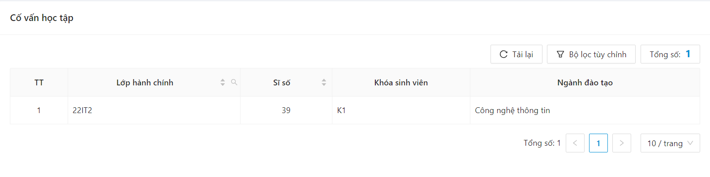
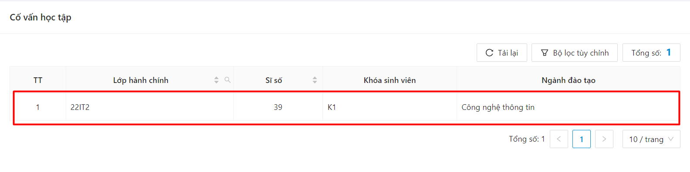
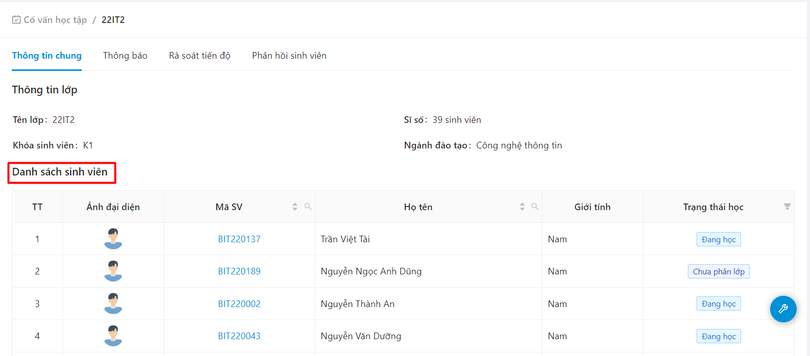

# Cố vấn học tập

### Xem danh sách lớp cố vấn 

* Chọn mục Lớp hành chính

.png>)

* Danh sách các lớp cố vấn hiển thị

.png>)

### Xem thông tin chi tiết lớp 

* Bước 1: Chọn mục Lớp hành chính

.png>)

* Bước 2: Danh sách các lớp cố vấn hiển thị

.png>)

* Bước 3: Chọn 1 lớp cố vấn bất kỳ bất kỳ

.png>)

* Bước 4: Thông tin lớp cố vấn hiển thị

.png>)

### Xem chi tiết thông tin sinh viên 

* Bước 1: Chọn mục Lớp hành chính

.png>)

* Bước 2: Danh sách các lớp cố vấn hiển thị

* Bước 3: Chọn 1 lớp cố vấn bất kỳ bất kỳ

* Bước 4: Thông tin sinh viên lớp cố vấn hiển thị

