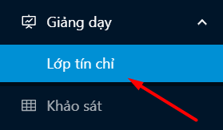
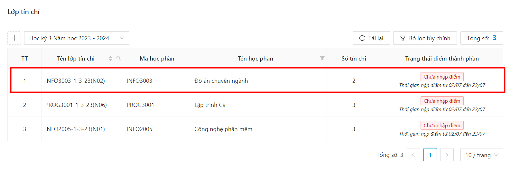
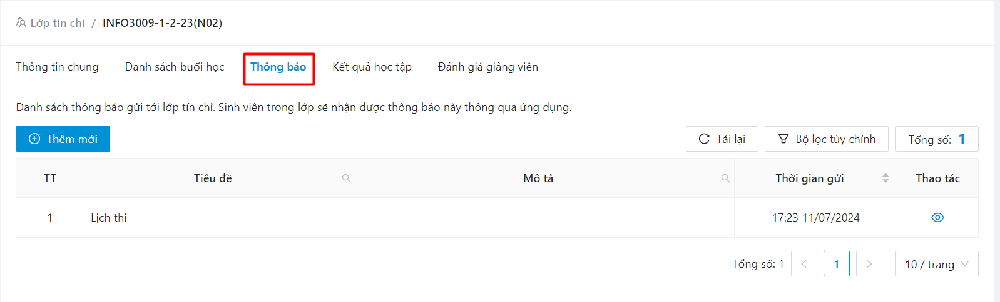
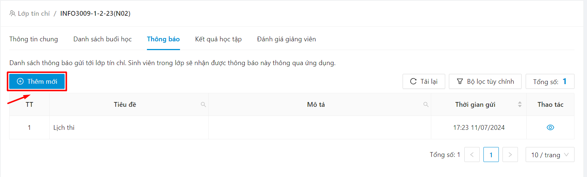
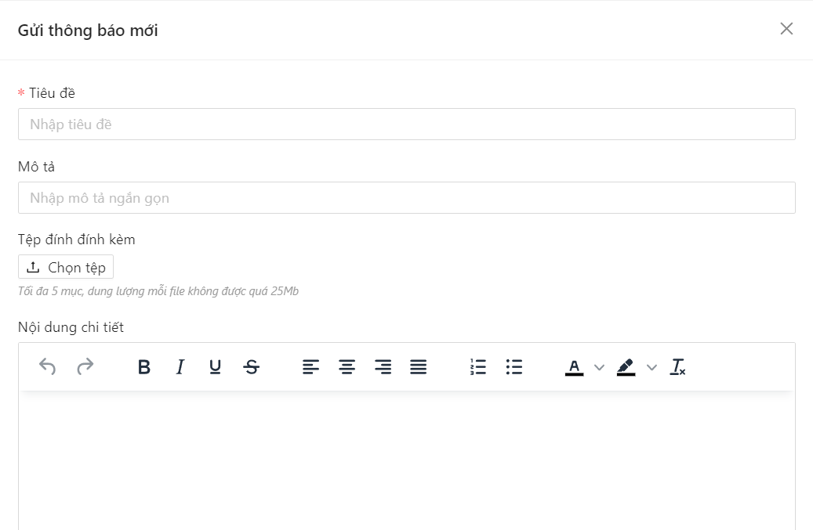
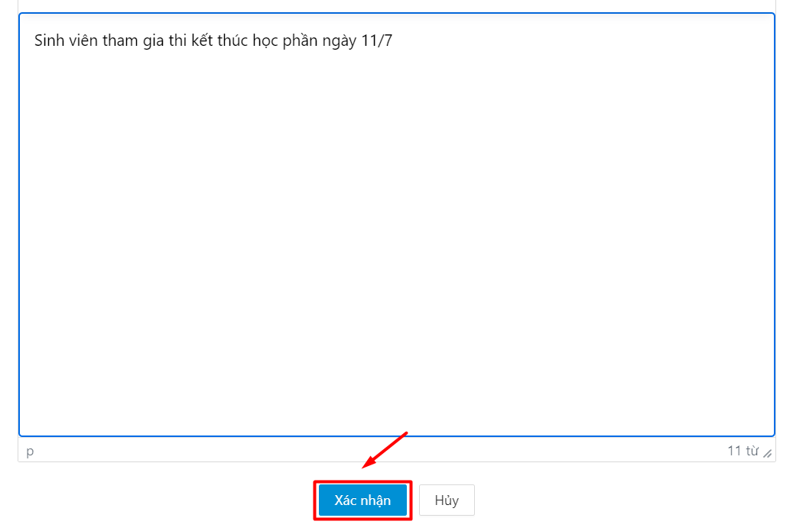
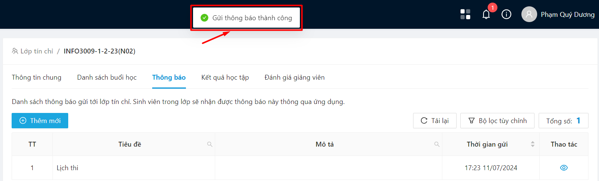

# Gửi thông báo lớp giảng dạy

* Bước 1: Chọn mục Lớp tín chỉ

* Bước 2: Người dùng chọn lớp giảng dạy muốn gửi thông báo

* Bước 3: Người dùng chọn biểu tượng Thông báo.

* Bước 4: Chọn biểu tượng Thêm mới thông báo

* Bước 5: Màn hình gửi thông báo hiển thị

* Bước 6: Người dùng nhập nội dung thông báo, sau đó ấn Gửi thông báo

* Bước 7: Gửi thông báo đến lớp giảng dạy thành công

