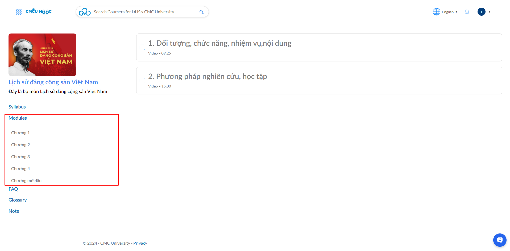

# Welcome

**Bước 1: Truy cập vào LMS** ([https://lms.cmc-u.edu.vn](https://lms.cmc-u.edu.vn))

<figure><figcaption>
Màn hình chính của hệ thống LMS
</figcaption></figure>

**Bước 2: Chọn khóa học cần tham gia học**&#x20;

Khóa học cần tham gia có tên : [Lịch sử Đảng Cộng sản Việt Nam-1-1-24(N01)/(22IT1+22IT2)](https://lms.cmc-u.edu.vn/courses/1083)&#x20;

<figure><figcaption>
Lựa chọn khóa học tương ứng
</figcaption></figure>

**Bước 3: Lựa chọn danh mục bài học để bắt đầu học tập**

Lưu ý : Các bài học sẽ được mở theo tuần hoặc đồng thời và bắt buộc hoàn thành toàn bộ.

Cần tuân thủ thứ tự để học tập và tiếp thu kiến thức một cách hiệu quả.

<figure><figcaption>
Màn hình tranh chủ của lớp học
</figcaption></figure>

<figure><figcaption>
Thông tin liên quan đến học tập cần chú ý
</figcaption></figure>

**Bước 4 : Chọn các bài học**

4.1 Tài liệu : Các tài liệu môn học sẽ được cung cấp dưới dạng PDF, sinh viên có thể lấy thông tin truy cập từ trong LMS và có cấu trúc dưới dạng : "Tài liệu : ......". Tài liệu chỉ cung cấp cho các sinh viên trường Đại học CMC.

<figure><figcaption>
Tài liệu
</figcaption></figure>

4.2 Video tương tác : Video tương tác sẽ được đặt dưới tài liệu (Triển khai trên hệ thống MOOC)

<figure><figcaption>
Video tương tác
</figcaption></figure>

4.3 Hỗ trợ và thảo luận : Sinh viên có thể nêu các vấn đề cần trao đổi cùng giáo viên hoặc thảo luận cùng các bạn học

<figure><figcaption>
Thảo luận
</figcaption></figure>

**Bước 5 : Tham gia học trực tuyến**

Khi chọn video tương tác trên hệ thống LMS, sinh viên sẽ được chuyển sang hệ thống học trực tuyến MOOC

<figure><figcaption>
Lựa chọn học hiệu
</figcaption></figure>

<figure><figcaption>
Màn hình đăng nhập hệ thống MOOC
</figcaption></figure>

Tại đây sinh viên cần sử dụng tài khoảng office 365 do nhà trường cung cấp để truy cập và lưu kết quả học tập.

Nếu sinh viên có trong kế hoạch học tập sẽ được chuyển đến màn hình chính của MOOC

<figure><figcaption>
Màn hình chính hệ thống MOOC
</figcaption></figure>

Nếu chưa có trong kế hoạch học tập sẽ hiển thị thông báo : Email chưa có trên hệ thống. Vui lòng kiểm tra lại email hoặc liên hệ quản trị viên.

<figure><figcaption>
Thông báo tài khoản chưa có trong hệ thống
</figcaption></figure>

**Bước 6 : Thông tin môn học**

<figure><figcaption>
Thông tin môn học
</figcaption></figure>

1 : Tên môn

2 : Nhóm môn

3 : Tỉ lệ hoàn thành bài học của sinh viên&#x20;

**Bước 7 : Thông tin chi tiết môn học**

Màn hình chính&#x20;

<figure><figcaption>
Thông tin chi tiết học phần
</figcaption></figure>

<figure><figcaption>
Thông tin các Module học tập
</figcaption></figure>

<figure><figcaption>
Thông tin FAQ - Câu hỏi thường gặp
</figcaption></figure>

<figure><figcaption>
Thông tin Từ điển thuật ngữ
</figcaption></figure>

**Bước 8 : Học tập**

<figure><figcaption>
Học tập
</figcaption></figure>

1 : Lựa chọn module cần học tập

2 : Thông tin tiết học tương ứng với module. Lựa chọn tiết học tương ứng để tham gia học tập

<figure><figcaption>
Màn hình học tập
</figcaption></figure>

<mark style="color:red;">Lưu ý : Lần đầu tiên khi lựa chọn tiết học cần cấp quyền cho phép sử dụng camera, điều này giúp xác nhận thông tin sinh viên trong quá trình học tập.</mark>

<figure><figcaption>
Cấp quyền sử dụng camera cho hệ thống
</figcaption></figure>

**Thông tin ghi nhận học tập : Với mỗi bài học được xác nhận, hệ thống sẽ hiển thị tích xanh giúp sinh viên xác nhận được nội dung.** 

<figure><figcaption>
Thông tin hoàn thành
</figcaption></figure>

**Kết quả học tập sẽ được tổng hợp từ 2 hệ thống LMS và MOOC.**

