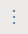
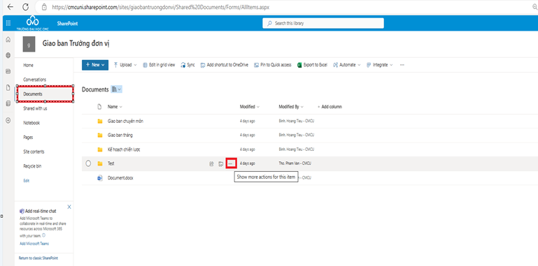

# HƯỚNG DẪN SỬ DỤNG SHAREPOINT

## **HƯỚNG DẪN SỬ DỤNG SHAREPOINT**

## **I. GIỚI THIỆU**

### 1. Đăng nhập vào hệ thống SharePoint Trường

#### Bước 1: Link truy cập : [https://intranet.cmcu.edu.vn/](https://intranet.cmc-u.edu.vn/) hoặc https://cmcuni.sharepoint.com/sites/CMCUIntranet/

#### Bước 2: Người sử dụng (NSD) đăng nhập bằng cách sử dụng Email được nhà trường cung cấp ( đối với NSD đã đăng nhập hệ thống Email trước trên web bỏ qua bước này)

#### Bước 3: Nhập mật khẩu

### 2. Giấy thiệu về SharePoint

#### Trên SharePoint của trường (Portal nội bộ/Intranet) có các tính năng cơ bản như sau :

\- Quản lý và chia sẻ tài liệu theo phạm vi: toàn trường, đơn vị phòng/ban/khoa, công đoàn, hội sinh viên, câu lạc bộ.&#x20;

\- Chia sẻ thông tin, cập nhật tin tức về trường CMC, tập đoàn CMC&#x20;

\- Xem, chia sẻ báo cáo Power BI&#x20;

\- Chia sẻ các liên kết nhanh đến các hệ thống trong toàn trường (QLĐT, thư viện, LMS, SF4C...)&#x20;

## **II. HƯỚNG DẪN SỬ DỤNG CHI TIẾT**

### Người sử dụng (NSD) truy cập các site SharePoint của phòng ban mình ở mục các đơn vị hoặc C-Share (hoặc đúng site SharePoint được cấp quyền)

### Chọn Documents ( tài liệu )

### Tạo thư mục hoặc tạo File word/excel chọn New 🡺 Folder/Word/Excel…🡺 Ở Create a folder 🡺 Đặt tên cho folder muốn tạo 🡺 Create

### Upload file hoặc Folder lên SharePoint: Chọn Upload 🡺 Chọn File/Folder/Template 🡺 Chọn tài liệu muốn upload lên ( lưu ý chọn đúng đường dẫn đang lưu file/folder để ở máy tính các nhân) 🡺 Chọn Open

### Xóa file/folder : Chọn file/folder muốn xóa 🡺 Chọn chuột phải 🡺 Chọn Delete

### Di chuyển file/folder: Chọn file/folder muốn di chuyển 🡺 Chọn chuột phải 🡺 Chọn Move to 🡺 Di chuyển đến folder mới 🡺 Chọn Move here

### Share file hoặc folder cho người ngoài phòng ban

#### Trong giao diện SharePoint Online, mục Document, chọn dữ liệu muốn chia sẻ để các thành viên trong và ngoài tổ chức có thể cùng truy cập và chỉnh sửa 🡪 chọn dấu 3 chấm như hình dưới

#### Chọn Share

#### Chọn biểu tượng Setting như hình dưới

#### Trong mục Share settings:

* Share the link with: Chọn đối tượng được chia sẻ dữ liệu
* Can edit: Chọn quyền muốn chia sẻ
* MM/DD/YYYY: Chọn thời gian giới hạn của đường link cần chia sẻ
* Set password: Đặt mật khẩu cho đường link chia sẻ

Chọn Apply để lưu cấu hình

#### Nhập tên Email của người dùng cần chia sẻ dữ liệu và chọn Send để gửi mail chia sẻ.

#### Ngoài ra, ta còn có thể chọn Copy link để copy link chia sẻ và gửi cho người nhận.

### Download File/Folder về máy tính cá nhân

#### Chọn thư mục muốn Download về máy tính cá nhân 🡺 chọn biểu tượng  🡺 chọn Download

#### Chọn thư mục muốn lưu file 🡺 chọn Save

### Khôi phục lai version cũ của một file

#### Chọn file muốn khôi phục lại các version cũ hơn, nhằm khôi phục dữ liệu 🡺 chọn biểu tượng  như hình dưới

#### Chọn Version history

#### Chọn version của File muốn thực hiện khôi phục 🡺 chọn biểu tượng  🡺 chọn Restore

#### Khôi phục lai file đã xóa

#### Trong giao diện OneDrive cá nhân trên Web 🡺 chọn Recycle bin

#### Chọn File muốn thực hiện khôi phục 🡺 chọn Restore

## **III.HƯỚNG DẪN SỬ DỤNG PHÂN QUYỀN TRÊN SHAREPOINT**

### Trong giao diện SharePoint Online, mục Document, chọn dữ liệu muốn phân quyền để các thành viên trong tổ chức có thể cùng truy cập và chỉnh sửa 🡪 chọn dấu 3 chấm như hình dưới

<figure><figcaption></figcaption></figure>

### Chọn Manage access

<figure><figcaption></figcaption></figure>

### Trong Manage access chọn biểu tượng  🡺Chọn Advanced settings

<figure><figcaption></figcaption></figure>

### Ở mục phần quyền 🡺 Chọn Stop Inheriting Permissions 🡺Chọn OK

<figure><figcaption></figcaption></figure>

#### Trong mục Permissions 🡺 Chọn để xóa hết các phần quyền mặc định: Members, Owenrs,Vistiors 🡺 Remove User Permissions 🡺 Chọn Ok

<figure><figcaption></figcaption></figure>

#### Trong mục Permissions 🡺 Chọn Grant Permissions

<figure><figcaption></figcaption></figure>

#### Chọn Invite People:  Enter names or email addresses đánh tên tài khoản Email

<figure><figcaption></figcaption></figure>

#### Chọn show options: Chọn Share everything in this folder, even items with unique permissions

<figure><figcaption></figcaption></figure>

#### Chọn Select a permission level chọn 1 trong 2 phân quyền sau

#### Edit: Có quyền chỉnh sửa

#### Read: Chỉ có quyền đọc

#### Chọn Share để hoàn thành phần quyền

#### Phần phân quyền có thể tham khảo videos dưới này: [https://youtu.be/IenF5\_JqvZY](https://youtu.be/IenF5_JqvZY)
