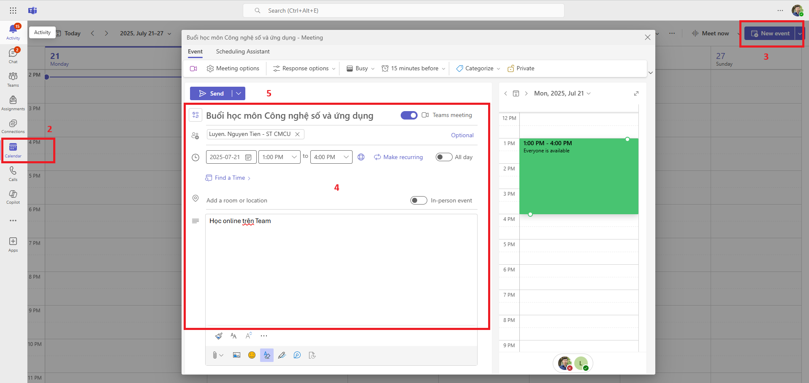

# Hướng dẫn sử dụng Microsoft Team

### 🎓 **Dành cho Giảng viên: Tạo cuộc họp với sinh viên**

#### ✅ **Cách 1: Tạo cuộc họp từ Lịch trong Microsoft Teams**

1. **Mở ứng dụng Microsoft Teams** trên máy tính hoặc trình duyệt.
2. Chọn **Lịch (Calendar)** ở thanh bên trái.
3. Nhấn **+ Cuộc họp mới (New Meeting), Chọn Teams meeting**
4. Nhập thông tin:
   * **Tiêu đề**: Ví dụ “Buổi học môn Công nghệ số và ứng dụng”
   * **Người tham gia**: Nhập email sinh viên hoặc nhóm lớp (nếu có nhóm lớp đã tạo trong Teams) hoặc có thể bỏ qua.
   * **Thời gian**: Chọn ngày và giờ bắt đầu/kết thúc buổi học.
   * **Chi tiết**: Ghi chú nội dung buổi học, tài liệu cần chuẩn bị, v.v.
5. Nhấn **Lưu(Save) hoặc Gửi (Send)** — sinh viên sẽ nhận được lời mời qua email và trong Teams.

<figure><figcaption></figcaption></figure>

***

#### ✅ **Cách 2: Tạo cuộc họp từ Nhóm lớp học (Class Team)**

Nếu giảng viên đã tạo **nhóm lớp học** trong Teams:

* Vào nhóm lớp học trong Teams (Ví dụ Tin học đại cương).

<figure><figcaption></figcaption></figure>

* Chọn tab **Bài đăng (Posts)**.
* Nhấn vào biểu tượng **camera** → chọn **Cuộc họp ngay (Meet now)** hoặc **Lên lịch cuộc họp (Schedule a meeting)**.

<figure><figcaption></figcaption></figure>

* Nhập thông tin và nhấn **Gửi** — tất cả thành viên trong nhóm sẽ thấy thông báo.

Trong cuộc họp/buổi học, giảng viên có thể bật chế độ ghi âm bằng cách chọn Record and transcribe/Start recording, sau đó chọn ngôn ngữ và chọn **Confirm** để bắt đầu ghi âm bài học

<figure><figcaption></figcaption></figure>

Trong quá trình học/họp, để cho phép sinh viên/người tham dự có thể trình bày slide, chia sẻ màn hình, giáo viên có thể chọn **More\Setting\Meeting Option\Roles**, sau đó chọn đối tượng được trình bày và chọn **Apply**

<figure><figcaption></figcaption></figure>

***

### 👩‍🎓 **Dành cho Sinh viên: Cách tham gia cuộc họp**

1. **Mở Microsoft Teams** trên máy tính hoặc điện thoại.
2. Vào mục **Lịch (Calendar)** hoặc **Nhóm lớp học**.
3. Nhấn vào cuộc họp đã được lên lịch → chọn **Tham gia (Join)**.
4. Kiểm tra micro, camera → nhấn **Tham gia ngay (Join now)**.

📌 **Lưu ý**:

* Sinh viên nên đăng nhập bằng tài khoản trường để nhận lời mời.
* Giảng viên gửi link qua email hoặc LMS (https://lms.cmcu.edu.vn), sinh viên chỉ cần nhấn vào link để tham gia. Để copy đường link họp, chọn **More\Meeting Info**, sau đó thực hiện **Copy join info**

<figure><figcaption></figcaption></figure>

### Hướng dẫn lấy file ghi âm cuộc họp trên microsoft teams (web) trong microsoft 365

#### &#x20;Cuộc họp không diễn ra trong kênh Teams (meeting thường)

> &#x20;File ghi âm được lưu vào **OneDrive của người ghi** cuộc họp.

**Các bước:**

1. Truy cập: https://portal.office.com → đăng nhập tài khoản M365 tổ chức.
2. Chọn biểu tượng APP (Ứng Dụng)  → One driver .
3. Vào Tập tin của tôi chọn Recordings:
4. Tại đây sẽ có file `.mp4` với tên dạng:
5. Bạn có thể:
   * **Tải xuống**
   * **Chia sẻ** cho người khác
   * **Phát lại trực tiếp trên web**

> &#x20;Lưu ý: Nếu bạn **không phải người ghi**, bạn vẫn có quyền truy cập nếu bạn **tham dự cuộc họp đó**, vì OneDrive sẽ tự chia sẻ file cho người tham giam
