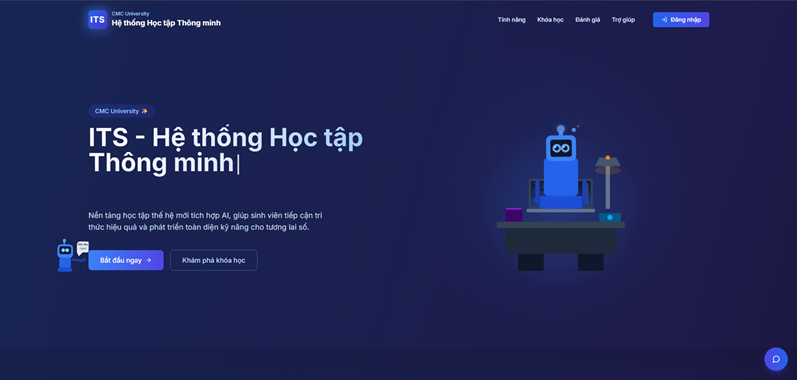

# II. Hướng dẫn sử dụng

1. **Màn hình giới thiệu**

<figure><figcaption>
Trang chủ hệ thống ITS 
</figcaption></figure>

Bước 1: Mở trình duyệt bạn đang sử dụng và truy cập vào địa chỉ: [https://its.cmcu.edu.vn](https://its.cmcu.edu.vn)

Bước 2: Khi giao diện trang chủ hiện ra, bạn có thể lựa chọn một trong hai cách sau:

\-         Ấn vào bắt đầu ngay hoặc đăng nhập để tới giao diện đăng nhập

2. **Màn hình đăng nhập**

<figure><figcaption>
Trang đăng nhập 
</figcaption></figure>

Bước 1: Chọn Đăng nhập với Microsoft

<figure><figcaption>
Trang dăng nhập bầng  SSO 
</figcaption></figure>

Bước 2: Sau đó đăng nhập bằng tài khoản của bạn để vào bên trong hệ thống

3. **Màn hình chính**

<figure><figcaption>
Thống kê hệ thống 
</figcaption></figure>

Chào mừng bạn đến với hệ thống học tập thông minh ITS với các chức năng sau :

**+ Thống kê**: Trang tổng quan

**+ Tiến trình của tôi**: Giúp bạn theo dõi lộ trình học tập của từng môn, biết mình đang ở đâu và cần hoàn thiện gì.

**+ Khám phá khóa học** Tìm kiếm và đăng ký những khóa học mới phù hợp với mục tiêu và sở thích của bạn.

**+ Khóa học của tôi:** Danh sách các khóa học bạn đã tham gia. Truy cập nhanh vào nội dung và bài giảng.

**+ Bài tập :** Nơi bạn xem và nộp bài tập, bài kiểm tra được giao từ giảng viên.

**+ Hỏi đáp:** Đặt câu hỏi và nhận phản hồi từ giảng viên hoặc các bạn học khác khi gặp khó khăn.

**+ Hỗ trợ :** Gửi yêu cầu khi gặp sự cố kỹ thuật hoặc cần trợ giúp.

4. **Tiến Trình của tôi**

<figure><figcaption>
Tiến trình học của sinh viên
</figcaption></figure>

Đây là nơi bạn có thể dễ dàng theo dõi toàn bộ tiến trình học tập của mình một cách trực quan và chi tiết. Mỗi khóa học, mỗi bài học đều được cập nhật liên tục về thời gian học, mức độ hoàn thành và hiệu suất học tập, giúp bạn nhận biết rõ những nội dung đã hoàn thành, những phần còn thiếu sót và những điểm cần cải thiện. Nhờ đó, bạn có thể chủ động sắp xếp thời gian học phù hợp, điều chỉnh chiến lược học tập kịp thời và từng bước nâng cao chất lượng học tập một cách hiệu quả và bền vững

5. **Khám phá khóa học**

<figure><figcaption>
Khám phá khóa học 
</figcaption></figure>

Đây là giao diện “Khám phá khóa học” trong hệ thống học tập thông minh (ITS) của CMC University, với chức năng chính là hỗ trợ sinh viên đăng ký các môn học. Giao diện được thiết kế trực quan, cho phép người học dễ dàng tìm kiếm, xem thông tin chi tiết và lựa chọn các học phần phù hợp với kế hoạch học tập của mình trong từng học kỳ.

6. **Khóa học của tôi**

<figure><figcaption>
Khóa học của sinh viên 
</figcaption></figure>

Bước 1: Đầu tiên nếu bạn có môn học e-learning của kì đó sẽ hiển thị môn học của bạn ở đây á

Bước 2: Vào học

<figure><figcaption>
Màn hình học tập của sinh viên
</figcaption></figure>

Bước 3: Bạn sẽ được vào trong màn hình học tập

Lưu ý : Bạn nên xem các lưu ý quan trọng trước khi bạn bắt đầu vào học để tránh không gặp lỗi trong lúc học tập

<figure><figcaption>
Các điều quan trọng khi học
</figcaption></figure>

Nếu bạn gặp các vấn đề trong lúc học mà không giải quyết được bạn có thể đến trức tiếp văn phòng để xử lý

**Nhấn mạnh:** Hãy **đọc kỹ các cảnh báo** được hiển thị trên hệ thống. Nếu bạn thực hiện sai hoặc không tuân thủ hướng dẫn, **bộ phận điều hành sẽ không chịu trách nhiệm** về kết quả học tập bị thiếu hoặc không ghi nhận.

7. Bài tập

<figure><figcaption>
Màn hình bài tập của sinh viên
</figcaption></figure>

**Bước 1:** Nhấn vào **"Làm bài tập"** để xem nội dung và bắt đầu làm bài.

<figure><figcaption>
Màn hình nộp bài tập và xem bài tập
</figcaption></figure>

Bước 2: Sau khi hoàn thành, chọn "Nộp bài" để gửi bài cho giảng viên chấm điểm.

Lưu ý: Hãy hoàn thành và nộp bài đúng thời hạn để tránh bị quá hạn và không được tính điểm.

8. Hỏi đáp

<figure><figcaption>
Màn hình hỏi đáp
</figcaption></figure>

**Nếu bạn có bất kỳ câu hỏi hay thắc mắc nào, đừng ngần ngại!**\
Hãy đặt câu hỏi tại đây, giảng viên hoặc các bạn khác sẽ sớm phản hồi và giúp bạn giải đáp.

Bước 1 : Ấn vào hỏi ngay để hiển thị form nhập câu hỏi

<figure><figcaption>
Form tạo câu hỏi
</figcaption></figure>

Khi đặt câu hỏi, đừng quên chọn danh mục và thêm các thẻ (tags) liên quan. Việc này sẽ giúp:

**+ Dễ dàng tìm kiếm** và phân loại nội dung bạn quan tâm.\
&#xNAN;**+ Tăng độ nổi bật** cho câu hỏi, giúp người khác nhanh chóng hiểu chủ đề và hỗ trợ bạn tốt hơn.\
&#xNAN;**+ Tiết kiệm thời gian** cho cả bạn và người đọc, đảm bảo câu hỏi được tiếp cận đúng người có chuyên môn.

<figure><figcaption>
Form nhập câu trả lời cho câu hỏi
</figcaption></figure>

Nếu bạn muốn trả lời một câu hỏi:

\+ Mở câu hỏi mà bạn quan tâm.\
\+ Nhập nội dung câu trả lời của bạn vào ô trả lời được hiển thị.\
\+ Sau khi gửi, câu trả lời của bạn sẽ được chuyển ngay đến người đã đặt câu hỏi, giúp họ nhận được phản hồi nhanh chóng.

9. Hỗ trợ và phản hồi

<figure><figcaption>
Màn hình hỗ trợ và phản hồi
</figcaption></figure>

Đây là nơi bạn có thể gửi phản hồi khi gặp sự cố hoặc thắc mắc trong quá trình sử dụng. Đội ngũ cán bộ hỗ trợ sẽ luôn sẵn sàng tiếp nhận và giải đáp kịp thời, nhằm mang đến cho bạn trải nghiệm tốt nhất.

**Bước 1:** Nhấn vào nút **"Tạo phản hồi mới"**.

<figure><figcaption>
Form nhập câu phản hồi
</figcaption></figure>

**Bước 2:** Nhập nội dung phản hồi, mô tả rõ ràng vấn đề bạn đang gặp phải hoặc góp ý cần gửi. Sau đó, nhấn **"Gửi"** để hệ thống tiếp nhận và chuyển đến bộ phận hỗ trợ.
