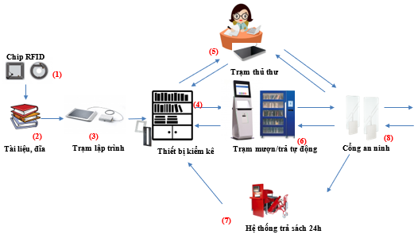

# HDSD MƯỢN TRẢ SÁCH TỰ ĐỘNG - THỦ THƯ

### Tổng quan về hệ thống 

### Mô hình hệ thống 

Hình 1: Sơ đồ lưu thông tài liệu kết hợp công nghệ RFID trong thư viện

### Mô tả sơ đồ 

* Tài liệu của thư viện như sách, luận văn, đĩa CD/DVD sẽ được dán các chip RFID **(1)**. Các tài liệu đã được dán chip RFID sẽ được ghi các thông tin cần thiết bao gồm mã số đăng ký cá biệt, thông qua trạm lập trình chip RFID **(3)**. Chíp gắn trên tài liệu sau khi nạp thông tin sẽ luôn ở trạng thái đã được kích hoạt tính năng an ninh (activated). Tài liệu sau đó đã có thể được chuyển tới kho, giá sách **(4)** để lưu thông mượn/trả.
* Bạn đọc đăng ký mượn tài liệu bằng 2 cách:
* Mượn tài liệu tại trạm thủ thư **(5)**: Tại đây thủ thư sẽ sử dụng trạm lưu thông kiểm tra thông tin tài liệu trong chip RFID gắn trên tài liệu. Trạm sẽ tự động nhận dạng tài liệu theo các thông tin đã được lập trình trên chip RFID và xác nhận cho mượn (check-out) trên giao diện phần mềm thư viện. Đồng thời chip RFID gắn trên tài liệu sẽ được bỏ kích hoạt (de-activated) tính năng chống trộm (EAS) và bạn đọc có thể mang tài liệu ra khỏi thư viện.
* Mượn tài liệu tại các trạm mượn/trả tự động **(6)**: Các thiết bị này có thể là các trạm mượn/trả hoặc tủ thư viện mini. Bạn đọc cần có thẻ ID (thẻ thư viện) (bao gồm thông tin họ tên, khoa, lớp. mã số…) để đăng ký mượn. Các thiết sẽ tự động kiểm tra thông tin các tài liệu trên chip RFID và kết nối trực tiếp đến phần mềm thư viện để đăng ký cho mượn (check-out) với thông tin trên thẻ thư viện và trên tài liệu, đồng thời bỏ kích hoạt (de-activated) tính năng an ninh. Sau khi mượn trên thiết bị xong, bạn đọc Bạn đọc có thể in biên lai ghi thông tin về việc mượn tài liệu và mang tài liệu ra khỏi thư viện.
* Sau khi đã làm đầy đủ thủ tục mượn tài liệu, bạn đọc sẽ mang ra ngoài theo cổng an ninh **(8)**. Nếu đăng ký đúng thủ tục nghĩa là chip RFID trên tài liệu đã được bỏ kích hoạt tính năng an ninh và cổng sẽ không báo động. Ngược lại, nếu chưa đúng thủ tục hoặc bạn đọc cố ý lấy trộm tài liệu, cổng an ninh sẽ báo động bằng âm thanh và đèn báo.
* Để trả tài liệu bạn đọc có thể chọn một trong những cách sau:
* Trả tài liệu tại trạm thủ thư **(3)**: Thủ thư sẽ nhận lại tài liệu sau đó kiểm tra thông tin tài liệu trên trạm lưu thông. Tại đây, thủ thư sẽ sử dụng trạm lưu thông nhận dạng tài liệu và kết hợp với giao diện phần mềm thư viện để đăng ký trả (check-in) cho bạn đọc. Tài liệu sẽ được kích hoạt tính năng an ninh để chống trộm và có thể được đưa vào xếp giá để sẵn sàng cho mượn
* Trả tài liệu tại các trạm mượn/trả tự động **(5)**: Trạm sẽ tự động kiểm tra thông tin các tài liệu trên chip RFID và tìm trong CSDL của thư viện. Sau khi trạm nhận dạng tài liệu nó sẽ tự động kết nối trực tiếp với phần mềm thư viện để đăng ký trả (check-in) cho bạn đọc, đồng thời kích hoạt tính năng an ninh để chống trộm. Bạn đọc có thể in biên lai ghi thông tin về việc trả tài liệu và đặt lại tài liệu vào nơi quy định.
* Tại giá trả sách thông minh **(7)**: bạn đọc đặt sách lên các giá sách, thiết bị sẽ kiểm tra thông tin tài liệu và tự động đăng ký trả vào cơ sở dữ liệu của phần mềm thư viện.
* Với hệ thống trả sách 24h **(7)**: bạn đọc cho sách muốn trả tại các cửa trả sách, sau khi nhận dạng đúng tài liệu là của thư viện, băng chuyền sẽ chuyển sách vào và phân loại tài liệu theo các thùng quy định, kích hoạt tính năng an ninh, đồng thời tự động đăng ký trả cho bạn đọc. Nếu sách không phải của thư viện, băng chuyền sẽ đẩy sách trở lại cho người trả.

Thiết bị kiểm kê **(4):** Tại kho, giá sách. Nhân viên thư viện có thể sử dụng thiết bị kiểm kê cầm tay để kiểm kê, tìm kiếm và sắp xếp lại vị trí các tài liệu. Chỉ đơn giản là quét thiết bị tại tất cả các giá sách và xem danh sách các tài liệu đã được quét hiển thị trên màn hình. Thiết bị kiểm kê còn cho phép tìm kiếm hay phát hiện các tài liệu nằm sai vị trí xếp giá, qua đó thủ thư có thể dựa vào đó để sắp xếp lại các tài liệu đặt sai vị trí. Thiết bị này giúp cho việc kiểm kê trở nên nhanh chóng, dễ dàng hơn rất nhiều so với các biện pháp kiểm kê trước đây.

### Giới thiệu và hướng dẫn sử dụng các thiết bị hệ thống RFID 

### **Cổng an ninh thư viện** 

#### Giới thiệu 

Cổng an ninh hoạt động với tính năng nhận dạng bằng sóng vô tuyến (Radio Frequency Identification). Các tài liệu có dán một nhãn RFID đã được kích hoạt (activate) tính năng chống trộm sẽ phát ra âm báo và đèn hiệu nếu một người mượn hay một khách mang tài liệu đi giữa các anten. Chức năng chống trộm chỉ được vô hiệu hóa (de-activate) khi tài liệu được mượn tại quầy thủ thư hoặc tại các trạm tự phục vụ có chức năng đăng ký mượn tài liệu và tắt chức năng này thì tài liệu mới không gây ra báo động

<figure><figcaption></figcaption></figure>

_Cổng an ninh Lyngsoe sử dụng công nghệ RFID với tần số 13.56Mhz_

#### Tính năng 

* Giải pháp toàn diện cho quản lý an ninh thư viện với công nghệ RFID, có khả năng phát hiện 3 chiều và nhận dạng các tài liệu có dán nhãn (chip) RFID bên trong.
* Kiểu dáng thiết kế ưa thích, sang trọng, thân thiện môi trường với các cánh cổng trong suốt và độ dày chỉ 15mm.
* Đầu đọc dành riêng cho các cổng an ninh thư viện giúp phát hiện các nhãn RFID bên trong tài liệu sách, CD/DVD.
* Tích hợp bộ ghép đa kênh multiplexer bên trong các đầu đọc giúp các đầu đọc hoạt động với hiệu suất cao, khoảng cách phát hiện rộng hơn, do đó khoảng cách giữa các cánh cổng có thể mở rộng lên tới 1.3m và dòng sản phẩm cao cấp hơn có thể mở rộng lên tới 1.6m (ở điều kiện hoàn hảo).
* Có khả năng kết nối tới cơ sở dữ liệu của thư viện để cập nhật thông tin tài liệu.
* Tích hợp mô-đun quản lý điện năng giúp tiết kiệm tới hơn 60% tổng điện năng tiêu thụ.
* Tích hợp mô-đun đếm số lượt người ra/vào giúp kiểm soát và so sánh lượng người tới thư viện so với lượng người mượn, trả tài liệu.
* Có chức năng giám sát EAS – bit (chức năng an ninh giám sát Electronic Article Surveilance) hoặc AFI – byte (chức năng an ninh phân biệt ứng dụng Aplication Family Identifier).
* Báo động trực quan bằng âm báo hoặc đèn hiệu có thể điều chỉnh.
* Lắp đặt đơn giản, linh hoạt, có thể tùy chọn lắp đặt một chân cho phép gỡ bỏ nhanh chóng, dễ dàng.

#### Hướng dẫn sử dụng 

Khởi chạy giao diện kiểm soát cổng an ninh Dashboard .png>)

<figure><figcaption></figcaption></figure>

Trong phần giao diện của Dashboard, có các thông tin chính như sau:

* Header màu xanh lá báo OK: Cho thấy các kết nối giữa phần mềm người dùng và cổng an ninh và các Service phần mềm hoạt động tốt, trong trường hợp báo đỏ là có lỗi trong kết nối.
* Gate alarms: Trả về thông tin tài liệu gây báo động. Thông tin trả về báo gồm: thời gian, cổng phát hiện báo động, mã tài liệu gây báo động.
* Messages: Thông báo các tình trạng hoạt động của cổng an ninh và Trả về thông tin đếm số người ra/vào thư viện nhận được khi có người đi qua cổng an ninh. Thời gian mỗi lượt trả về thông tin đếm người ra/vào có thể tùy chỉnh (mặc định 15 phút). Thông tin trả về bao gồm: thời gian, cổng trả thông tin đếm người, số lượt người ra vào theo thời gian trả về thông tin và tổng số lượng người ra/vào.

### Trạm lập trình 

#### Giới thiệu 

Khi thư viện bổ sung thêm tài liệu mới, những tài liệu này sẽ được dán nhãn RFID và ghi thông tin định danh tài liệu lên chip. Đây chính là cơ sở để các thiết bị RFID có thể xác định được đó là tài liệu gì trong suốt chu trình lưu thông của tài liệu.

<figure><figcaption></figcaption></figure>

#### Tính năng 

* Thiết bị được lắp đặt đơn giản ở trên bàn và có thể kết nối với phần cứng có sẵn của thư viện như máy tính và/hoặc Hệ thống quản lý thư viện
* Kết hợp với phần mềm GoodStuff2 để lập trình, ghi thông tin lên nhãn chip RFID
* Xử lý đọc, nhập, sửa đổi dữ liệu trên nhãn chip RFID
* Bật/tắt tính năng an ninh trên nhãn chip RFID

#### Hướng dẫn sử dụng Phần mềm lập trình cho chip 

* Kết nối nguồn điện cho thiết bị.
* Khởi động phần mềm bằng cách nhấn chuột phải vào biểu tượng GoodStuff2 và chọn “Convert tags” trên màn hình máy tính để bật phần mềm

<figure><figcaption></figcaption></figure>

* Giao diện phần mềm sẽ hiển thị như dưới đây:

<figure><figcaption></figcaption></figure>

Trong đó:

* Item id: Mã số đăng ký cá biệt của tài liệu
* Tags: Số lượng chip RFID đang có trên antenna
* Set size: Số thành phần trong bộ tài liệu
* Usage type: Chọn kiểu sử dụng cho tài liệu sau khi được lập trình (mặc định là Item for circulation)
* Media type: Chọn kiểu tài liệu tương ứng (Sách, đĩa CD, …)

**Tiến hành lập trình với các bước sau:**

* Bước 1: Chọn số thành phần: với tài liệu đơn lẻ ta chọn 1, đối với tài liệu có nhiều thành phần đi kèm với nhau (vd. Sách có kèm đĩa CD) thì ta chọn theo tổng số thành phần (thường là tổng số chip RFID)
* Bước 2: Chọn loại sử dụng, loại tài liệu tùy theo thực tế tài liệu đang lập trình là gì
* Bước 3: Đặt tài liệu đã được dán chíp RFID lên antenna để bắt đầu lập trình
* Bước 4: Click con trỏ chuột vào khu vực nhập mã tài liệu
* Bước 5: Dùng đầu đọc Barcode để đọc mã vạch trên tài liệu hoặc gõ tay để nhập.

<figure><figcaption></figcaption></figure>

* Bước 6: Nhấn Enter để lập trình nếu cần (đa phần các đầu đọc Barcode đều tự động thêm Enter trong bước 5 nên không cần người dùng nhấn Enter)

<figure><figcaption></figcaption></figure>

Sau đó, màn hình sẽ hiển thị đã lập trình xong

Người thực hiện lập trình lấy cuốn sách đã lập trình ra khỏi tài liệu và đặt cuốn sách khác lên và thực hiện tương tự theo các bước lập trình.

**Ghi chú:** Thông thường, các Bước 1 và Bước 2 chỉ cần thực hiện 1 lần nếu các tài liệu được lập trình là cùng loại. Vì thế các bước được rút gọn thành:

* Bước 1: Đặt tài liệu lên an-ten của trạm
* Bước 2: Dùng đầu đọc barcode đọc mã vạch trên tài liệu
* Bước 3: Khi giao diện hiển thị thông báo đã lập trình xong, lấy sách đó ra và thực hiện tương tự với các cuốn sách tiếp theo

**Lưu ý:**

* Số lượng chip hiển thị tương ứng với số tài liệu được dán
* Số lượng thành phần tài liệu tương ứng số tài liệu và chip được lập trình.
* Chỉ bỏ tài liệu sau khi được lập trình khi thông tin lập trình được hiển thị.

### Trạm lưu thông 

#### Giới thiệu 

Trạm cho phép nhân viên thư viện xác định và đọc thông tin tất cả các vật phẩm đã gắn nhãn RFID và kích hoạt (activate) hoặc bỏ kích hoạt (de-activate) tính năng chống trộm, hỗ trợ bạn đọc mượn tài liệu một cách nhanh chóng. Tại quầy thủ thư, khi phát sinh một yêu cầu mượn/trả, (các) tài liệu sẽ được đặt lên trạm để đọc thông tin trên chip RFID gắn trong tài liệu. Lúc này thủ thư chỉ việc kết hợp với thông tin bạn đọc qua thẻ để thực hiện giao dịch mượn/trả này thông qua một lần nhấn nút trên phần mềm. Các tính năng an ninh (EAS) trên các tài liệu được bỏ kích hoạt và giao dịch được ghi nhận trên CSDL.

<figure><figcaption></figcaption></figure>

_Trạm lưu thông mượn, trả_

#### Tính năng 

* Thiết bị được lắp đặt đơn giản ở trên bàn và có thể kết nối với phần cứng có sẵn của thư viện như máy tính và/hoặc Hệ thống quản lý thư viện.
* Kết hợp với phần mềm Goodstuff và phần mềm thư viện hỗ trợ đăng ký mượn/trả tài liệu.
* Bật/tắt tính năng an ninh trên nhãn chip RFID

#### Hướng dẫn sử dụng 

* Kết nối nguồn điện cho thiết bị.
* Khởi động phần mềm bằng cách nhấn vào biểu tượng Goodstuff2 trên màn hình máy tính

<figure><figcaption></figcaption></figure>

**Trả tài liệu:**

<figure><figcaption></figcaption></figure>

* Bước 1: Click chuột vào giao diện phần mềm Goodstuff2, nhấn Fn+F8 để phần mềm chuyển sang chế độ trả (màu đỏ)
* Bước 2: Mở phần mềm phần mềm thư viện, chọn chế độ trả tài liệu
* Bước 3: Đặt tài liệu cần trả lên anten của trạm

<figure><figcaption></figcaption></figure>

* Giao diện hiển thị của Goodstuff2 các tài liệu đã được trả.
* Kết thúc quá trình trả tài liệu.

**Mượn/ gia hạn tài liệu:**

<figure><figcaption></figcaption></figure>

* Bước &#x31;**:** Click chuột vào giao diện phần mềm Goodstuff, nhấn Fn+F7 để phần mềm chuyển sang chế độ mượn/gia hạn (màu xanh)
* Bước 2: Mở phần mềm thư viện, chọn đế độ mượn/gia hạn trên phần mềm thư viện
* Bước 3: Đọc thẻ bạn đọc bằng đầu đọc barcode
* Bước 4: Đặt sách muốn mượn/gia hạn lên an-ten của thiết bị

<figure><figcaption></figcaption></figure>

* Giao diện hiển thị của Goodstuff2 sau khi đã mượn/gia hạn xong
* Kết thúc quá trình mượn/ gia hạn tài liệu.

### Trạm tự mượn trả tài liệu 

#### Giới thiệu 

Thiết bị tự mượn trả dạng Kiosk đứng cho phép bạn đọc thực hiện mượn/trả/gia hạn/xem thông tin tài khoản mà hoàn toàn không cần sự trợ giúp của thủ thư.

Bạn đọc chỉ cần mang sách đến trạm, thực hiện theo chỉ dẫn trên màn hình với giao diện Tiếng Việt trực quan, để thực hiện mượn trả. Thiết bị sẽ đăng ký mượn/trả trên hệ thống phần mềm thư viện cho bạn đọc đó một cách hoàn toàn tự động.

<figure><figcaption></figcaption></figure>

#### Tính năng 

* Thiết bị có chức năng như một trạm kiểm soát đăng ký mượn/trả hoặc kết hợp cả hai tính năng và có hỗ trợ dịch vụ từ xa.
* Có thể kích hoạt (activate) hoặc bỏ kích hoạt (de-activate) tính năng chống trộm trên nhãn RFID hỗ trợ bạn đọc mượn, trả tài liệu.
* Trang bị màn hình cảm ứng cùng phần mềm thân thiện với người dùng nên sử dụng dễ dàng đối với mọi lứa tuổi.

#### Hướng dẫn sử dụng thiết bị tự mượn/ trả 

Tại giao diện của phần mềm, phần mềm mặc định Tiếng Việt, muốn chuyển đổi sang giao diện Tiếng Anh. Vui lòng chọn biểu tưởng hình vuông bên dưới góc trái.

<figure><figcaption></figcaption></figure>

Sau khi chọn ngôn ngữ, giao diện các tính năng của phần mềm sẽ hiện lên bao gồm: Trả, mượn, gia hạn tài liệu và xem thông tin của bạn đọc.

<figure><figcaption></figcaption></figure>

**Mượn tài liệu**

Để mượn tài liệu của thư viện, cần thực hiện các bước bao gồm:

* Bước 1: Chạm vào nút MƯỢN tại giao diện trên màn hình, giao diện sẽ hiện thông báo như hình

<figure><figcaption></figcaption></figure>

* Bước 2: Cho thẻ thư viện vào vị trí đầu đọc mã vạch (Chùm tia màu đỏ ngay dưới màn hình). Sau khi nghe một tiếng “bíp”, tức là thẻ đã được đọc thành công. Giao diện sẽ chuyển sang màn hình hiển thị thông tin của bạn đọc.

<figure><figcaption></figcaption></figure>

* Bước 3: Đặt tài liệu muốn mượn vào ô vuông có viền màu trắng ở trên mặt bàn của thiết bị. Sau đó, một danh sách bao gồm: tên, loại và thời gian hết hạn của tài liệu đó sẽ hiện lên như hình dưới. (Có thể đặt nhiều tài liệu cùng lúc)
* Bước 5: Chạm vào nút đã xong để hoàn thành việc mượn. Sau đó, thiết bị sẽ hỏi bạn có muốn in biên lai hay không.

**Trả tài liệu**

Việc trả tài liệu được thực hiện theo các bước như sau:

* Bước 1: Chạm vào nút “TRẢ” tại giao diện trên màn hình. Một thông báo sẽ hiện lên như hình dưới.

<figure><figcaption></figcaption></figure>

* Bước 2: Đặt tài liệu muốn trả vào ô vuông viền trắng ở trên mặt bàn của thiết bị. Sau đó, một danh sách bao gồm tên, loại của các tài liệu được trả sẽ hiển thị. (Có thể đặt nhiều tài liệu cùng lúc)

<figure><figcaption></figcaption></figure>

* Bước 3: Thiết bị sẽ thực hiện trả tài liệu đó cho phần mềm thư viện một cách tự động, chính xác giúp bạn đọc. Chạm vào nút “Đã xong”, tài liệu sẽ hiển thị thông báo nhắc bạn đọc xếp tài liệu lên giá và sau đó là in biên lai.

<figure><figcaption></figcaption></figure>

* Bước 4: Chọn “Không” hoặc “In biên lai”. Bạn đọc lấy biên lai được in ở ngay bên tay trái.

<figure><figcaption></figcaption></figure>

**Gia hạn tài liệu**

Để gia hạn tài liệu, bạn đọc thưc hiện các bước như sau:

<figure><figcaption></figcaption></figure>

* Bước 1: Chọn “Gia hạn” trên giao diện
* Bước 2: Quẹt thẻ thư viện tại đầu đọc tương tự như khi mượn tài liệu.
* Bước 4: Danh sách các tài liệu đã quá hạn của bạn đọc sẽ hiện lên bao gồm tên, thời hạn của tài liệu. Bạn đọc chạm vào tài liệu mình muốn gia hạn rồi nhấn vào nút “gia hạn” hiện lên bên phải của tên tài liệu.
* Bước 5: Nhấn “Đã xong để kết thúc”

### Nhãn (Chip) RFID: 

#### Giới thiệu 

Nhãn (chip) RFID dùng cho sách, tài liệu được cấu tạo mềm mỏng có chứa chíp vi xử lý và anten. Nó có thể đọc, ghi dữ liệu, và thậm chí có chứa cả thông tin về bảo mật.

<figure><figcaption></figcaption></figure>

#### Tính năng 

* Có thể dán vào các vật phẩm cần quản lý như sách, tài liệu in hay tạp chí…
* Có độ bền cao, được sử dụng rộng rãi trong các kho sách, thư viện.
* Có thể ghi, sửa, cập nhật thông tin lên chip

#### Hướng dẫn sử dụng 

* Dán ở mặt trong trang bìa cuối cùng của tài liệu:
* Bạn đọc ít mở tới trang bìa cuối
* Trang bìa cuối ít bị lật, bị uốn cong hơn trang bìa đầu
* Dán ở mặt trong bìa sẽ ít bị tác động, bị tiếp xúc với các bề mặt khác hơn so với mặt ngoài bìa

**Vị trí dán thẻ nhãn RFID:**

* Chiều cao:
* Nằm trong khoảng 20cm: Trong khoảng anten của thiết bị kiểm kê
* Cách từ mép dưới của tài liệu 5cm: Tránh tiếp xúc gần với các giá sách kim loại
* Chiều rộng:

Nằm trong khoảng 10cm tính từ gáy tài liệu: Ít bị mở, bị gập cong và nằm trong phạm vị quét của thiết bị kiểm kê

* Dán nhãn theo thứ tự quyển số 1, 2, 3, 4, 5….: Để giảm việc thẻ chip RFID nằm cùng vị trí

## **HÌNH MÔ TẢ**

### **(KHỔ GIẤY A4 THU NHỎ VỚI TỈ LỆ THU NHỎ 50%)**

<figure><figcaption></figcaption></figure>
