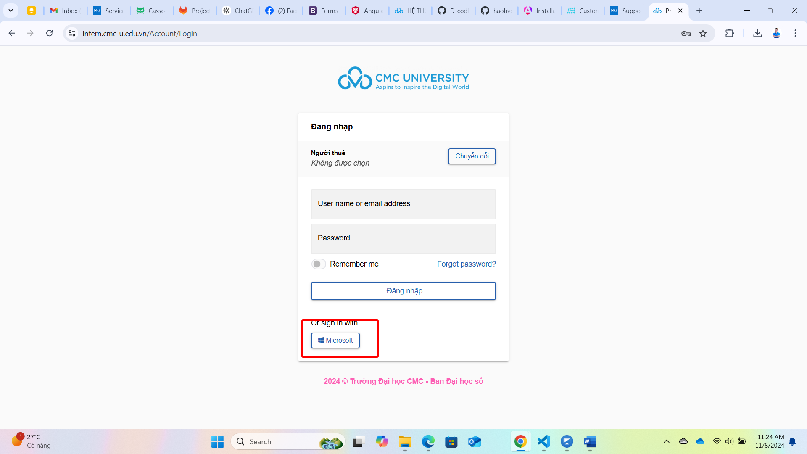

# Hệ thống QL Thực tập - Dành cho Sinh viên

**Bước 1:** Sinh viên truy cập phần mềm tại địa chỉ: [https://intern.cmcu.edu.vn/](https://intern.cmcu.edu.vn/)

**Bước 2:** Tại màn hình đăng nhập, sinh viên sử dụng chức năng "Đăng nhập bằng Microsoft" để tiến hành xác thực tập trung

<figure><figcaption></figcaption></figure>

**Bước 3:** Tại thanh Menu bên trái màn hình, sinh viên lựa chọn lần lượt: **"SV - Đăng ký thực tập => Nhật ký thực tập sinh viên"** để bắt đầu ghi lại quá trình thực tập, cũng như upload minh chứng

<figure><figcaption></figcaption></figure>

**Bước 4:** Để bắt đầu ghi nhận quá trình, sinh viên bấm vào nút **"Thêm mới"**. Sau đó thực hiện nhập các trường thông tin để tiến hành lưu lại thông tin.

<figure><figcaption></figcaption></figure>

<figure><figcaption></figcaption></figure>

**Bước 5:** Sinh viên thực hiện upload minh chứng tương ứng với quá trình thực tập, bao gồm các minh chứng về văn bản, hình ảnh, source code,...

<figure><figcaption></figcaption></figure>
