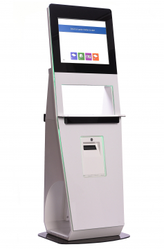

# Hướng dẫn mượn trả sách tự động

#### Giới thiệu

Thiết bị tự mượn trả dạng Kiosk đứng cho phép bạn đọc thực hiện mượn/trả/gia hạn/xem thông tin tài khoản mà hoàn toàn không cần sự trợ giúp của thủ thư.

Bạn đọc chỉ cần mang sách đến trạm, thực hiện theo chỉ dẫn trên màn hình với giao diện Tiếng Việt trực quan, để thực hiện mượn trả. Thiết bị sẽ đăng ký mượn/trả trên hệ thống phần mềm thư viện cho bạn đọc đó một cách hoàn toàn tự động.

<figure><figcaption></figcaption></figure>

LibMaster Phoenix | Information and Digital technology joint stock ...

_Trạm tự phục vụ mượn, trả tài liệu_

#### Tính năng

* Thiết bị có chức năng như một trạm kiểm soát đăng ký mượn/trả hoặc kết hợp cả hai tính năng và có hỗ trợ dịch vụ từ xa.
* Có thể kích hoạt (activate) hoặc bỏ kích hoạt (de-activate) tính năng chống trộm trên nhãn RFID hỗ trợ bạn đọc mượn, trả tài liệu.
* Trang bị màn hình cảm ứng cùng phần mềm thân thiện với người dùng nên sử dụng dễ dàng đối với mọi lứa tuổi.

#### Hướng dẫn sử dụng thiết bị tự mượn/ trả

Tại giao diện của phần mềm, phần mềm mặc định Tiếng Việt, muốn chuyển đổi sang giao diện Tiếng Anh. Vui lòng chọn biểu tưởng hình vuông bên dưới góc trái.

<figure><figcaption></figcaption></figure>

Sau khi chọn ngôn ngữ, giao diện các tính năng của phần mềm sẽ hiện lên bao gồm: Trả, mượn, gia hạn tài liệu và xem thông tin của bạn đọc.

#### Mượn tài liệu

Để mượn tài liệu của thư viện, cần thực hiện các bước bao gồm:

* Bước 1: Chạm vào nút MƯỢN tại giao diện trên màn hình, giao diện sẽ hiện thông báo như hình

* Bước 2: Cho thẻ thư viện vào vị trí đầu đọc mã vạch (Chùm tia màu đỏ ngay dưới màn hình). Sau khi nghe một tiếng "bíp", tức là thẻ đã được đọc thành công. Giao diện sẽ chuyển sang màn hình hiển thị thông tin của bạn đọc.

* Bước 3: Đặt tài liệu muốn mượn vào ô vuông có viền màu trắng ở trên mặt bàn của thiết bị. Sau đó, một danh sách bao gồm: tên, loại và thời gian hết hạn của tài liệu đó sẽ hiện lên như hình dưới. (Có thể đặt nhiều tài liệu cùng lúc)

* Bước 5: Chạm vào nút đã xong để hoàn thành việc mượn. Sau đó, thiết bị sẽ hỏi bạn có muốn in biên lai hay không.

* Bước 6: Chạm vào "Không" để kết thúc hoặc nhấn "In biên lai" nếu bạn muốn lấy biên lai mượn sách. Nếu bạn in chọn có in biên lai, đợi một vài giây để lấy biên lai ở bên tay trái của bạn.

Trả tài liệu

Việc trả tài liệu được thực hiện theo các bước như sau:

* Bước 1: Chạm vào nút "TRẢ" tại giao diện trên màn hình. Một thông báo sẽ hiện lên như hình dưới.

* Bước 2: Đặt tài liệu muốn trả vào ô vuông viền trắng ở trên mặt bàn của thiết bị. Sau đó, một danh sách bao gồm tên, loại của các tài liệu được trả sẽ hiển thị. (Có thể đặt nhiều tài liệu cùng lúc)

* Bước 3: Thiết bị sẽ thực hiện trả tài liệu đó cho phần mềm thư viện một cách tự động, chính xác giúp bạn đọc. Chạm vào nút "Đã xong", tài liệu sẽ hiển thị thông báo nhắc bạn đọc xếp tài liệu lên giá và sau đó là in biên lai.

* Bước 4: Chọn "Không" hoặc "In biên lai". Bạn đọc lấy biên lai được in ở ngay bên tay trái.

#### Gia hạn tài liệu

Để gia hạn tài liệu, bạn đọc thưc hiện các bước như sau:

* Bước 1: Chọn "Gia hạn" trên giao diện
* Bước 2: Quẹt thẻ thư viện tại đầu đọc tương tự như khi mượn tài liệu.
* Bước 4: Danh sách các tài liệu đã quá hạn của bạn đọc sẽ hiện lên bao gồm tên, thời hạn của tài liệu. Bạn đọc chạm vào tài liệu mình muốn gia hạn rồi nhấn vào nút "gia hạn" hiện lên bên phải của tên tài liệu.
* Bước 5: Nhấn "Đã xong để kết thúc"SS
