# TLHDSD\_SV\_V3

**CÔNG TY CỔ PHẦN CÔNG NGHỆ CAO VÀ DỊCH VỤ PHẦN MỀM FACENET**

**HỆ THỐNG CỒNG THỰC HÀNH LẬP TRÌNH**

**TÀI LIỆU HƯỚNG DẪN SỬ DỤNG**

**Dành cho tài khoản sinh viên**

**Phiên bản tài liệu: v1.0**

**BẢNG GHI NHẬN THAY ĐỔI**

| **LỊCH SỬ THAY ĐỔI** |            |                   |                    |
| -------------------- | ---------- | ----------------- | ------------------ |
| Phiên bản            | Ngày       | Chi tiết thay đổi | Người thực hiện    |
| 1.0                  | 22/11/2020 | Phiên bản đầu     | tiennv@cmcu.edu.vn |
| 2.0                  | 06/12/2023 | Phiên bản thứ hai | tiennv@cmcu.edu.vn |
| 3.0                  | 29/02/2024 | Phiên bản thứ ba  | tiennv@cmcu.edu.vn |

MỤC LỤC

I. GIỚI THIỆU CHUNG 1

1\. Mục đích tài liệu 1

2\. Khái niệm, thuật ngữ 2

3\. Mô tả tài liệu 2

II. HƯỚNG DẪN SỬ DỤNG HỆ THỐNG 3

1\. Hướng dẫn thao tác trên tài khoản 3

1.1. Chức năng đăng nhập 3

1.2. Chỉnh sửa thông tin cá nhân 5

2\. Hướng dẫn sử dụng khi luyện tập các môn học 7

2.1. Chức năng quản lý bài tập 7

2.1.1. Danh sách bài tập 7

2.1.2. Nộp bài tập trên hệ thống 7

2.1.3. Diễn đàn trao đổi về bài tập 9

2.2. Trạng thái nộp bài 10

2.3. Xem bảng xếp hạng theo môn học 10

3\. Hướng dẫn sử dụng hệ thống trong thực hành, thi 12

3.1. Xem danh sách ca thực hành, thi 12

3.2. Danh sách bài tập trong ca thực hành, thi 12

**Danh mục hình ảnh**

Hình 1. 1. Giao diện đăng nhập cổng thực hành 3

Hình 1. 2. Giao diện ghi nhớ tài khoản 4

Hình 1. 3. Giao diện điều hướng hệ thống 4

Hình 1. 4. Giao diện sau khi click “Giảng viên DLAB” 5

Hình 1. 5. Giao diện sau khi click “Authorize” 5

Hình 1. 6. Menu chức năng tài khoản cá nhân 6

Hình 1. 7. Giao diện trang thông tin cá nhân 6

Hình 1. 8. Giao diện cập nhật thông tin cá nhân 7

Hình 2. 1. Giao diện danh sách bài tập 7

Hình 2. 2. Nội dung chi tiết của bài tập 8

Hình 2. 3. Giao diện nộp bài 8

Hình 2. 4. Giao diện lịch sử nộp bài cá nhân 9

Hình 2. 5. Chi tiết trạng thái kết quả chấm bài 9

Hình 2. 6. Diễn đàn trao đổi thông tin theo từng bài tập 10

Hình 2. 7. Giao diện trạng thái giải bài trên hệ thống 10

Hình 2. 8. Bảng xếp hạng môn học 11

Hình 3. 1. Giao diện quản lý ca thực hành, thi 12

Hình 3. 2. Giao diện quản lý bài tập theo ca thực hành, thi 13

Hình 3. 3. Giao diện nộp bài trong ca thực hành, thi 13

### I. GIỚI THIỆU CHUNG 

### 1. Mục đích tài liệu 

Cung cấp cho người dùng hoặc khách hàng thông tin chi tiết về cách sử dụng hệ thống. Mục đích của tài liệu HDSD là giúp người dùng hiểu rõ về cách hoạt động của sản phẩm, cách tận dụng tối đa các tính năng và chức năng, cũng như giúp họ vận dụng sản phẩm hoặc dịch vụ một cách hiệu quả và an toàn.

Hệ thống cổng thực hành là website luyện tập, thực hành, thi dành riêng cho các môn học lập trình cho sinh viên, giảng viên ngành Công nghệ thông tin trường đại học CMC. Tài liệu này là hướng dẫn sử dụng các chức năng dành cho sinh viên. Nội dung gồm:

\- Hướng dẫn thao tác trên tài khoản: đăng nhập, thay đổi thông tin cá nhân.

\- Hướng dẫn sử dụng hệ thống để luyện tập khi tham gia các môn học.

\- Hướng dẫn sử dụng hệ thống để tham gia thực hành, thi.

Đối tượng sử dụng tài liệu:

| **Người sử dụng**                       | **Mục đích**                                                                                                                                                                                                          |
| --------------------------------------- | --------------------------------------------------------------------------------------------------------------------------------------------------------------------------------------------------------------------- |
| Người dùng (đối tượng sử dụng phần mềm) | Tài liệu hướng dẫn giúp họ làm quen với phần mềm và hướng dẫn cách sử dụng các tính năng cơ bản.                                                                                                                      |
| Nhân viên hỗ trợ khách hàng             | Các nhân viên hỗ trợ khách hàng có thể sử dụng tài liệu hướng dẫn để giải đáp các câu hỏi phổ biến, xử lý sự cố và cung cấp hỗ trợ cho người dùng cuối                                                                |
| Nhà phát triển                          | Những người phát triển phần mềm hoặc nhà phát triển ứng dụng có thể sử dụng tài liệu hướng dẫn để hiểu kiến trúc, API và các khía cạnh kỹ thuật của phần mềm để tạo ra các tính năng mới hoặc tương tác với phần mềm. |
| Nhà quản trị                            | Các quản trị viên hệ thống, quản lý dự án hoặc quản lý sản phẩm có thể sử dụng tài liệu hướng dẫn để hiểu cách triển khai, cấu hình hoặc quản lý phần mềm trong một môi trường công việc.                             |

### 2. Khái niệm, thuật ngữ 

| **Thuật ngữ** | **Định nghĩa** | **Ghi chú** |
| ------------- | -------------- | ----------- |
| N/A           | N/A            | N/A         |

### 3. Mô tả tài liệu 

Tài liệu bao gồm 2 phần chính:

Phần 1: Giới thiệu chung: giới thiệu tổng quan về tài liệu

Phần 2: Hướng dẫn sử dụng hệ thống

### II. HƯỚNG DẪN SỬ DỤNG HỆ THỐNG 

### 1. Hướng dẫn thao tác trên tài khoản 

### 1.1. Chức năng đăng nhập 

Mỗi sinh viên khi được phân công giảng quản lý cổng thực hành đều được cấp một tài khoản để đăng nhập hệ thống. Tài khoản này được nhóm quản lý máy chủ cổng thực hành thuộc bộ môn CNPM cung cấp. Một số tài khoản sinh viên được cấp quyền quản trị có thể truy cập vào trang quản lý của quản trị viên từ chức năng đăng nhập quản trị trên thanh điều hướng.

Khi đã được cấp tài khoản, sinh viên truy cập cổng thực hành qua đường dẫn: http://dlab.cmc-u.edu.vn

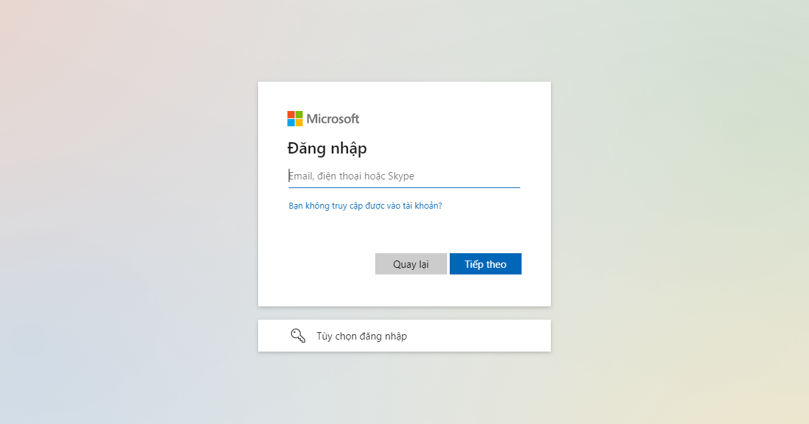

Hình 1. 1. Giao diện đăng nhập cổng thực hành

Trên màn hình đăng nhập có hộp chọn ghi nhớ, khi chọn hộp chọn này, tài khoản đăng nhập trên máy tính sẽ được ghi nhớ trong thời gian dài dựa trên cookie của trình duyệt, sinh viên không cần đăng nhập lại sau mỗi lần mở trình duyệt. Tuy nhiên, chức năng này chỉ nên chọn khi sử dụng máy tính cá nhân, không sử dụng khi dùng chung máy tính hoặc trên các máy tính công cộng.

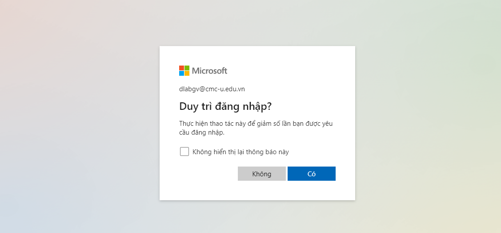

Hình 1. 2. Giao diện ghi nhớ tài khoản

Khi đăng nhập thành công bằng account, sẽ hiển thị giao diện điều hướng cho quản trị viên.

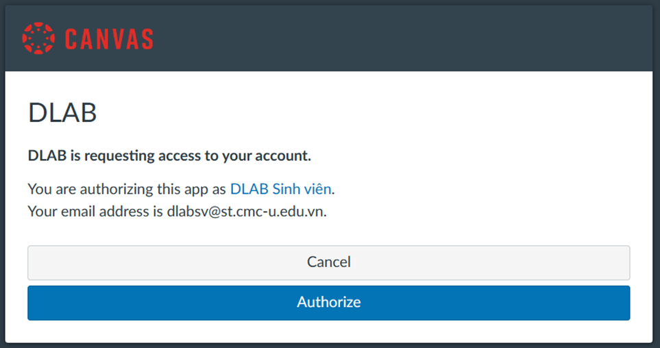

Hình 1. 3. Giao diện điều hướng hệ thống

Nếu giảng viên click “Sinh viên DLAB”, hệ thống sẽ điều hướng sang trang lms.cmc-u.edu.vn

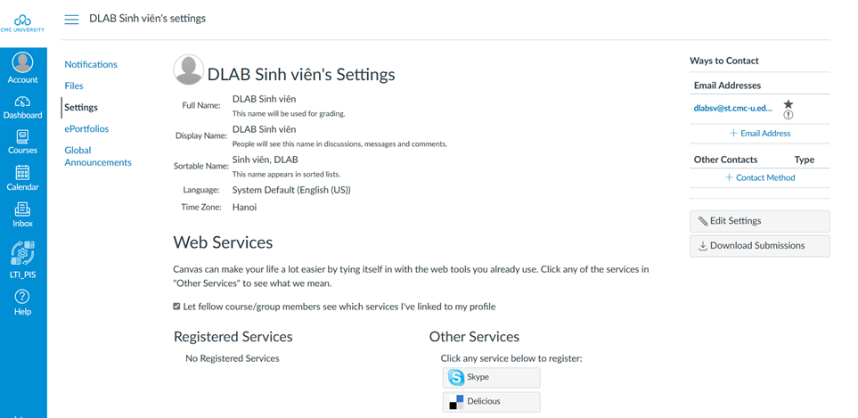

Hình 1. 4. Giao diện sau khi click “Giảng viên DLAB”

Nếu giảng viên click “Authorize”, hệ thống sẽ điều hướng sang trang cổng thực hành lập trình.

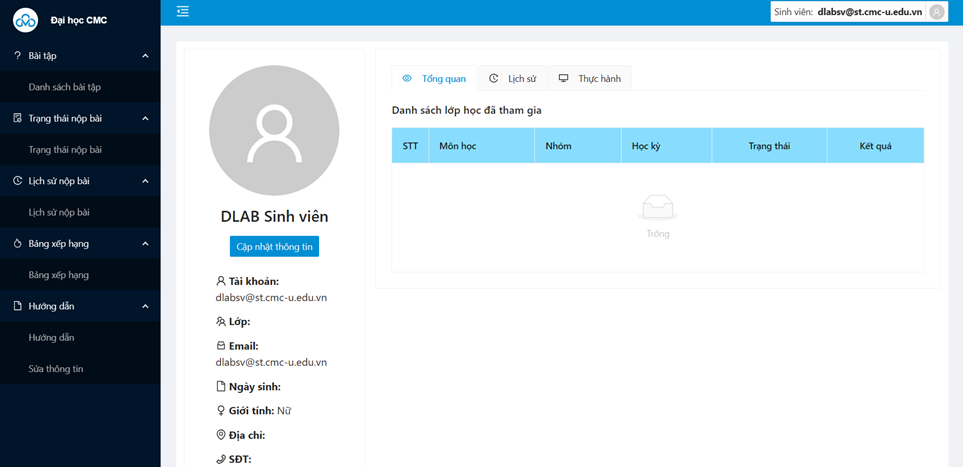

Hình 1. 5. Giao diện sau khi click “Authorize”

*
  1. 1.2. Chỉnh sửa thông tin cá nhân

Thông tin cá nhân mặc định ban đầu được nhập liệu thông thường chỉ bao gồm mã sinh viên, họ và tên, lớp học. Sinh viên có thể xem lại các thông tin cá nhân của mình ở mục Hồ sơ trên trang cá nhân bằng cách nhấn vào ảnh đại diện ở góc phải phía trên.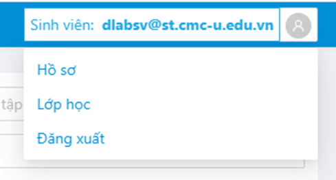

Hình 1. 6. Menu chức năng tài khoản cá nhân

Giao diện dưới đây sẽ tóm tắt các thông tin cá nhân, danh sách các lớp học được phân công, lịch sử làm bài tập và lịch sử các ca thực hành đã tổ chức trên hệ thống. Để cập nhật thông tin cá nhân, sinh viên chọn chức năng “_Cập nhật thông tin”._

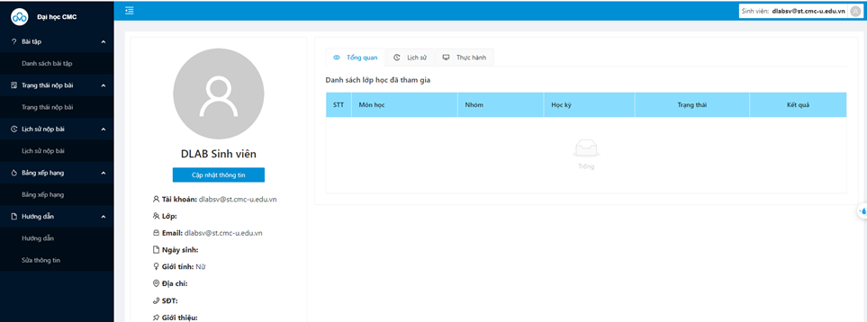

Hình 1. 7. Giao diện trang thông tin cá nhân

Sinh viên tiến hành cập nhật thông tin cá nhân bằng cách điền vào các trường thông tin trên giao diện. Các trường thông tin có dấu \* là bắt buộc.

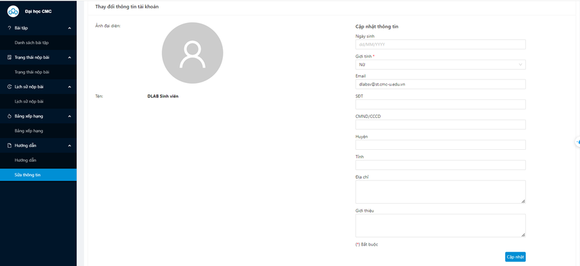

Hình 1. 8. Giao diện cập nhật thông tin cá nhân

Trên menu tài khoản người dùng, có chức năng đăng xuất, sau khi kết thúc phiên làm việc, giảng viên có thể đăng xuất khỏi hệ thống.

### 2. Hướng dẫn sử dụng khi luyện tập các môn học 

**2.1. Chức năng quản lý bài tập**

*
  *
    1. 2.1.1. Danh sách bài tập

Thông thường, trong một học kỳ, sinh viên có thể tham gia một hoặc nhiều môn học. Tại chức năng này, sinh viên thấy được danh bài tập cho giảng viên của lớp học đó giao. Sinh viên có thể lọc bài tập theo môn học. Để tham gia luyện tập và làm bài tập, sinh viên bấm chọn tên têu đề bài tập tại cột “Tiêu đề” trong “Danh sách bài tập”.

*
  *
    1. 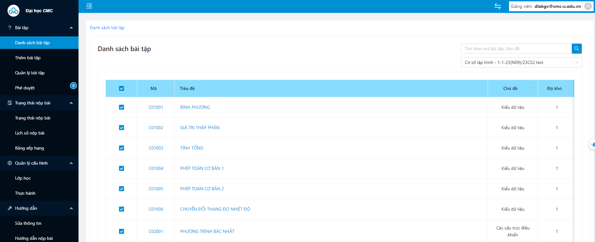

Hình 2. 1. Giao diện danh sách bài tập

*
  *
    1. 2.1.2. Nộp bài tập trên hệ thống

Trên giao diện danh sách các bài tập, sinh viên chọn bài tập để xem chi tiết đề bài và thực hiện nộp bài sau khi làm xong. Trên mỗi dòng có thông tin về mã bài tập, tiêu đề, nhóm, chủ đề và độ khó.

Những bài tập đã hoàn thành sẽ được đánh dấu bằng màu nền xanh, những bài màu nền trắng là chưa hoàn thành. Khi nhấn vào tên hoặc mã bài tập sẽ được chuyển đến giao diện thông tin chi tiết đề bài.

Nội dung bài tập sẽ bao gồm mô tả, yêu cầu và ví dụ. Ngoài ra, giới hạn về thời gian thực thi, giới hạn bộ nhớ cũng được thông báo cùng đề bài.

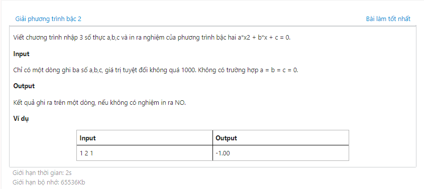

Hình 2. 2. Nội dung chi tiết của bài tập

Để nộp bài tập, sinh viên chọn trình biên dịch phù hợp với môn học và ngôn ngữ lập trình đã sử dụng, đưa mã nguồn bài tập đã làm vào trình soạn thảo. Sau đó sinh viên tiến hành chọn tệp tải lên và khi đã tải lên file thành công giảng viến ấn nộp bài.

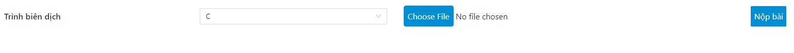

Hình 2. 3. Giao diện nộp bài

Sau khi nộp bài, hệ thống sẽ chuyển hướng đến trang kết quả. Tại giao diện này kết quả chấm bài tự động sẽ được cập nhật ngay khi máy chấm thực hiện xong mà không cần người dùng phải làm mới trang web. Người dùng có thể xem lại mã nguồn của các bài tập đã nộp bằng cách nhấn vào trạng thái kết quả của từng bài tập.

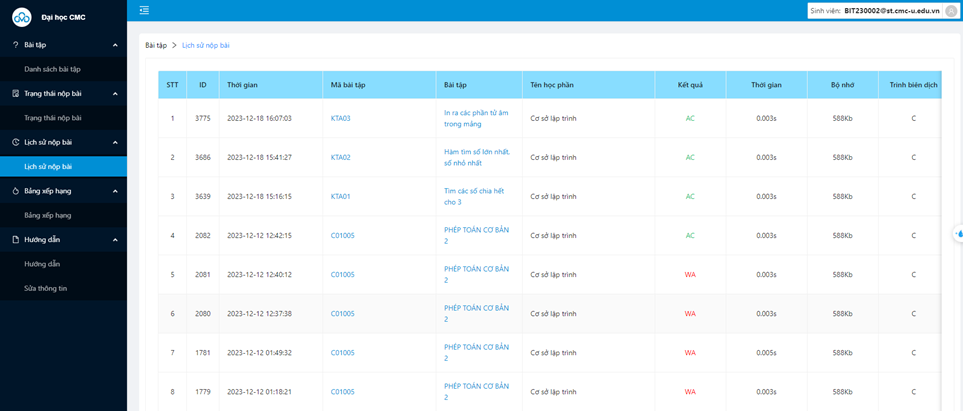

Hình 2. 4. Giao diện lịch sử nộp bài cá nhân

Bên dưới bảng lịch sử nộp bài sẽ có giải thích chi tiết về kết quả chấm bài như hình dưới đây.

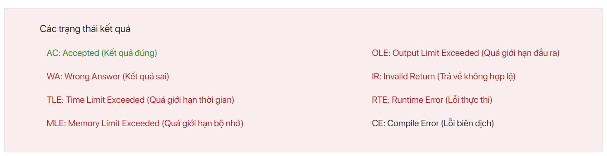

Hình 2. 5. Chi tiết trạng thái kết quả chấm bài

*
  *
    1. 2.1.3. Diễn đàn trao đổi về bài tập

Tại các trang chi tiết về đề bài, sinh viên và giảng viên có thể tham gia thảo luận, trao đổi về cách làm bài tập, hoặc báo cáo về nội dung của bài tập. Chức năng này giúp sinh viên và giảng viên có thể giao tiếp với các sinh viên khác đang học môn học tương tự.

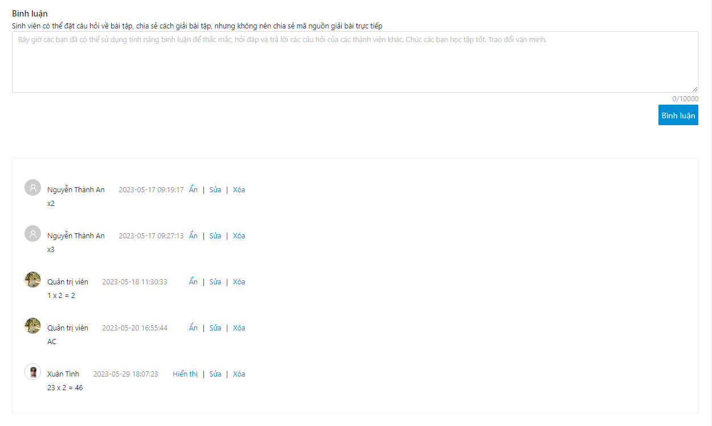

Hình 2. 6. Diễn đàn trao đổi thông tin theo từng bài tập

**2.2. Trạng thái nộp bài**

Ngoài tính năng xem lịch sử cá nhân, sinh viên hoàn toàn có thể xem lịch sử giải bài trên toàn hệ thống của các sinh viên khác. Giao diện này cũng tương tự như giao diện xem lịch sử nộp bài cá nhân. Tuy nhiên sinh viên không thể xem mã nguồn chi tiết của các bài làm này.

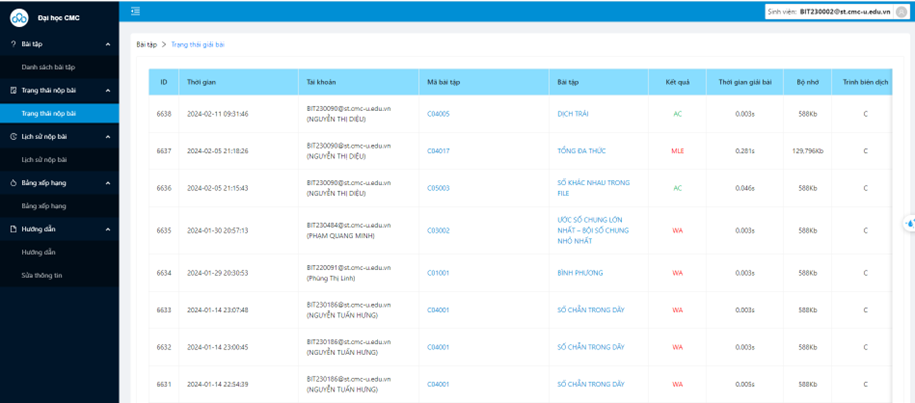

Hình 2. 7. Giao diện trạng thái giải bài trên hệ thống

*
  *
    1. 2.3. Xem bảng xếp hạng theo môn học

Với mỗi lớp học, hệ thống có bảng xếp hạng chi tiết đánh giá tự động các cá nhân trong lớp. Bảng xếp hạng này sẽ được hiển thị công khai tới toàn bộ sinh viên trong lớp để có thể chủ động theo dõi kết quả học tập của mình so với cả lớp. Bảng xếp hạng này cũng có thể được giảng viên sử dụng để đánh giá năng lực, chuyên cần của sinh viên.

Đối với sinh viên học nhiều môn học trong một học kỳ, có thể chọn môn học ở hộp chọn trên giao diện bảng xếp hạng giống như chọn môn học khi làm bài tập.

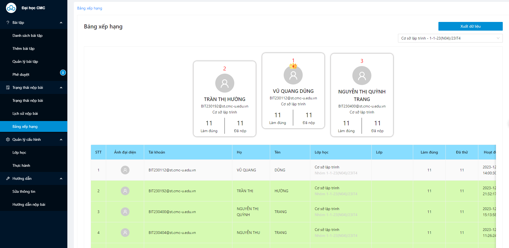

Hình 2. 8. Bảng xếp hạng môn học

1. 3\. Hướng dẫn sử dụng hệ thống trong thực hành, thi
2. 3.1. Xem danh sách ca thực hành, thi

Khi được thiết lập ở chế độ thực hành, thi, sau khi sinh viên đăng nhập vào hệ thống sẽ được chuyển hướng tới giao diện danh sách ca thực hành. Các chức năng khác sẽ được ẩn đi để sinh viên có thể tập trung vào làm bài tập. Ca thực hành và bài thi sẽ được giới hạn thời gian. Để bắt đầu làm bài thi, sinh viên chọn bắt đầu trên giao diện danh sách ca thực hành tương ứng.

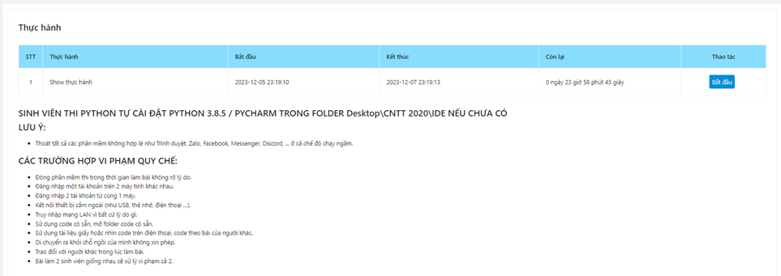

Hình 3. 1. Giao diện quản lý ca thực hành, thi

*
  1. 3.2. Danh sách bài tập trong ca thực hành, thi

Giao diện danh sách bài tập trong ca thực hành, thi tương tự với giao diện luyện tập theo môn học. Tuy nhiên, mã bài tập, độ khó, chủ đề, … sẽ được ẩn đi. Các bài tập đã hoàn thành cũng sẽ được đánh dấu màu xanh, các bài màu trắng là chưa hoàn thành. Để làm bài tập sinh viên nhấn vào tên của bài tập để đến với giao diện chi tiết đề bài và nộp bài.

Ở chế độ thực hành, thi chức năng diễn đàn trao đổi thông tin cũng sẽ được ẩn đi để tránh trao đổi trong giờ thi. Tên của sinh viên đang thực hiện làm bài sẽ được hiển thị lên màn hình cùng với đồng hồ đếm người thời gian làm bài còn lại để sinh viên có thể chủ động theo dõi.

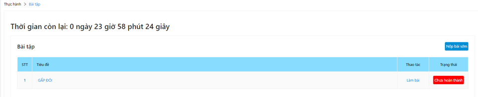

Hình 3. 2. Giao diện quản lý bài tập theo ca thực hành, thi

Với chức năng nộp bài khi thi, có thể giao diện nộp bài sẽ thay đổi và yêu cầu sinh viên chọn tệp mã nguồn từ máy và tải lên thay vì trình biên soạn như chế độ luyện tập.

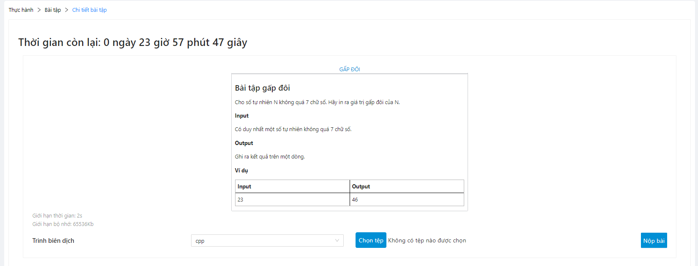

Hình 3. 3. Giao diện nộp bài trong ca thực hành, thi
