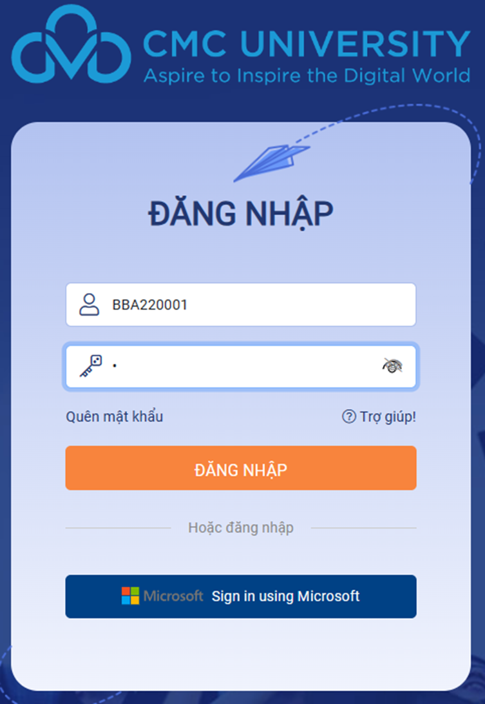

# Tra cứu TKB và điểm danh

## 1. Đăng nhập vào hệ thống cổng sinh viên

Sinh viên vào đường link sau:

[https://iu.cmcu.edu.vn](https://iu.cmcu.edu.vn/)

Lưu ý: Sử dụng Sign in using Microsoft -&#x20;

Tài khoản đăng nhập là tài khoản email của sinh viên đã được nhà trường cấp

Ví dụ BSCxxxxxx@st.cmcu.edu.vn

<figure><figcaption></figcaption></figure>

## 2. Các chức năng tra cứu lịch học và điểm danh

&#x20;Sau khi đăng nhập xong, màn hình chính hiển thị như sau:

<figure><figcaption></figcaption></figure>

&#x20;_Chức năng tra cứu lịch học cá nhân và điểm danh_

 

#### Bước 1: Chọn chức năng Thời khóa biểu\Lịch học, màn hình chức năng như sau

<figure><figcaption></figcaption></figure>

Mặc định hệ thống sẽ hiển thị lịch của tuần hiện tại, theo ngày hiện tại, Sinh viên có thể chọn ngày khác (Tuần khác) để xem lịch

<figure><figcaption></figcaption></figure>

Thông tin lịch sẽ được hiển thị chi tiết, bao gồm các thông tin:

<figure><figcaption></figcaption></figure>

o   Tên học phần: Nhiệt động học

o   Giờ học: 06:45 - 09:25

o   Tiết tương ứng: Tiết 1 – 3

o   Lớp học phần tương ứng với học phần trên: Nhiệt động học-1-1-22(N03)

o   Phòng học: Phòng học: A4-301.302

o   Giảng viên: Vũ Văn Trường

#### &#x20;Bước 2: Thực hiện điểm danh

&#x20;Vẫn trên giao diện tra cứu thời khóa biểu, sinh viên click vào lịch cụ thể, hệ thống sẽ hiện danh sách các bạn sinh viên đang học cùng lớp tương ứng như sau&#x20;

<figure><figcaption></figcaption></figure>

<figure><figcaption></figcaption></figure>

Sinh viên thực hiện điểm danh bằng cách gõ từ khóa điểm danh khi được giảng viên yêu cầu:

<figure><figcaption></figcaption></figure>

Và sau đó ấn Nút  để hoàn tất
