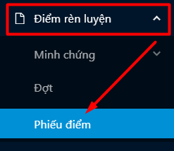
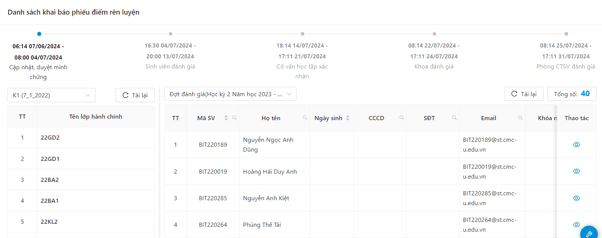
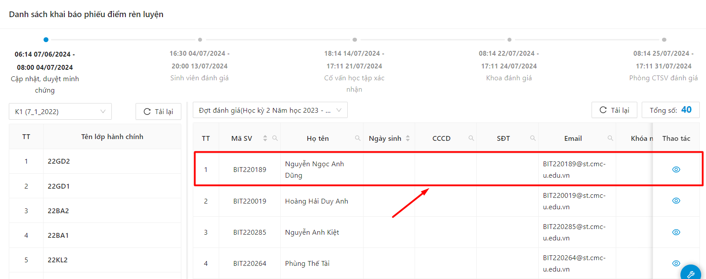
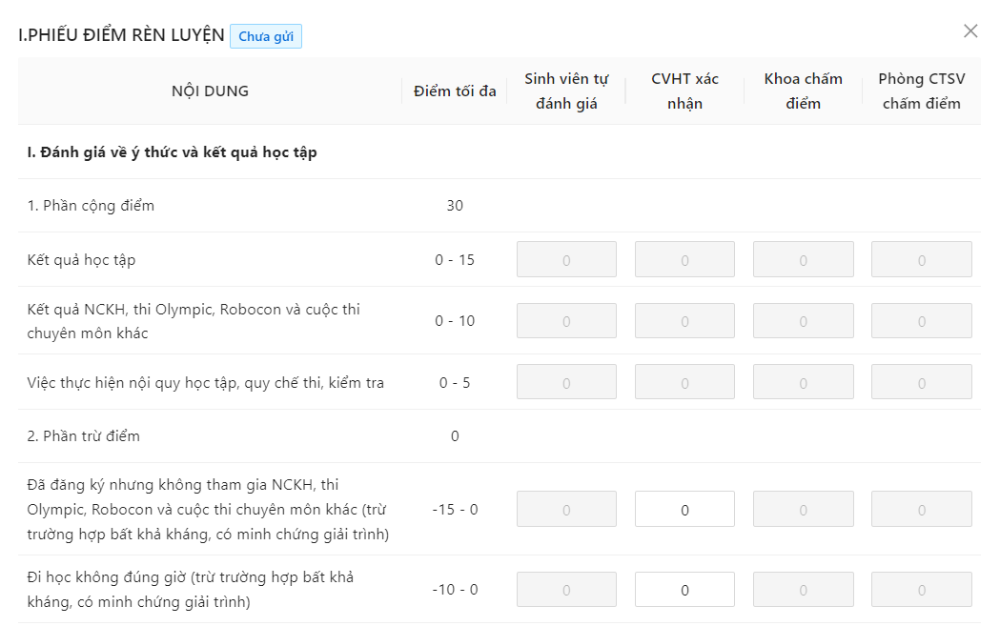
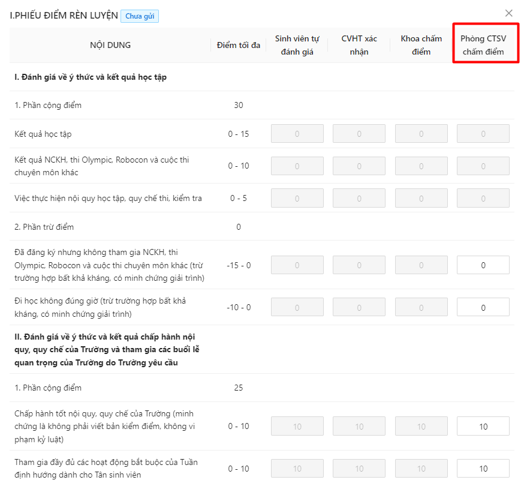
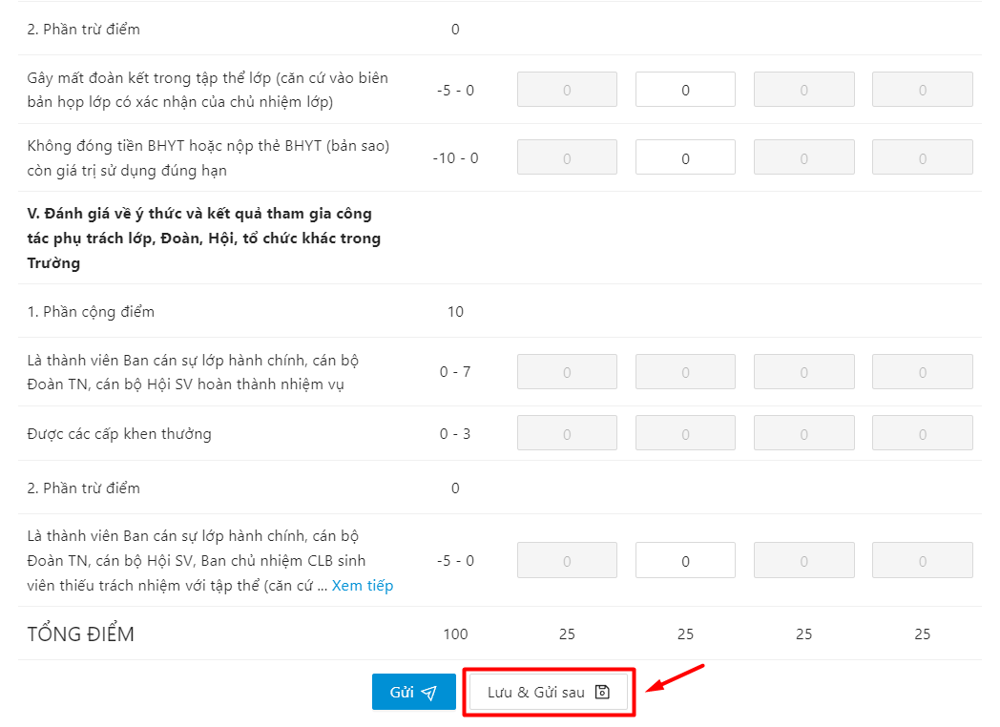
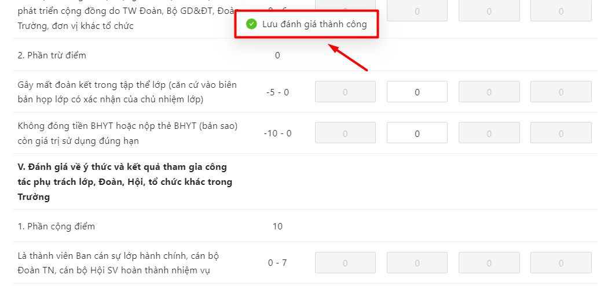
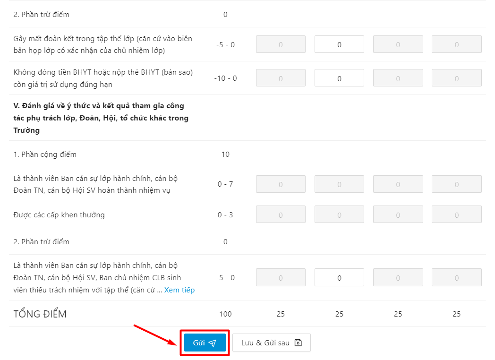
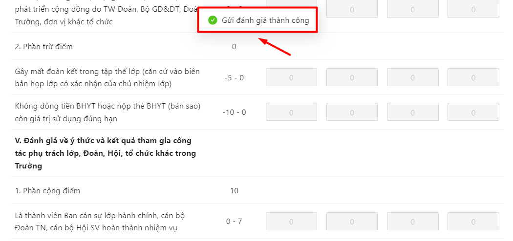

# Đánh giá điểm rèn luyện

* Quy trình chấm điểm rèn luyện sẽ diễn ra tuần tự như sau
  * Sinh viên thực hiện chấm điểm rèn luyện trong thời gian SV tự đánh giá
  * Sau khi SV tự đánh giá, CVHT sẽ chấm điểm
  * Sau khi hết thời gian CVHT chấm điểm, Khoa sẽ chấm điểm
  * Cuối cùng là cán bộ phòng CTSV chấm điểm cho sinh viên
* Bước 1: Người dùng chọn menu Điểm rèn luyện, chọn mục Phiếu điểm

* Bước 2: Hệ thống hiển thị danh sách lớp hành chính và sinh viên trong lớp

* Bước 3: Người dùng chọn 1 phiếu đánh giá điểm rèn luyện của sinh viên

* Bước 4: Thông tin phiếu chấm điểm rèn luyện SV tự chấm điểm hiển thị

* Bước 5: Phòng CTSV nhập thông tin đánh giá điểm rèn luyện của sinh viên

_**Lưu ý:** Những ô xám màu là những ô điểm hệ thống chấm, người dùng chỉ được điền điểm vào những ô trắng trong thời gian chấm điểm_

* Bước 6: Sau khi hoàn thiện nhập đủ thông tin, người dùng có thể Lưu và gửi sau hoặc Gửi ngay thông tin phiếu điểm rèn luyện

**Lưu và gửi sau**

* Người dùng ấn **Lưu và gửi sau** để lưu lại thông tin phiếu đã chấm điểm

 Lưu phiếu điểm rèn luyện thành công. Sau khi lưu phiếu, người dùng có thể vào tiếp tục chỉnh sửa phiếu chấm điểm rèn luyện.

**Gửi**

* Người dùng ấn **Gửi** để gửi thông tin xác nhận phiếu điểm của sinh viên

 Gửi phiếu điểm rèn luyện thành công.

