# Quản lý biểu mẫu chấm điểm rèn luyện

## Xem danh sách biểu mẫu chấm điểm rèn luyện 

* Người dùng chọn menu Cấu hình, chọn mục Phiếu điểm rèn luyện

.png>)

⇒ Hệ thống hiển thị danh sách biểu mẫu chấm điểm rèn luyện

.png>)

## Xem biểu mẫu chấm điểm rèn luyện 

* Bước 1: Người dùng chọn menu Cấu hình, chọn mục Phiếu điểm rèn luyện

.png>)

* Bước 2: Chọn thao tác Xem chi tiết ở cuối mẫu phiếu chấm điểm

.png>)

* Bước 3: Thông tin chi tiết biểu mẫu chấm điểm rèn luyện hiển thị

.png>)

## Thêm mới biểu mẫu chấm điểm rèn luyện 

* Bước 1: Người dùng chọn menu Cấu hình, chọn mục Phiếu điểm rèn luyện

.png>)

* Bước 2: Người dùng chọn thao tác **Thêm mới** để thêm mới biểu mẫu chấm điểm rèn luyện

.png>)

* Bước 3: Người dùng thực hiện khai báo thông tin chung của biểu mẫu chấm điểm rèn luyện, sau đó ấn Tiếp theo

.png>)

* Bước 4: Nhập thông tin cấu hình biểu mẫu chấm điểm rèn luyện. Người dùng ấn vào **Thêm khối**

.png>)

* Nhập tiêu đề
* Nhập nội dung tiêu chí chấm điểm rèn luyện
* Chọn loại minh chứng phù hợp cho câu hỏi
* Đánh giá (nhập số): SV sẽ thực hiện tự đánh giá tiêu chí bằng cách nhập số điểm

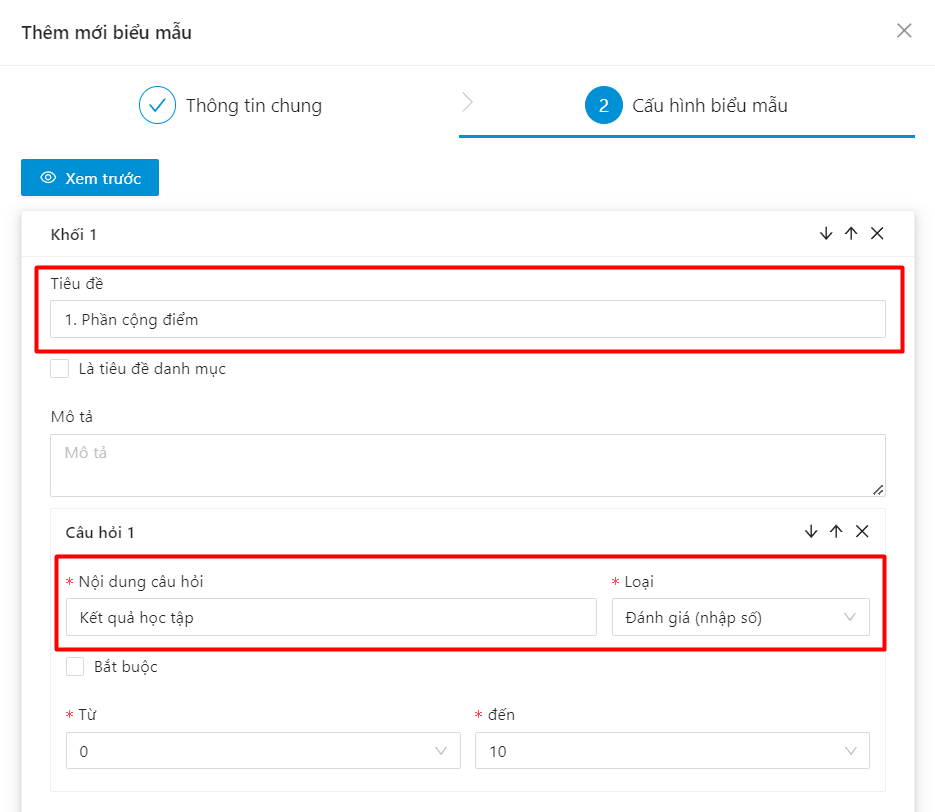

* Minh chứng điểm rèn luyện: SV thực hiện khai báo minh chứng, điểm của tiêu chí sẽ tính từ điểm các minh chứng SV khai báo được duyệt. Người dùng chọn mẫu loại minh chứng đã cấu hình

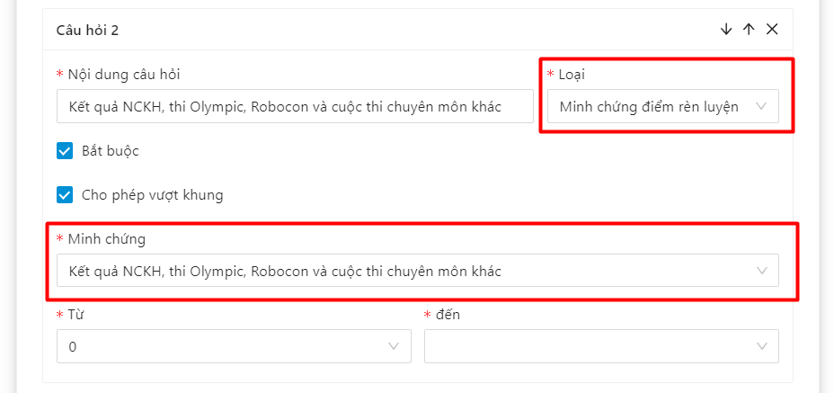

* Người dùng tiếp tục thêm các tiêu chí chấm điểm như thao tác trên cho đến khi hoàn thành biểu mẫu chấm điểm rèn luyện
* Bước 5: Sau khi thêm đầy đủ thông tin. Người dùng ấn vào nút **Thêm mới** ở cuối form

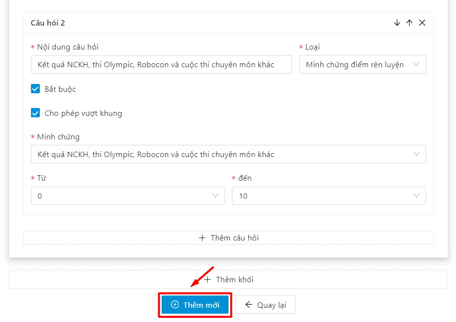

\=> Thêm mới biểu mẫu chấm điểm rèn luyện thành công

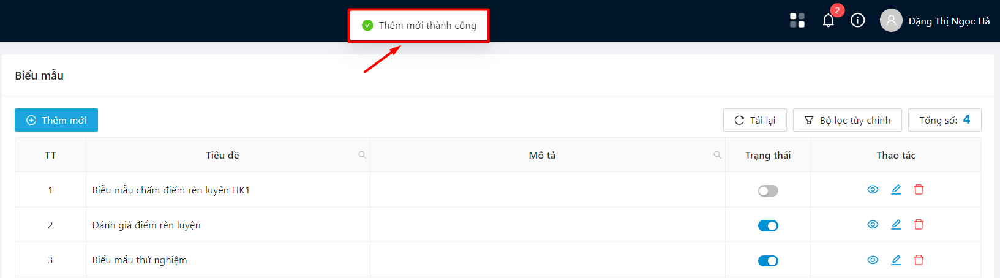

## Chỉnh sửa biểu mẫu chấm điểm rèn luyện 

* Bước 1: Người dùng chọn menu Cấu hình, chọn mục Phiếu điểm rèn luyện

* Bước 2: Người dùng ấn vào Chỉnh sửa ở cột **Thao tác**

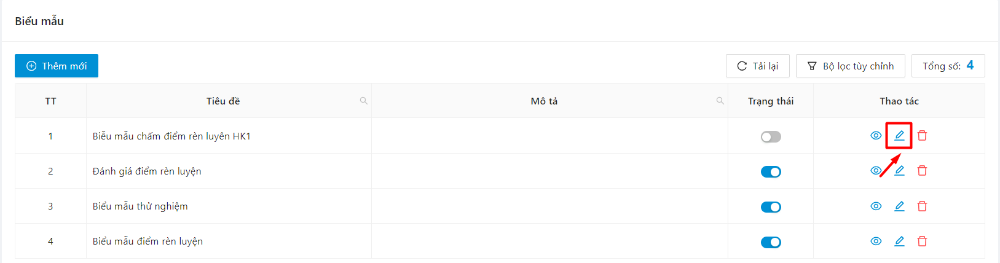

* Bước 3: Hệ thống hiển thị màn chỉnh sửa thông tin biểu mẫu chấm điểm rèn luyện

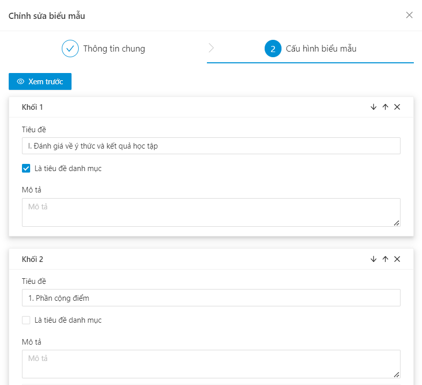

* Bước 4: Người dùng thực hiện chỉnh sửa thông tin biểu mẫu chấm điểm rèn luyện, sau đó ấn vào nút **Lưu lại**

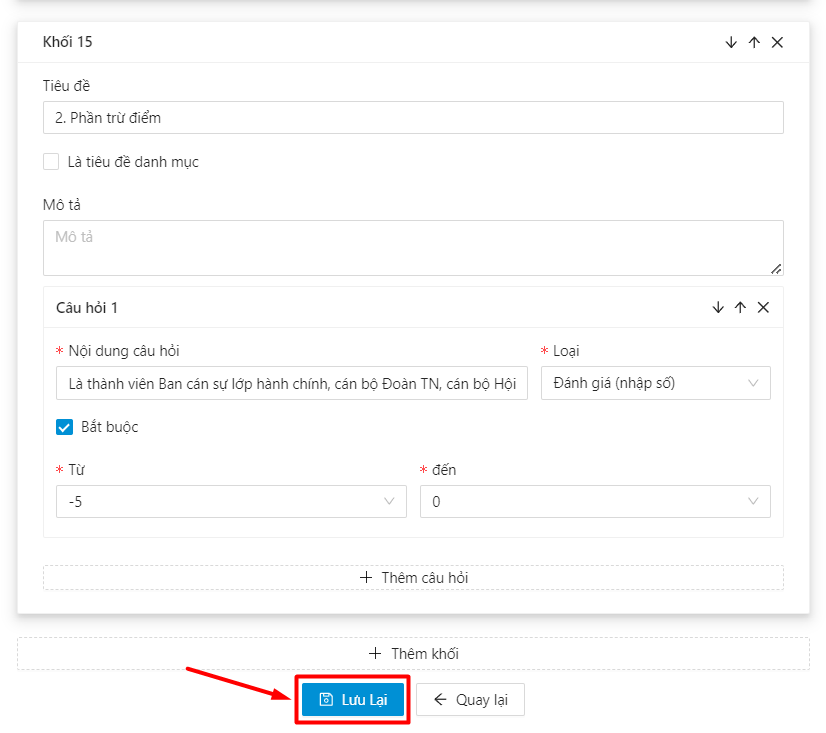

⇒ Hệ thống thông báo chỉnh sửa thành công

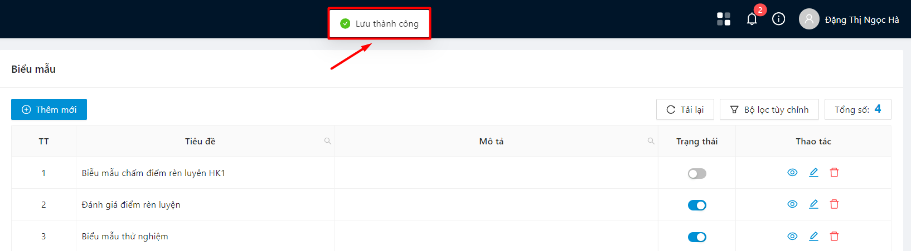

## Xoá biểu mẫu chấm điểm rèn luyện 

* Bước 1: Người dùng chọn menu Cấu hình, chọn mục Phiếu điểm rèn luyện

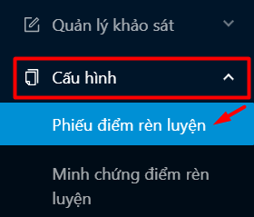

* Bước 2: Người dùng ấn vào button Xóa ở cột Thao tác

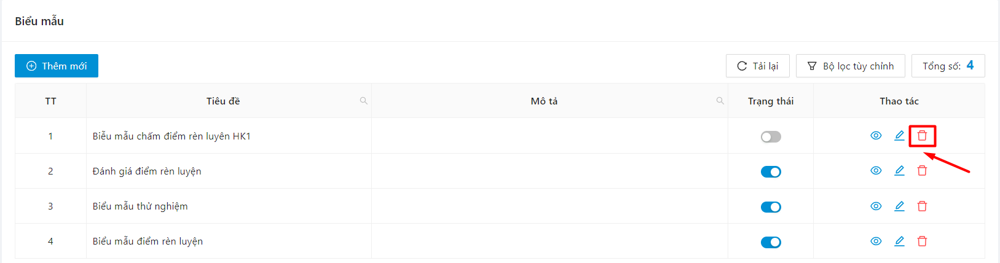

* Bước 3: Người dùng chọn **OK** để xác nhận xoá

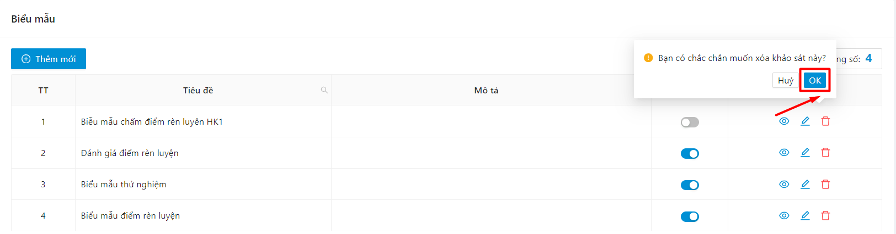

⇒ Hệ thống thông báo xoá thành công.
